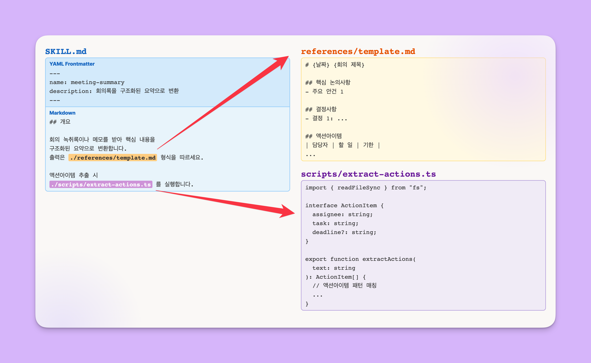

# 1.1 스킬이란?

> Claude에게 주는 "업무 지침서"

---

## 🎯 한 줄 정의

**스킬 = Claude에게 주는 업무 지침서**

새로 온 비서에게 "이 일은 이렇게 해줘"라고 적어주는 것처럼,
Claude에게 **한 번 적어두면** 매번 설명 없이 실행됩니다.

---

## 비유로 이해하기

### 스킬 = 비서에게 주는 업무 지침서

새로 온 비서가 있다고 상상해보세요.

**지침서 없이 일하면:**
```
나: "오늘 피드백 정리해줘"
비서: "어떤 형식으로요? 어디서 가져와요? 누구한테 보내요?"
나: (매번 처음부터 설명...)
```

**지침서 적어주면:**
```
나: "오늘 피드백 정리해줘"
비서: (지침서 보고) "네, 에어테이블에서 가져와서 → 요약하고 → 
       이메일 초안 만들면 되죠? 바로 할게요!"
```

| 일반 업무 | Claude 세계 |
|----------|------------|
| 업무 지침서 | **스킬** |
| "이 업무는 이렇게 해" | `SKILL.md` 파일 |
| 한 번 적어두면 끝 | 매번 설명 안 해도 됨 |

---

## 왜 필요한가요?

### Before vs After

| 스킬 없이 😰 | 스킬 있으면 ✨ |
|------------|--------------|
| 매번 긴 프롬프트 작성 | **한 마디**로 실행 |
| "지난번에 어떻게 했더라?" | **항상 같은 방식**으로 처리 |
| 결과물 들쭉날쭉 | **일관된** 품질 |
| 나만 아는 방법 | **팀과 공유** 가능 |
| 설명하다 지침 | Claude가 **알아서** 단계 수행 |

### 실제 절약 효과 예시

```
Before: 매번 프롬프트 작성 → 확인 → 수정 → 30분
After:  "/daily-feedback" 입력 → 확인만 → 5분

절약: 주 5회 × 25분 = 주 2시간 이상
```

---

## 어떻게 생겼나요?

### 스킬의 정체: 그냥 폴더입니다!


딱 **하나만** 필수입니다: `SKILL.md`

---

### SKILL.md 맛보기

```markdown
---
name: meeting-summary
description: 회의록/미팅노트/인터뷰 기록을 구조화된 요약 마크다운으로 변환.
             "회의록 요약해줘", "미팅 정리해줘", "meeting-summary" 등으로 호출.
             사용자가 텍스트를 붙여넣으면 핵심 논의사항, 결정사항,
             액션아이템을 추출하여 YYMMDD-제목.md 파일로 저장.
---

# Meeting Summary 스킬

## 단계별 절차
1. 사용자가 붙여넣은 회의 내용 분석
2. 핵심 논의사항 추출 및 요약
3. 결정사항 정리
4. 액션아이템을 담당자/할일/기한으로 구조화
5. ./references/template.md 형식에 맞춰 마크다운 생성
6. YYMMDD-제목.md 파일로 저장

## 주의사항
- 원문에 없는 내용을 추측하지 말 것
- 액션아이템의 담당자가 불분명하면 "미정"으로 표시
- 기밀 내용은 파일 저장 전 사용자에게 확인
```

---

### SKILL.md의 핵심 구조

| 부분 | 역할 | 예시 |
|------|------|------|
| `---` 사이 | **메타정보** (언제 이 스킬 쓸지) | name, description |
| `---` 아래 | **본문** (어떻게 처리할지) | 단계, 주의사항 등 |

**가장 중요한 것**: `description`에 **언제 쓰는지** 적어두면 Claude가 **알아서 인식**!

```yaml
description: 회의록/미팅노트/인터뷰 기록을... "회의록 요약해줘"라고 말하면 실행.
```

이렇게 적어두면 사용자가 "회의록 정리해줘"라고만 해도 이 스킬이 자동으로 활성화됩니다.

### 공부하면 좋을 자료
- [Claude Skills.. 앤트로픽에 $200를 내야하는 이유](https://www.youtube.com/watch?v=jxzpitU9YBg)

---

## 💡 점진적 공개: 스킬이 똑똑한 이유

스킬은 **필요할 때만** 정보를 불러옵니다. 매번 모든 지침을 다 읽지 않아요.

### 3단계 로딩

```
1단계: 메타정보(name, description)만 읽음 (항상)
       → "이 스킬은 피드백 정리할 때 쓰는구나"

2단계: 본문 읽음 (관련 있을 때만)
       → 사용자가 "피드백 정리해줘" 하면 그때 읽음

3단계: 참고 파일 (필요할 때만)
       → references/ 폴더 내용은 스킬을 진짜 실행할 때만
```



### 왜 이게 중요한가요?

| 방식 | 토큰 사용 | 속도 |
|------|----------|------|
| 매번 긴 프롬프트 | 매번 전체 사용 📈 | 느림 |
| 스킬 (점진적 공개) | 필요한 만큼만 📉 | 빠름 |

**비유**: 백과사전 전체를 매번 읽는 것 vs 목차 보고 필요한 페이지만 펼치는 것

---

## 📁 스킬이 저장되는 위치

스킬은 **두 군데**에 저장할 수 있습니다.

> 📚 **공식 문서**: [code.claude.com/docs/en/skills](https://code.claude.com/docs/en/skills)

### 전역 설치 vs 프로젝트 설치

| 구분 | 위치 | 적용 범위 |
|------|------|----------|
| **전역 (Personal)** | `~/.claude/skills/스킬명/` | 내 컴퓨터의 모든 프로젝트 |
| **프로젝트 (Local)** | `.claude/skills/스킬명/` | 이 프로젝트 폴더에서만 |


### 언제 어디에 설치할까?

| 상황 | 추천 위치 | 이유 |
|------|----------|------|
| 어떤 프로젝트에서든 쓰고 싶은 스킬 | **전역** | 한 번 설치하면 어디서든 사용 |
| 특정 프로젝트 전용 스킬 | **프로젝트** | 다른 작업 중 갑자기 트리거되지 않음 |
| 팀원과 공유해야 하는 스킬 | **프로젝트** | Git 커밋하면 팀원도 바로 사용 가능 |

### 예시: `/billing` 스킬

영수증 자동 정리 스킬을 만들었다고 가정해봅시다.

| 설치 위치 | 결과 |
|----------|------|
| **전역 설치** | 다른 프로젝트에서 작업 중 "청구서 정리해줘"라고 말하면 갑자기 실행될 수 있음 😰 |
| **프로젝트 설치** | 영수증 프로젝트 폴더에서만 작동. 다른 곳에서는 트리거 안 됨 ✅ |

### 프로젝트 설치의 장점: 팀 공유

```
1. 내가 .claude/skills/에 스킬 만듦
   ↓
2. Git에 커밋 & 푸시
   ↓
3. 팀원이 프로젝트 clone
   ↓
4. 스킬이 이미 포함되어 있음! (별도 설치 불필요)
```

> 💡 **핵심**: 프로젝트 스킬은 **맥락 격리** + **자동 공유**가 장점!

### 우선순위

같은 이름의 스킬이 두 곳에 있으면?

```
Enterprise > 전역(Personal) > 프로젝트(Project)
```

전역이 우선 적용됩니다. (공식 문서 기준)

---

## 🔍 실습: 스킬 폴더 직접 열어보기

> ⭐ 직접 해보세요!

### Step 1: Finder에서 전역 스킬 폴더 열기

1. **Finder** 열기 → 내 홈 폴더로 이동 (사이드바에서 내 이름 클릭)
2. `Cmd + Shift + .` 눌러서 **숨김 폴더 보기**
3. `.claude` 폴더가 보입니다! → 열기
4. 그 안에 `skills` 폴더 열기

> 💡 `.`으로 시작하는 폴더는 숨김 폴더입니다. `Cmd + Shift + .`으로 언제든 토글할 수 있어요!

**예상 결과**: 워크샵 준비에서 설치한 `workshop-prep` 등 스킬들이 폴더로 보입니다!

### Step 2: workshop-prep 스킬의 SKILL.md 열어보기

사전 준비에서 설치한 `workshop-prep` 스킬을 직접 열어봅시다!

1. `workshop-prep` 폴더 클릭
2. 안에 있는 **SKILL.md** 파일을 **텍스트 편집기**나 **VSCode**로 열기
   - 더블클릭하면 기본 앱으로 열립니다
   - 또는 우클릭 → "다음으로 열기" → 원하는 앱 선택

**확인 포인트**:
- `---` 사이에 있는 **메타정보** (name, description) 찾아보기
- `---` 아래의 **본문** (절차, 규칙 등) 훑어보기
- 아까 배운 구조 그대로인지 확인!

> 💡 **발견**: 워크샵 전에 `/workshop-prep` 으로 설계서를 만들었죠? 그게 바로 이 SKILL.md 덕분이에요!


---

## ✅ 실습 완료 체크

- [ ] Finder에서 `~/.claude/skills/` 폴더 열어서 전역 스킬 목록 확인
- [ ] 스킬 폴더 안에 `SKILL.md` 파일이 있는 것 확인
- [ ] 전역 vs 프로젝트 설치 차이 이해

---

## 💡 Claude Code 확장 기능 비교

스킬 외에도 Claude Code를 확장하는 방법이 있습니다. 오늘은 **스킬**에 집중하지만, 전체 그림을 알아두면 좋아요.

### Claude 능력 확장 3총사

| 기능 | 한 줄 설명 | 비유 | 예시 |
|------|-----------|------|------|
| **스킬** | 업무 지침서 | 업무 SOP | "피드백 정리해줘" → 정해진 절차대로 실행 |
| **서브에이전트** | 전문가에게 위임 | 팀원 | "이 코드 리뷰해줘" → 코드리뷰 전문가가 처리 |
| **커스텀 커맨드** | 단축 명령어 | 키보드 단축키 | `/deploy` → 배포 스크립트 실행 |

### 훅: 자동 트리거

| 기능 | 한 줄 설명 | 비유 | 예시 |
|------|-----------|------|------|
| **훅** | 특정 이벤트에 자동 실행 | 알람 | 커밋할 때마다 자동으로 린트 검사 |

> 💡 훅은 "내가 명령하지 않아도 알아서 실행"되는 자동화입니다.


### 오늘의 초점

```
✅ 스킬     ← 오늘 집중!
⬚ 서브에이전트, 커스텀 커맨드, 훅 ← 알아두면 좋음
⬚ 플러그인  ← 배포할 때 잠깐 다룸
```

> 💡 **비개발자 추천**: 스킬만 잘 써도 대부분의 업무 자동화가 가능합니다!

---

## 핵심 정리

| 개념 | 한 줄 |
|------|-------|
| **스킬** | Claude에게 주는 업무 지침서 |
| **SKILL.md** | 지침서 본문 (필수 파일) |
| **description** | "언제 이 스킬 쓸지" 적는 곳 (가장 중요!) |
| **전역 스킬** | `~/.claude/skills/` → 모든 프로젝트에서 사용 (개인용) |
| **프로젝트 스킬** | `.claude/skills/` → 현재 프로젝트만 (맥락 격리 + 팀 공유) |
| **점진적 공개** | 필요한 만큼만 읽어서 효율적 |

---

## 📚 공식 문서 링크

더 자세히 알고 싶다면:

| 문서 | URL | 내용 |
|------|-----|------|
| **스킬 가이드** | [code.claude.com/docs/en/skills](https://code.claude.com/docs/en/skills) | 스킬 생성, 설치, 공유 전체 가이드 |
| 서브에이전트 | [code.claude.com/docs/en/sub-agents](https://code.claude.com/docs/en/sub-agents) | 스킬을 별도 에이전트에서 실행 |
| 플러그인 | [code.claude.com/docs/en/plugins](https://code.claude.com/docs/en/plugins) | 스킬 패키징 및 배포 |
| 권한 설정 | [code.claude.com/docs/en/permissions](https://code.claude.com/docs/en/permissions) | 스킬 접근 제어 |

---

## ✅ 완료 체크

- [ ] 스킬 = "업무 지침서"라는 개념 이해
- [ ] Before/After 차이 이해
- [ ] SKILL.md 구조 파악 (메타정보 + 본문)
- [ ] 전역 vs 프로젝트 스킬 위치 차이 이해
- [ ] Finder에서 스킬 폴더 확인 완료
- [ ] 점진적 공개 원리 이해 (3단계 로딩)

---

