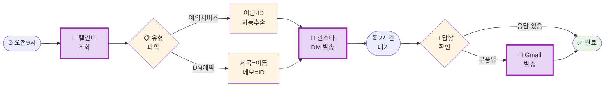

# 나의 워크샵 스킬 설계서

> 📋 **이 설계서는 [사전설문응답.md](사전설문응답.md) 인터뷰를 바탕으로 작성되었습니다.**

> ⚠️ **이 설계서는 초안입니다!**
>
> 정답이 아니에요. 워크샵 당일 강사님과 함께 범위를 더 좁히거나, 더 구체화할 수 있습니다.
>
> **사전과제의 목적**:
> 1. 스킬을 설치해서 한 번 써본 것 ✅
> 2. 나만의 스킬 설계서를 만들어서 "아, 내 작업이 이렇게 자동화되겠구나", "이런 흐름이겠구나" 감 잡기 ✅
>
> 이 정도면 충분해요! 나머지는 워크샵에서 함께 다듬어봐요 😊

## 목차
- [0. 선언](#0-선언)
- [한눈에 보기](#한눈에-보기)
- [Core (필수)](#core-필수)
  - [1. 언제 쓰나요?](#1-언제-쓰나요)
  - [2. 사용법](#2-사용법)
  - [3. 입력/출력 명세](#3-입력출력-명세)
  - [4. 범위](#4-범위)
  - [5. 데이터/도구/권한](#5-데이터도구권한)
  - [6. 실패/예외 처리](#6-실패예외-처리)
  - [7. 대화 시나리오](#7-대화-시나리오)
  - [8. 테스트 & 완료 기준](#8-테스트--완료-기준)
- [Optional](#optional)
  - [B. 외부 API 연동](#b-외부-api-연동인-경우)
  - [C. 다단계 워크플로우](#c-다단계-워크플로우인-경우)
- [나중에 더 발전시킬 아이디어](#나중에-더-발전시킬-아이디어)

---

## 0. 선언

- **스킬 이름**: `booking-notifier`
- **한 줄 설명**: 구글 캘린더에서 다음 날 예약을 자동 조회해 인스타 DM으로 리마인더를 보내고, 미응답 시 Gmail로 후속 발송
- **만드는 사람**: 대표
- **스킬 유형**: [x] 외부 API  [x] 다단계 워크플로우
- **MVP 목표**: "내일 예약 고객에게 이름+시간이 담긴 인스타 DM이 오전 9시에 자동 발송된다"

---

## 한눈에 보기

### 외부 연동

| 서비스 | 용도 | 연동 방식 | 복잡도 | 가이드 |
|--------|------|----------|--------|--------|
| Google Calendar | 내일 예약 고객 정보 조회 | 스크립트 | 중간 | [📘 설정 가이드](연동가이드/google-calendar.md) |
| Instagram Business API | 고객에게 DM 발송 + 응답 확인 | 스크립트 | 어려움 | [📘 설정 가이드](연동가이드/instagram.md) |
| Gmail | 미응답 고객에게 이메일 발송 | 스크립트 | 중간 | [📘 설정 가이드](연동가이드/gmail.md) |

> 📁 상세 설정 가이드: [연동가이드/](연동가이드/) 폴더 참조

> ⚠️ **사전 설정 필수**: Instagram API는 워크샵 전에 미리 설정해두세요! (약 30-40분 소요)
> Google Calendar와 Gmail은 당일 설정 가능하지만, 미리 해두면 더 좋아요.

### 워크플로 시각화

> 💡 **다이어그램이 안 보이나요?**
>
> VSCode에서 Mermaid 다이어그램을 보려면 확장 프로그램이 필요해요:
> 1. VSCode 왼쪽 사이드바에서 **확장(Extensions)** 아이콘 클릭 (또는 `Cmd+Shift+X`)
> 2. `Markdown Preview Mermaid Support` 검색
> 3. **Install** 클릭
> 4. 이 파일을 다시 열고 **미리보기**(`Cmd+Shift+V`)로 확인!



---

## Core (필수)

### 1. 언제 쓰나요?

**대표 상황**:
매일 전날, 다음 날 예약 고객(5팀)에게 인스타 DM으로 예약 리마인더를 보내야 함. 구글 캘린더에는 두 가지 형태의 고객 정보가 섞여 있음:
- **예약 서비스 고객**: 구글 약속예약서비스를 통해 예약 → 이벤트에 이름/이메일/인스타ID가 구조화된 형태로 저장
- **DM 예약 고객**: 인스타 DM으로 직접 예약 후 수동 등록 → 이벤트 제목에 이름, 메모에 인스타 아이디

두 유형 모두 같은 날의 모든 일정을 대상으로 DM 발송. 미응답 시 Gmail 후속 발송.

**왜 필요한가** (불편/비용/시간):
매일 밤 5명씩 수동으로 캘린더 확인 → DM 작성 → 발송 → 2시간 후 응답 확인 → 미응답자 이메일 발송까지 반복. 매일 반복되는 루틴이라 자동화 효과가 큼.

### 2. 사용법

**이렇게 부르면**:
- `/booking-notifier`
- "오늘 리마인더 보내줘"
- "내일 예약 DM 발송해줘"

**결과물 형태**: [x] 메시지 (인스타 DM + Gmail)

**결과물 예시**:
> ✅ 내일 예약 고객 5팀에게 DM 발송 완료!
>
> 📱 DM 발송: 홍길동(10:00), 김철수(11:30), 이영희(14:00), 박민준(15:30), 최지은(17:00)
>
> ⏳ 2시간 후(11:00) 미응답 고객 이메일 자동 발송 예정

### 3. 입력/출력 명세

| 구분 | 내용 |
|------|------|
| **사용자 입력** | 없음 (완전 자동 - 매일 9시 실행) |
| **데이터 형태 A** | 예약 서비스 고객: 이벤트 필드에 이름/이메일/인스타ID 구조화 저장 |
| **데이터 형태 B** | DM 예약 고객: 이벤트 **제목** = 고객 이름, 이벤트 **메모** = 인스타 아이디 |
| **공통 추출 정보** | 이름, 인스타 아이디, 이메일(있는 경우), 예약 시간 |
| **DM 템플릿** | "안녕하세요 {이름}님! 내일 {시간} 예약이 있으시네요. 확인 부탁드려요 😊" |
| **이메일 템플릿** | "인스타그램 DM으로 메시지를 보냈는데 아직 확인이 안 되었어요. DM 확인 후 답장 부탁드립니다!" |
| **출력 규칙** | 발송 결과 요약 + 미응답자 목록 |

### 4. 범위

**하는 것** (3개):
1. 구글 캘린더에서 내일 예약 고객 정보 자동 조회
2. 고객별 이름+시간 넣어서 인스타 DM 발송 (오전 9시)
3. 2시간 후 미응답 고객에게 Gmail 발송 (오전 11시)

**안 하는 것** (2개):
1. DM 내용 개인화 (이름/시간 외 추가 커스텀 없음)
2. 예약 취소/변경 처리 (리마인더 발송만)

### 5. 데이터/도구/권한

| 항목 | 내용 |
|------|------|
| **읽는 데이터** | 구글 캘린더 (내일 전체 일정 - 예약서비스 + 수동등록 모두) |
| **쓰는 위치** | 인스타 DM, Gmail |
| **외부 서비스** | Google Calendar API, Instagram Graph API, Gmail SMTP |
| **민감정보** | Google OAuth 토큰, Instagram Access Token, Gmail 앱 비밀번호 → `.env` 파일 관리 |

### 6. 실패/예외 처리

**예상되는 실패 상황**:
1. 인스타 DM 발송 실패 (계정 제한, API 오류) → 해당 고객에게는 Gmail만 발송
2. 캘린더에 인스타 아이디 없는 고객 → Gmail로만 발송, 로그 기록
3. 내일 예약이 없는 경우 → "내일 예약이 없어요!" 메시지 출력

**실패 시 안내 원칙**:
실패한 고객 목록을 따로 보여주고, "이 고객들은 수동으로 확인해주세요"라고 안내.

### 7. 대화 시나리오

**정상 케이스**:

**나**: "내일 예약 DM 보내줘"

**스킬**:
> 📅 내일(2/21) 예약 고객 5팀 확인했어요!
>
> 📱 인스타 DM 발송 중...
> ✅ 홍길동님 (10:00) - 발송 완료
> ✅ 김철수님 (11:30) - 발송 완료
> ✅ 이영희님 (14:00) - 발송 완료
> ✅ 박민준님 (15:30) - 발송 완료
> ✅ 최지은님 (17:00) - 발송 완료
>
> ⏳ 11:00에 미응답 고객 이메일 자동 발송할게요!

**실패 케이스**:

**나**: "내일 예약 DM 보내줘" (인스타 아이디 없는 고객 있을 때)

**스킬**:
> ⚠️ 박민준님 캘린더에 인스타 아이디가 없어요!
>
> → 박민준님은 이메일로만 발송할게요.
> 나머지 4팀은 DM 발송 완료!

### 8. 테스트 & 완료 기준

**테스트 체크리스트**:
- [ ] 구글 캘린더에서 내일 일정 정상 조회
- [ ] 테스트 계정으로 인스타 DM 발송 성공
- [ ] 2시간 대기 후 미응답 → Gmail 발송 성공
- [ ] 인스타 아이디 없는 경우 → Gmail 폴백 처리

**Done 기준**:
"매일 아침 9시에 자동으로 DM이 나가고, 11시에 미응답자 이메일이 발송된다."

---

## Optional

### B. 외부 API 연동인 경우

3개의 외부 서비스 연동이 필요합니다.

#### 환경변수 요약

| 변수명 | 서비스 | 발급 방법 |
|--------|--------|----------|
| `GOOGLE_CLIENT_ID` | Google Calendar | Google Cloud Console |
| `GOOGLE_CLIENT_SECRET` | Google Calendar | Google Cloud Console |
| `INSTAGRAM_ACCESS_TOKEN` | Instagram Business API | Meta Developer Console |
| `INSTAGRAM_PAGE_ID` | Instagram Business API | Meta Developer Console |
| `GMAIL_APP_PASSWORD` | Gmail | Google 계정 설정 |
| `GMAIL_ADDRESS` | Gmail | 내 Gmail 주소 |

> **Tip**: Claude Code에게 키를 알려주면 자동으로 `.env`에 설정해줘요!

#### B-1. Google Calendar

| 항목 | 내용 |
|------|------|
| **필요한 credential** | OAuth 2.0 Client ID + Secret |
| **환경변수** | `GOOGLE_CLIENT_ID`, `GOOGLE_CLIENT_SECRET` |
| **복잡도** | 중간 (OAuth 설정 필요) |
| **예상 설정 시간** | 약 20-30분 |

#### B-2. Instagram Business API

| 항목 | 내용 |
|------|------|
| **필요한 credential** | Meta Developer App + Instagram Access Token |
| **환경변수** | `INSTAGRAM_ACCESS_TOKEN`, `INSTAGRAM_PAGE_ID` |
| **복잡도** | 어려움 (앱 등록 + Facebook 페이지 연결 필요) |
| **예상 설정 시간** | 약 30-40분 |

#### B-3. Gmail

| 항목 | 내용 |
|------|------|
| **필요한 credential** | Gmail 앱 비밀번호 (2단계 인증 필요) |
| **환경변수** | `GMAIL_APP_PASSWORD`, `GMAIL_ADDRESS` |
| **복잡도** | 중간 (2단계 인증 설정 필요) |
| **예상 설정 시간** | 약 10-15분 |

---

> **참고**: 상세 가이드는 `연동가이드/` 폴더의 개별 파일을 확인하세요.

### C. 다단계 워크플로우인 경우

**단계 목록**:
1. **[9:00] 캘린더 조회** → 산출물: 내일 전체 일정 목록 (두 가지 형태 혼재)
2. **[9:00] 고객 정보 파싱** → 예약서비스 형태(구조화) vs DM예약 형태(제목+메모) 구분하여 이름/인스타ID/시간 통일된 형태로 추출
3. **[9:00] 인스타 DM 발송** → 산출물: 발송 완료 목록 + 실패 목록 (인스타ID 없으면 Gmail 대체)
4. **[11:00] 응답 확인** → 산출물: 미응답 고객 목록
5. **[11:00] Gmail 발송** → 산출물: 이메일 발송 완료

**중단/재개 방법**:
실패한 고객 목록이 로그로 남아, 수동으로 개별 재발송 가능.

---

## 나중에 더 발전시킬 아이디어

- [ ] 예약 당일 아침에도 한 번 더 리마인더 발송 (당일 리마인더)
- [ ] 예약 확정 답장이 오면 구글 캘린더에 "확인완료" 태그 추가
- [ ] 노쇼 고객 기록 → 다음 예약 시 주의 메시지 추가

---

## 배포 준비 (워크샵 후)

| 파일 | 상태 | 설명 |
|------|------|------|
| `SKILL.md` | [ ] 미완성 | 스킬 정의 (워크샵에서 작성) |
| `README.md` | [ ] 자동생성 예정 | 설치 가이드 (배포 시 자동 생성) |
| `.env.example` | [x] 완료 | 환경변수 예시 |
| `.gitignore` | [x] 완료 | .env 제외 설정 |

워크샵에서 스킬을 완성한 후, Claude Code에게 말하세요:

```
이 스킬 배포해줘
```

---

**워크샵 당일 이 설계서 가져오세요!**
