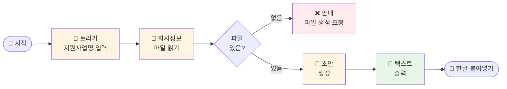

# 나의 워크샵 스킬 설계서

> 📋 **이 설계서는 [사전설문응답.md](사전설문응답.md) 인터뷰를 바탕으로 작성되었습니다.**

> ⚠️ **이 설계서는 초안입니다!**
>
> 정답이 아니에요. 워크샵 당일 강사님과 함께 범위를 더 좁히거나, 더 구체화할 수 있습니다.
>
> **사전과제의 목적**:
> 1. 스킬을 설치해서 한 번 써본 것 ✅
> 2. 나만의 스킬 설계서를 만들어서 "아, 내 작업이 이렇게 자동화되겠구나", "이런 흐름이겠구나" 감 잡기 ✅
>
> 이 정도면 충분해요! 나머지는 워크샵에서 함께 다듬어봐요 😊

## 목차
- [0. 선언](#0-선언)
- [한눈에 보기](#한눈에-보기)
- [Core (필수)](#core-필수)
  - [1. 언제 쓰나요?](#1-언제-쓰나요)
  - [2. 사용법](#2-사용법)
  - [3. 입력/출력 명세](#3-입력출력-명세)
  - [4. 범위](#4-범위)
  - [5. 데이터/도구/권한](#5-데이터도구권한)
  - [6. 실패/예외 처리](#6-실패예외-처리)
  - [7. 대화 시나리오](#7-대화-시나리오)
  - [8. 테스트 & 완료 기준](#8-테스트--완료-기준)
- [Optional](#optional)
  - [A. 파일 기반](#a-파일-기반)
- [나중에 더 발전시킬 아이디어](#나중에-더-발전시킬-아이디어)
- [배포 준비](#배포-준비-워크샵-후)

---

## 0. 선언

- **스킬 이름**: `business-proposal-draft`
- **한 줄 설명**: 회사 핵심 정보를 기반으로 지원사업/인증 사업설명서 초안을 자동 생성
- **만드는 사람**: 디렉터 (민간 지역연구소)
- **스킬 유형**: [x] 파일 기반
- **MVP 목표**: "지원사업 이름과 요구 항목을 알려주면, 회사 정보 파일을 읽어 초안을 바로 뽑아줌"

---

## 한눈에 보기

### 외부 연동

외부 연동 없음 — 별도 설정 없이 바로 시작할 수 있어요!

### 워크플로 시각화

> 💡 **다이어그램이 안 보이나요?**
>
> VSCode에서 Mermaid 다이어그램을 보려면 확장 프로그램이 필요해요:
> 1. VSCode 왼쪽 사이드바에서 **확장(Extensions)** 아이콘 클릭 (또는 `Ctrl+Shift+X`)
> 2. `Markdown Preview Mermaid Support` 검색
> 3. **Install** 클릭
> 4. 이 파일을 다시 열고 **미리보기**(`Ctrl+Shift+V`)로 확인!



---

## Core (필수)

### 1. 언제 쓰나요?

**대표 상황**:
새로운 지원사업 공고나 인증 신청이 생겼을 때. 예: 벤처확인, 청년친화강소기업, 각종 R&D 지원사업 공고.

**왜 필요한가**:
- 3개월차 디렉터로서 이전 자료(대표/부대표 작성)가 내 머릿속에 정리되어 있지 않음
- 매번 구글 드라이브·슬랙에서 이전 자료를 뒤져 조합하는 데 시간 소요
- 항목은 비슷한데 지원사업마다 조금씩 다른 형식에 맞춰 다시 쓰는 반복 작업

### 2. 사용법

**이렇게 부르면**:
- `/business-proposal-draft`
- "벤처확인 사업설명서 초안 써줘"
- "○○ 지원사업 제안서 뽑아줘"
- "[지원사업명] 신청서 작성해줘"

**결과물 형태**: [x] 텍스트 (한글 파일에 붙여넣기용)

**결과물 예시**:
> **[회사 소개]**
>
> (주)○○연구소는 민간 지역연구소로, 지역 연구·청년-지역 연결 프로그램·창업교육을 통해 지역 생태계 활성화를 이끌고 있습니다.
>
> **[문제 / 사업의 필요성]**
>
> 수도권 집중 심화로 지역 청년 유출이 가속화되고 있으며...
>
> *(이하 솔루션, 목표시장, 실적 항목 순으로 이어짐)*

### 3. 입력/출력 명세

| 구분 | 내용 |
|------|------|
| **사용자 입력** | 지원사업 이름 + (선택) 요구 항목 목록 |
| **필수 옵션** | 지원사업 이름 |
| **선택 옵션** | 항목별 글자 수 제한, 특별히 강조할 내용 |
| **출력 규칙** | 항목별 제목 + 본문 텍스트, 한글 파일 붙여넣기에 최적화된 포맷 |

### 4. 범위

**하는 것**:
1. `company-info.md` 파일에서 회사 핵심 정보 읽기
2. 지원사업 요구 항목에 맞춰 섹션별 초안 생성
3. 한글 파일에 바로 붙여넣을 수 있는 텍스트 출력

**안 하는 것**:
1. 한글(.hwp) 파일 직접 생성 — 텍스트만 뽑아줌, 붙여넣기는 직접
2. 구글 드라이브 자동 탐색 — 회사 정보는 `company-info.md`에 정리해두는 방식

### 5. 데이터/도구/권한

| 항목 | 내용 |
|------|------|
| **읽는 데이터** | `business-proposal-draft/company-info.md` (회사 핵심 정보 파일) |
| **쓰는 위치** | 채팅창에 텍스트 출력 (파일 저장 안 함) |
| **외부 서비스** | 없음 |
| **민감정보** | 없음 (회사 공개 정보만 사용) |

### 6. 실패/예외 처리

**예상되는 실패 상황**:
1. `company-info.md` 파일이 없는 경우
2. 지원사업 이름만 말하고 요구 항목이 불분명한 경우
3. 특정 항목에 해당하는 실적 데이터가 `company-info.md`에 없는 경우

**실패 시 안내 원칙**:
- 파일 없음: "`company-info.md` 파일이 아직 없어요! 회사 소개, 서비스, 실적 내용을 간단히 알려주시면 제가 파일을 만들어드릴게요."
- 항목 불분명: "공고문에서 요구 항목 목록을 복사해서 붙여넣어 주시면 더 정확하게 맞출 수 있어요!"
- 정보 부족: "[실적] 항목에 넣을 구체적인 수치가 파일에 없어요. 대략적인 내용을 알려주시면 채워드릴게요."

### 7. 대화 시나리오

**정상 케이스**:

**나**: "벤처확인 사업설명서 초안 써줘. 항목은 회사 소개, 문제, 솔루션, 시장 규모, 실적이야"

**스킬**:
> `company-info.md`를 읽었어요! 아래 초안을 한글에 붙여넣으시면 됩니다.
>
> ---
> **[회사 소개]**
> (주)○○연구소는 ...
>
> **[문제 / 사업의 필요성]**
> ...
>
> *(계속)*

**실패 케이스**:

**나**: "지원사업 써줘"

**스킬**:
> 어떤 지원사업인지 알려주시면 더 잘 맞출 수 있어요! 예: "벤처확인 사업설명서 써줘" 또는 공고문의 요구 항목을 붙여넣어 주세요.

### 8. 테스트 & 완료 기준

**테스트 체크리스트**:
- [ ] `company-info.md` 파일이 있을 때 → 각 항목별 초안이 나오는지
- [ ] 지원사업마다 다른 항목 요구 시 → 해당 항목만 선택해서 뽑아주는지
- [ ] `company-info.md` 파일이 없을 때 → 친절한 안내 메시지가 나오는지

**Done 기준**:
"지원사업 이름을 말했을 때, 30초 안에 각 항목별 텍스트 초안이 나와서 한글에 바로 붙여넣을 수 있다."

---

## Optional

### A. 파일 기반

| 항목 | 내용 |
|------|------|
| **주요 파일** | `company-info.md` |
| **예시 입력 파일** | 회사 소개, 핵심 서비스, 목표시장, 주요 실적, 팀 소개 등 섹션으로 구성된 마크다운 |
| **출력 형태** | 채팅창 텍스트 (복사 후 한글에 붙여넣기) |

**`company-info.md` 예시 구조**:
```markdown
# 회사 핵심 정보

## 회사 소개
(주)○○연구소는 민간 지역연구소로...

## 핵심 서비스 / 솔루션
1. 지역 연구 및 측정
2. 청년-지역 연결 현장 프로그램
3. 창업교육

## 목표 시장
- 지자체, 공공기관, 지역 청년

## 주요 실적
- ○○ 프로그램 참가자 ○명 (20XX)
- ○○ 연구 보고서 발간

## 팀
- 대표: ...
- 부대표: ...
- 디렉터: ...
```

---

## 나중에 더 발전시킬 아이디어

- [ ] 공고문 PDF/URL을 주면 항목을 자동으로 파싱해서 맞춤 생성
- [ ] 생성된 초안을 구글 드라이브에 자동 저장
- [ ] 자주 쓰는 지원사업 유형별 템플릿 저장 (벤처확인용, R&D용 등)
- [ ] 글자 수 제한에 맞게 자동 조절

---

## 배포 준비 (워크샵 후)

워크샵에서 스킬을 완성한 후, GitHub에 배포하여 다른 사람도 사용할 수 있게 합니다.

### 필요한 파일

| 파일 | 상태 | 설명 |
|------|------|------|
| `SKILL.md` | [ ] 미완성 | 스킬 정의 (워크샵에서 작성) |
| `README.md` | [ ] 자동생성 예정 | 설치 가이드 (배포 시 자동 생성) |

### 배포 방법

워크샵에서 스킬을 완성한 후, Claude Code에게 말하세요:

```
이 스킬 배포해줘
```

---

**워크샵 당일 이 설계서 가져오세요!**
