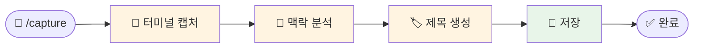

# 나의 워크샵 스킬 설계서

> 📋 **이 설계서는 [사전설문응답.md](사전설문응답.md) 인터뷰를 바탕으로 작성되었습니다.**

> ⚠️ **이 설계서는 초안입니다!**
>
> 정답이 아니에요. 워크샵 당일 강사님과 함께 범위를 더 좁히거나, 더 구체화할 수 있습니다.
>
> **사전과제의 목적**:
> 1. 스킬을 설치해서 한 번 써본 것 ✅
> 2. 나만의 스킬 설계서를 만들어서 "아, 내 작업이 이렇게 자동화되겠구나", "이런 흐름이겠구나" 감 잡기 ✅
>
> 이 정도면 충분해요! 나머지는 워크샵에서 함께 다듬어봐요 😊

## 목차
- [0. 선언](#0-선언)
- [한눈에 보기](#한눈에-보기)
- [Core (필수)](#core-필수)
  - [1. 언제 쓰나요?](#1-언제-쓰나요)
  - [2. 사용법](#2-사용법)
  - [3. 입력/출력 명세](#3-입력출력-명세)
  - [4. 범위](#4-범위)
  - [5. 데이터/도구/권한](#5-데이터도구권한)
  - [6. 실패/예외 처리](#6-실패예외-처리)
  - [7. 대화 시나리오](#7-대화-시나리오)
  - [8. 테스트 & 완료 기준](#8-테스트--완료-기준)
- [Optional](#optional-스킬-유형에-따라-선택)
  - [A. 파일 기반](#a-파일-기반인-경우)
- [나중에 더 발전시킬 아이디어](#나중에-더-발전시킬-아이디어)

---

## 0. 선언

- **스킬 이름**: `capture`
- **한 줄 설명**: Claude Code 개발 중 터미널 화면을 명령어 한 번으로 캡처하고, 대화 맥락 기반 제목을 자동 생성하는 스킬
- **만드는 사람**: 윤누리 / PM·개발자 (GPTers/Geniefy)
- **스킬 유형**: [x] 파일 기반  [ ] 텍스트 변환  [ ] 외부 API  [ ] 다단계 워크플로우
- **MVP 목표**: "`/capture` 한 번이면 터미널 스크린샷 + 자동 제목이 screenshots/ 폴더에 저장된다"

---

## 한눈에 보기

### 외부 연동

별도 외부 서비스 연동 없이 **로컬에서 모두 동작**합니다.

| 도구 | 용도 | 비고 |
|------|------|------|
| macOS `screencapture` | 터미널 윈도우 캡처 | 기본 내장 명령어 |
| Claude Code 세션 컨텍스트 | 대화 맥락 기반 제목 생성 | 추가 설정 불필요 |

### 워크플로 시각화

> 💡 **다이어그램이 안 보이나요?**
>
> VSCode에서 Mermaid 다이어그램을 보려면 확장 프로그램이 필요해요:
> 1. VSCode 왼쪽 사이드바에서 **확장(Extensions)** 아이콘 클릭 (또는 `Cmd+Shift+X`)
> 2. `Markdown Preview Mermaid Support` 검색
> 3. **Install** 클릭
> 4. 이 파일을 다시 열고 **미리보기**(`Cmd+Shift+V`)로 확인!



**흐름 요약**: `/capture` 입력 → 터미널 스크린샷 → 현재 대화 맥락 읽기 → `01_프로젝트-초기-세팅.png` 형식으로 자동 저장

---

## Core (필수)

### 1. 언제 쓰나요?

**대표 상황**:
Claude Code로 개발하면서 지피터스 AI 사례 게시글에 넣을 스크린샷이 필요할 때. "이 대화 장면 캡처해야지!" 싶은 순간에 바로 `/capture`.

**왜 필요한가**:
- 개발에 몰입하면 캡처 타이밍을 놓침 → 이미지 없이 글 올리거나, 나중에 재현해서 다시 찍음
- CleanShot X로 수동 캡처하면 파일명이 `Screenshot 2026-02-19...` 식으로 의미 없음
- 게시글당 5장 정도 필요한데, 매번 수동이면 귀찮아서 안 하게 됨

### 2. 사용법

**이렇게 부르면**:
- `/capture`
- `/capture Next.js 라우팅 설정 장면`  (제목 직접 지정도 가능)

**결과물 형태**: [x] 파일  [ ] 메시지  [ ] 링크/리포트  [ ] 기타

**결과물 예시**:
> 📸 캡처 완료! `screenshots/03_API-라우트-생성.png` 저장됨 (총 3장)

### 3. 입력/출력 명세

| 구분 | 내용 |
|------|------|
| **사용자 입력** | `/capture` (명령어만) |
| **필수 옵션** | 없음 |
| **선택 옵션** | 제목 텍스트 (예: `/capture 로그인 페이지 완성`) — 없으면 대화 맥락에서 자동 생성 |
| **출력 규칙** | `{프로젝트}/screenshots/{번호}_{제목}.png` 형식. 번호는 01부터 순차 증가. 제목은 kebab-case 한글 허용. |

### 4. 범위

**하는 것** (3개 이내):
1. 현재 터미널(Claude Code) 윈도우 스크린샷 캡처
2. 대화 맥락 기반 파일명 자동 생성 (순번 + 설명)
3. `screenshots/` 폴더에 순서대로 저장

**안 하는 것** (2개 이내):
1. 웹 브라우저/앱 결과물 스크린샷 (이건 직접 또는 Playwright로 별도 처리)
2. 이미지를 지피터스에 자동 업로드 (게시글 작성은 /write-post 담당)

### 5. 데이터/도구/권한

| 항목 | 내용 |
|------|------|
| **읽는 데이터** | Claude Code 현재 세션의 대화 컨텍스트 (제목 생성용) |
| **쓰는 위치** | `{현재 프로젝트}/screenshots/` 폴더 (없으면 자동 생성) |
| **외부 서비스** | 없음 (로컬 전용) |
| **민감정보** | 없음 |

### 6. 실패/예외 처리

**예상되는 실패 상황**:
1. **macOS가 아닌 환경**: `screencapture` 명령어가 없음
2. **터미널 윈도우 식별 실패**: 여러 터미널이 열려 있을 때 어떤 걸 찍을지
3. **screenshots 폴더 권한 문제**: 드물지만 쓰기 권한이 없는 경우

**실패 시 안내 원칙**:
- macOS 아닌 경우: "이 스킬은 macOS 전용이에요. Linux에서는 `import` 명령어로 대체할 수 있어요."
- 윈도우 식별 실패: 현재 포커스된 윈도우를 기본으로 캡처
- 폴더 문제: 자동으로 `mkdir -p` 시도, 그래도 안 되면 안내

### 7. 대화 시나리오

**정상 케이스**:

**나**: `/capture`

**스킬**:
> 📸 캡처 완료!
> `screenshots/01_프로젝트-초기-세팅.png` 저장됨
> (screenshots/ 폴더에 총 1장)

---

**나**: `/capture API 엔드포인트 생성`

**스킬**:
> 📸 캡처 완료!
> `screenshots/02_API-엔드포인트-생성.png` 저장됨
> (screenshots/ 폴더에 총 2장)

---

**실패 케이스**:

**나**: `/capture` (Linux 환경에서)

**스킬**:
> ⚠️ `screencapture` 명령어를 찾을 수 없어요.
> 이 스킬은 macOS 전용입니다. Linux에서는 `import -window root screenshot.png` 명령어로 대체해보세요!

### 8. 테스트 & 완료 기준

**테스트 체크리스트**:
- [ ] `/capture` 실행 시 `screenshots/` 폴더에 PNG 파일 생성됨
- [ ] 파일명이 `01_설명.png` 형식으로 순번 자동 증가
- [ ] 제목 미지정 시 대화 맥락에서 자동 생성됨
- [ ] 제목 직접 지정 시 해당 텍스트가 파일명에 반영됨
- [ ] `screenshots/` 폴더가 없으면 자동 생성됨

**Done 기준**:
"`/capture` 한 번 치면 터미널 스크린샷이 의미 있는 파일명으로 screenshots/ 폴더에 저장되고, 나중에 /write-post 할 때 바로 활용할 수 있는 상태"

---

## Optional (스킬 유형에 따라 선택)

### A. 파일 기반인 경우

| 항목 | 내용 |
|------|------|
| **지원 형식** | .png (스크린샷 출력) |
| **예시 입력 파일** | 없음 (명령어 트리거) |
| **출력 파일 예시** | `screenshots/01_프로젝트-초기-세팅.png` |
| **파일명 규칙** | `{2자리 순번}_{kebab-case-설명}.png` |

---

## 나중에 더 발전시킬 아이디어

- [ ] **/write-post 연동**: /capture로 모은 이미지를 /write-post가 자동으로 글 중간에 배치
- [ ] **이미지 목록 보기**: `/capture list`로 현재까지 캡처한 이미지 목록 + 미리보기
- [ ] **웹 결과물 자동 캡처**: Playwright 연동으로 `localhost:3000` 자동 스크린샷
- [ ] **이미지 어노테이션**: 캡처 후 핵심 부분에 자동 하이라이트/화살표 추가
- [ ] **GIF 캡처**: 터미널 동작 과정을 짧은 GIF로 자동 녹화

---

## 배포 준비 (워크샵 후)

워크샵에서 스킬을 완성한 후, GitHub에 배포하여 다른 사람도 사용할 수 있게 합니다.

### 필요한 파일

| 파일 | 상태 | 설명 |
|------|------|------|
| `SKILL.md` | [ ] 미완성 | 스킬 정의 (워크샵에서 작성) |
| `README.md` | [ ] 자동생성 예정 | 설치 가이드 (배포 시 자동 생성) |

### 배포 방법

워크샵에서 스킬을 완성한 후, Claude Code에게 말하세요:

```
이 스킬 배포해줘
```

Claude Code가 자동으로:
1. README.md 생성 (설치 방법 + 사용법 가이드)
2. GitHub 레포 생성
3. 설치 명령어 안내

---

**워크샵 당일 이 설계서 가져오세요!**
