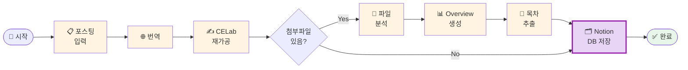

# 나의 워크샵 스킬 설계서

> 📋 **이 설계서는 [사전설문응답.md](사전설문응답.md) 인터뷰를 바탕으로 작성되었습니다.**

> ⚠️ **이 설계서는 초안입니다!**
>
> 정답이 아니에요. 워크샵 당일 강사님과 함께 범위를 더 좁히거나, 더 구체화할 수 있습니다.
>
> **사전과제의 목적**:
> 1. 스킬을 설치해서 한 번 써본 것 ✅
> 2. 나만의 스킬 설계서를 만들어서 "아, 내 작업이 이렇게 자동화되겠구나", "이런 흐름이겠구나" 감 잡기 ✅
>
> 이 정도면 충분해요! 나머지는 워크샵에서 함께 다듬어봐요 😊

## 목차
- [0. 선언](#0-선언)
- [한눈에 보기](#한눈에-보기)
- [Core (필수)](#core-필수)
  - [1. 언제 쓰나요?](#1-언제-쓰나요)
  - [2. 사용법](#2-사용법)
  - [3. 입력/출력 명세](#3-입력출력-명세)
  - [4. 범위](#4-범위)
  - [5. 데이터/도구/권한](#5-데이터도구권한)
  - [6. 실패/예외 처리](#6-실패예외-처리)
  - [7. 대화 시나리오](#7-대화-시나리오)
  - [8. 테스트 & 완료 기준](#8-테스트--완료-기준)
- [Optional](#optional)
  - [A. 파일 기반](#a-파일-기반)
  - [B. 외부 API 연동](#b-외부-api-연동)
  - [C. 다단계 워크플로우](#c-다단계-워크플로우)
- [나중에 더 발전시킬 아이디어](#나중에-더-발전시킬-아이디어)

---

## 0. 선언

- **스킬 이름**: `celab-content-curator`
- **한 줄 설명**: LinkedIn 팔로워 포스팅을 번역·재가공하고, 첨부파일을 분석하여 CELab Notion DB에 자동 저장
- **만드는 사람**: 화공연구소_CELab 운영자
- **스킬 유형**: [x] 파일 기반  [x] 외부 API  [x] 다단계 워크플로우
- **MVP 목표**: "LinkedIn 포스팅 내용과 첨부파일을 주면, CELab 스타일로 재가공하고 Notion DB에 자동 저장된다"

---

## 한눈에 보기

### 외부 연동

| 서비스 | 용도 | 연동 방식 | 복잡도 | 가이드 |
|--------|------|----------|--------|--------|
| Notion | DB 읽기·쓰기 (행 추가, 열 채우기) | MCP | 쉬움 | [📘 설정 가이드](연동가이드/notion.md) |

> 📁 상세 설정 가이드: [연동가이드/](연동가이드/) 폴더 참조

> 💡 **당일 설정 가능!** API 키만 있으면 돼요. 워크샵 10~15분이면 충분해요.

### 워크플로 시각화

> 💡 **다이어그램이 안 보이나요?**
>
> VSCode에서 Mermaid 다이어그램을 보려면 확장 프로그램이 필요해요:
> 1. VSCode 왼쪽 사이드바에서 **확장(Extensions)** 아이콘 클릭 (또는 `Cmd+Shift+X`)
> 2. `Markdown Preview Mermaid Support` 검색
> 3. **Install** 클릭
> 4. 이 파일을 다시 열고 **미리보기**(`Cmd+Shift+V`)로 확인!



---

## Core (필수)

### 1. 언제 쓰나요?

**대표 상황**:
매주 LinkedIn에서 팔로워들의 영문 포스팅을 확인하고, 내용과 첨부파일(PDF/PPT/Word)을 Notion DB에 정리해야 할 때.

**왜 필요한가** (불편/비용/시간):
- 현재 주 1회, 3시간 이상 소요
- 링크 하나하나 들어가서 복사 → 붙여넣기 → 번역 → 재가공 → 파일 다운로드 → Notion 입력 반복
- 한 달이면 12시간+, 단순 반복 작업에 너무 많은 시간 낭비

### 2. 사용법

**이렇게 부르면**:
- `/celab-content-curator`
- "링크드인 콘텐츠 처리해줘"
- "이 포스팅 CELab용으로 정리해줘"

**결과물 형태**: [x] 파일  [x] 기타 (Notion DB 자동 입력)

**결과물 예시**:
> ✅ Notion DB 업데이트 완료!
>
> - 원문: [LinkedIn 포스팅 링크]
> - 번역문: "AI가 화학 연구를 어떻게 바꾸고 있는가..."
> - CELab 포스팅: "🔬 화공연구소가 주목한 이번 주 AI 트렌드..."
> - 첨부파일 분석: overview.md 생성 완료 (12페이지 → 3분 요약)
> - 목차: 5개 챕터 추출 완료

### 3. 입력/출력 명세

| 구분 | 내용 |
|------|------|
| **사용자 입력** | LinkedIn 포스팅 URL 또는 텍스트 붙여넣기 + 첨부파일 (PDF/PPT/Word, 선택) |
| **필수 옵션** | 포스팅 원문 (텍스트 또는 URL) |
| **선택 옵션** | 첨부파일 경로, Notion DB 페이지 ID |
| **출력 규칙** | 번역문(한글), CELab 재가공 포스팅(한글, 화공연구소 톤), overview(마크다운), 목차(리스트) → 모두 Notion DB 해당 열에 저장 |

### 4. 범위

**하는 것** (3개 이내):
1. 영문 LinkedIn 포스팅 → 한글 번역 + CELab 스타일 재가공 포스팅 생성
2. 첨부파일(PDF/PPT/Word) 읽기 → 핵심 overview 요약 + 전체 목차 추출
3. 결과물 전체를 Notion DB 해당 행에 자동 저장

**안 하는 것** (2개 이내):
1. LinkedIn 자동 로그인 및 크롤링 (수동으로 내용 복사해서 붙여넣기)
2. 실제 PPT 파일 생성 (마크다운 형태의 overview 텍스트로 대체)

### 5. 데이터/도구/권한

| 항목 | 내용 |
|------|------|
| **읽는 데이터** | 사용자가 붙여넣은 LinkedIn 포스팅 텍스트, 로컬 첨부파일 (PDF/PPT/Word) |
| **쓰는 위치** | Notion DB (지정한 데이터베이스의 새 행 또는 기존 행) |
| **외부 서비스** | Notion MCP |
| **민감정보** | Notion Integration Token (`NOTION_TOKEN`) — `.env` 파일에 저장, Git 제외 |

### 6. 실패/예외 처리

**예상되는 실패 상황**:
1. 첨부파일 형식 미지원 (예: 이미지만 있는 PDF) → "이 파일은 텍스트 추출이 어려워요. 직접 내용을 붙여넣어 주시면 처리할게요!"
2. Notion 토큰 만료 또는 권한 없음 → "Notion 연결에 문제가 있어요. `.env`의 NOTION_TOKEN을 확인해주세요!"
3. 포스팅 내용이 너무 짧거나 없음 → "처리할 내용이 충분하지 않아요. 포스팅 원문을 더 붙여넣어 주세요!"

**실패 시 안내 원칙**:
무엇이 문제인지 + 어떻게 해결하면 되는지 함께 안내. 부분 완료된 내용은 중간 저장 후 알림.

### 7. 대화 시나리오

**정상 케이스**:

**나**: "링크드인 콘텐츠 처리해줘"
(포스팅 텍스트 + report.pdf 첨부)

**스킬**:
> 📥 내용 받았어요! 처리 시작할게요.
>
> 1️⃣ 번역 중... 완료
> 2️⃣ CELab 포스팅 재가공 중... 완료
> 3️⃣ report.pdf 분석 중... 완료 (overview + 목차 추출)
> 4️⃣ Notion DB 저장 중... 완료
>
> ✅ 모두 완료! Notion DB에서 확인해보세요.

**실패 케이스**:

**나**: "링크드인 콘텐츠 처리해줘" (내용 없이)

**스킬**:
> 처리할 LinkedIn 포스팅 내용이 필요해요!
> 포스팅 텍스트를 복사해서 붙여넣어 주시거나, LinkedIn URL을 알려주세요.

### 8. 테스트 & 완료 기준

**테스트 체크리스트**:
- [ ] 영문 포스팅 텍스트 붙여넣으면 → 번역 + CELab 재가공 포스팅 생성되는지
- [ ] PDF 첨부하면 → overview 요약 + 목차 추출되는지
- [ ] Notion DB에 결과물이 올바른 열에 저장되는지
- [ ] 첨부파일 없이 텍스트만 줘도 동작하는지

**Done 기준**:
"LinkedIn 포스팅 내용과 PDF를 붙여넣으면, 번역·재가공·overview·목차가 Notion DB에 자동으로 저장된다."

---

## Optional

### A. 파일 기반

| 항목 | 내용 |
|------|------|
| **지원 형식** | .pdf / .pptx / .docx / .txt |
| **예시 입력 파일** | AI_in_Chemistry_2025.pdf, Research_Trends.pptx |
| **출력 파일 예시** | Notion DB 내 overview 열 (마크다운 텍스트) + 목차 열 (리스트) |

### B. 외부 API 연동

1개의 외부 서비스 연동이 필요합니다.

#### 환경변수 요약

이 스킬에 필요한 환경변수 목록입니다. (`.env.example` 참조)

| 변수명 | 서비스 | 발급 방법 |
|--------|--------|----------|
| `NOTION_TOKEN` | Notion | https://www.notion.so/my-integrations |

> **Tip**: Claude Code에게 "노션 토큰은 ntn_xxxx야" 라고 알려주면 자동으로 `.env`에 저장해줘요!

#### B-1. Notion

| 항목 | 내용 |
|------|------|
| **Context7 Library ID** | `/makenotion/notion-mcp-server` |
| **필요한 credential** | Notion Integration Token |
| **환경변수** | `NOTION_TOKEN` |
| **복잡도** | 쉬움 (API 키만 필요) |
| **예상 설정 시간** | 10~15분 |

**설정 가이드 요약**:
1. https://www.notion.so/my-integrations 접속
2. "새 API 통합" 클릭 → 이름 입력 → 저장
3. "Internal Integration Token" 복사 (`ntn_`으로 시작)
4. `~/.mcp.json`에 Notion MCP 서버 추가
5. 연동할 Notion DB 페이지에서 "연결" → 만든 통합 추가

상세 가이드: [📘 notion.md](연동가이드/notion.md)

---

> **참고**: 상세 가이드는 `연동가이드/` 폴더의 개별 파일을 확인하세요.

### C. 다단계 워크플로우

**단계 목록**:
1. **입력 수신** → 산출물: 원문 텍스트 + 첨부파일 목록
2. **번역 & 재가공** → 산출물: 한글 번역문 + CELab 포스팅 초안
3. **첨부파일 분석** → 산출물: overview 마크다운 + 전체 목차 리스트
4. **Notion DB 저장** → 산출물: DB 행 업데이트 완료 확인

**중단/재개 방법**:
중간 단계까지 완료된 결과를 텍스트로 출력해두어, 재실행 시 해당 내용을 붙여넣으면 이어서 처리 가능.

---

## 나중에 더 발전시킬 아이디어

- [ ] LinkedIn URL만 넣으면 자동으로 포스팅 내용 가져오기 (웹 스크래핑)
- [ ] 여러 포스팅을 한 번에 배치 처리 (주간 묶음 처리)
- [ ] CELab 포스팅 초안을 자동으로 인스타그램/블로그 형식으로도 변환
- [ ] overview PPT 실제 파일(.pptx) 자동 생성

---

## 배포 준비 (워크샵 후)

워크샵에서 스킬을 완성한 후, GitHub에 배포하여 다른 사람도 사용할 수 있게 합니다.

### 필요한 파일

| 파일 | 상태 | 설명 |
|------|------|------|
| `SKILL.md` | [ ] 미완성 | 스킬 정의 (워크샵에서 작성) |
| `README.md` | [ ] 자동생성 예정 | 설치 가이드 (배포 시 자동 생성) |
| `.env.example` | [x] 완료 | 환경변수 예시 |
| `.gitignore` | [x] 완료 | .env 제외 설정 |

### 배포 방법

워크샵에서 스킬을 완성한 후, Claude Code에게 말하세요:

```
이 스킬 배포해줘
```

Claude Code가 자동으로:
1. README.md 생성 (설치 방법 + 환경변수 가이드)
2. GitHub 레포 생성
3. 설치 명령어 안내

---

**워크샵 당일 이 설계서 가져오세요!**
