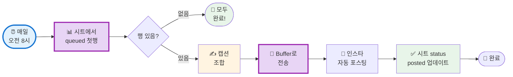

# 나의 워크샵 스킬 설계서

> 📋 **이 설계서는 [사전설문응답.md](사전설문응답.md) 인터뷰를 바탕으로 작성되었습니다.**

> ⚠️ **이 설계서는 초안입니다!**
>
> 정답이 아니에요. 워크샵 당일 강사님과 함께 범위를 더 좁히거나, 더 구체화할 수 있습니다.
>
> **사전과제의 목적**:
> 1. 스킬을 설치해서 한 번 써본 것 ✅
> 2. 나만의 자동화 흐름을 설계해서 "아, 이렇게 되겠구나" 감 잡기 ✅
>
> 이 정도면 충분해요! 나머지는 워크샵에서 함께 다듬어봐요 😊

## 목차
- [0. 선언](#0-선언)
- [한눈에 보기](#한눈에-보기)
- [Core (필수)](#core-필수)
  - [1. 언제 쓰나요?](#1-언제-쓰나요)
  - [2. 작동 방식](#2-작동-방식)
  - [3. 입력/출력 명세](#3-입력출력-명세)
  - [4. 범위](#4-범위)
  - [5. 데이터/도구/권한](#5-데이터도구권한)
  - [6. 실패/예외 처리](#6-실패예외-처리)
  - [7. 시나리오](#7-시나리오)
  - [8. 테스트 & 완료 기준](#8-테스트--완료-기준)
- [Optional](#optional)
  - [B. 외부 서비스 연동](#b-외부-서비스-연동)
  - [C. 다단계 워크플로우](#c-다단계-워크플로우)
- [나중에 더 발전시킬 아이디어](#나중에-더-발전시킬-아이디어)

---

## 0. 선언

- **스킬 이름**: `congenial-po-leadership`
- **한 줄 설명**: 구글 시트의 PO 리더십 표현을 Make.com이 매일 오전 8시에 자동으로 읽어 Buffer를 통해 인스타그램에 포스팅한다
- **만드는 사람**: CPO / UX Researcher / 팀프레너십 코치
- **자동화 방식**: 노코드 (Make.com + Buffer)
- **MVP 목표**: "매일 오전 8시, 구글 시트에서 다음 표현을 읽어 인스타그램에 자동으로 올라간다"

---

## 한눈에 보기

### 외부 연동

| 서비스 | 용도 | 연동 방식 | 복잡도 | 가이드 |
|--------|------|----------|--------|--------|
| Google Sheets | 표현 목록 관리 + 포스팅 상태 업데이트 | Make.com 모듈 | 쉬움 | [📘 설정 가이드](연동가이드/google-sheets.md) |
| Google Drive | 이미지 파일 공개 URL 호스팅 | 공유 링크 | 쉬움 | — |
| Make.com | 매일 오전 8시 자동화 트리거 + 시나리오 | 노코드 | 중간 | [📘 설정 가이드](연동가이드/make.md) |
| Buffer | Instagram 포스팅 스케줄링 | Make.com 연동 | 쉬움 | [📘 설정 가이드](연동가이드/buffer.md) |

> 💡 **Instagram Graph API 직접 연동 불필요!** Buffer가 대신 처리해줘요.
>
> 📁 상세 설정 가이드: [연동가이드/](연동가이드/) 폴더 참조

### 구글 시트 구조 (Language Archive)

| A (id) | B (korean) | C (english) | D (insight) | E (image_url) | F (status) | G (publish_date) |
|--------|-----------|-------------|-------------|---------------|------------|-----------------|
| 1 | 안전할 때만이 아니라, 일찍 목소리를 내세요. | Speak up early, not just when it's safe. | 심리적 안전감이 생기기 전에도 말할 용기가 필요하다 | https://drive.google.com/... | queued | |
| 2 | 사용자가 달성하려는 것이 무엇인지 물어보세요. | Ask what the user is trying to achieve. | 기능이 아닌 목적을 먼저 이해한다 | https://drive.google.com/... | posted | 2026-02-17 |

**status 값**: `queued` (대기) / `posted` (완료) / `hold` (보류)

### 워크플로 시각화

> 💡 **다이어그램이 안 보이나요?**
>
> VSCode에서 Mermaid 다이어그램을 보려면 확장 프로그램이 필요해요:
> 1. VSCode 왼쪽 사이드바에서 **확장(Extensions)** 아이콘 클릭 (또는 `Cmd+Shift+X`)
> 2. `Markdown Preview Mermaid Support` 검색
> 3. **Install** 클릭
> 4. 이 파일을 다시 열고 **미리보기**(`Cmd+Shift+V`)로 확인!



---

## Core (필수)

### 1. 언제 쓰나요?

**대표 상황**:
셀프 브랜딩을 위해 PO/리더십 관련 한/영 표현을 매일 인스타그램에 올리고 싶은데, 매일 수동으로 올리는 게 번거롭고 빠뜨리기 쉬울 때.

**왜 필요한가**:
- 300개 표현을 구글 시트에 미리 준비해두고, 매일 오전 8시에 자동으로 1개씩 포스팅
- 수동으로 하면 매일 잊지 않고 챙겨야 하고, 포스팅 형식 잡는 데 시간 소요
- 꾸준한 셀프브랜딩을 위해 완전 자동화가 필수

### 2. 작동 방식

**완전 자동 실행** — 매일 오전 8시, 아무것도 안 해도 Make.com이 자동으로 실행

**포스팅 캡션 형식**:
```
안전할 때만이 아니라, 일찍 목소리를 내세요.

Speak up early, not just when it's safe.

심리적 안전감이 생기기 전에도 말할 용기가 필요하다 💡

#PO리더십 #ProductLeadership #팀문화 #congenialPO #리더십
```

**필요한 경우 수동 개입**:
- 시트에서 특정 표현을 `hold`로 바꾸면 건너뜀
- Buffer 대시보드에서 예약 포스팅 수정/취소 가능

### 3. 입력/출력 명세

| 구분 | 내용 |
|------|------|
| **트리거** | Make.com 스케줄러 (매일 오전 8시) |
| **입력** | 구글 시트의 status=queued인 첫 번째 행 |
| **출력** | Buffer를 통한 인스타그램 포스팅 |
| **이미지** | 구글 드라이브 공개 URL (image_url 컬럼) |
| **캡션 형식** | 한글 표현 + 영문 표현 + insight + 해시태그 |

### 4. 범위

**하는 것**:
1. 매일 오전 8시 자동으로 구글 시트에서 `status=queued`인 첫 번째 행 읽기
2. 해당 행의 `image_url` (구글 드라이브 공개 링크)과 캡션을 Buffer로 전송
3. Buffer가 인스타그램에 자동 포스팅
4. 포스팅 완료 후 시트 해당 행의 status를 `posted`, publish_date를 오늘 날짜로 업데이트

**안 하는 것**:
1. 이미지 자동 생성 (직접 만든 PNG 파일 사용, 주 10개씩 추가)
2. 뉴스레터 발송 (나중에 별도로 추가)
3. 포스팅 성과 자동 수집 (나중에 추가)

### 5. 데이터/도구/권한

| 항목 | 내용 |
|------|------|
| **읽는 데이터** | 구글 시트 Language Archive (id, korean, english, insight, image_url, status, publish_date) |
| **이미지 파일** | 구글 드라이브 공개 URL — 직접 제작한 PNG (주 10개씩 추가) |
| **쓰는 위치** | 인스타그램 피드 (Buffer 경유) + 구글 시트 status/publish_date 컬럼 |
| **자동화 도구** | Make.com (무료 플랜으로 시작 가능, 월 1,000 operations) |
| **포스팅 도구** | Buffer Essentials 플랜 (~$6/월, 예약 포스팅 무제한) |
| **민감정보** | Make.com에서 Google/Buffer 계정 연결 (별도 API 키 불필요) |

### 6. 실패/예외 처리

**예상되는 실패 상황**:
1. `image_url`이 비공개 링크일 때 — 구글 드라이브 공유 설정 확인 필요
2. `status=queued`인 행이 없을 때 — 시트에 새 표현 추가 필요
3. Make.com operations 한도 초과 (무료 플랜 월 1,000개)
4. Buffer 계정 연결 만료

**실패 시 대응**:
- image_url 오류: Make.com에서 에러 알림 이메일 발송 → 구글 드라이브 공유 설정을 "링크가 있는 모든 사용자"로 변경
- queued 없음: Make.com이 조용히 종료 (포스팅 없음) → 시트에 표현 추가
- operations 초과: Make.com 유료 플랜으로 업그레이드 또는 다음 달 초기화 대기
- 300개 완료 시: "🎉 300개 표현을 모두 포스팅했어요! 새로운 표현을 추가해주세요."

### 7. 시나리오

**정상 케이스 (매일 오전 8시 자동 실행)**:

1. Make.com 트리거 작동
2. 구글 시트에서 `status=queued`인 42번 행 발견
3. 캡션 조합:
   ```
   안전할 때만이 아니라, 일찍 목소리를 내세요.
   Speak up early, not just when it's safe.
   심리적 안전감이 생기기 전에도 말할 용기가 필요하다 💡
   #PO리더십 #ProductLeadership #팀문화 #congenialPO #리더십
   ```
4. Buffer로 image_url + 캡션 전송 → 인스타그램 포스팅
5. 시트 42행: status → `posted`, publish_date → `2026-02-18`

**수동 개입 케이스**:

특정 표현을 건너뛰고 싶을 때:
→ 구글 시트에서 해당 행의 status를 `hold`로 변경
→ Make.com이 다음 `queued` 행으로 넘어감

### 8. 테스트 & 완료 기준

**테스트 체크리스트**:
- [ ] 구글 시트에 Language Archive 구조로 테스트 데이터 2-3행 입력
- [ ] 구글 드라이브 이미지 공개 URL이 브라우저에서 바로 열리는지 확인
- [ ] Make.com 시나리오 수동 실행 → 구글 시트 읽기 성공
- [ ] Buffer로 포스팅 전송 → 인스타그램에 실제 포스팅 확인
- [ ] 시트 status가 `posted`로 업데이트되는지 확인
- [ ] 다음날 다음 queued 행을 읽어오는지 확인

**Done 기준**:
"매일 오전 8시, 구글 시트에서 queued 상태인 첫 번째 표현을 읽어 이미지와 캡션을 인스타그램에 자동으로 올리고, 시트 status가 posted로 업데이트된다."

---

## Optional

### B. 외부 서비스 연동

3개의 외부 서비스 연동이 필요합니다. 모두 Make.com 안에서 노코드로 연결해요.

#### B-1. Google Sheets

| 항목 | 내용 |
|------|------|
| **역할** | 표현 목록 읽기 + status/publish_date 업데이트 |
| **연결 방식** | Make.com Google Sheets 모듈 (OAuth 로그인) |
| **복잡도** | 쉬움 |
| **예상 설정 시간** | 약 10분 |

**설정 가이드**: [📘 Google Sheets 설정 가이드](연동가이드/google-sheets.md)

#### B-2. Google Drive

| 항목 | 내용 |
|------|------|
| **역할** | 이미지 파일 공개 URL 호스팅 |
| **연결 방식** | 파일 공유 → "링크가 있는 모든 사용자" → URL 복사 |
| **복잡도** | 쉬움 |
| **예상 설정 시간** | 약 5분 (이미지당) |

> 💡 **팁**: 폴더 전체를 공개로 만들면 이미지 추가할 때마다 개별 설정 불필요!

#### B-3. Make.com (자동화 허브)

| 항목 | 내용 |
|------|------|
| **역할** | 매일 오전 8시 트리거 + Google Sheets 읽기/쓰기 + Buffer 전송 |
| **플랜** | 무료 (월 1,000 operations, 충분함) |
| **복잡도** | 중간 (시나리오 설계 필요) |
| **예상 설정 시간** | 약 30-40분 |

**설정 가이드**: [📘 Make.com 설정 가이드](연동가이드/make.md)

#### B-4. Buffer

| 항목 | 내용 |
|------|------|
| **역할** | Instagram 포스팅 스케줄링 (Make.com에서 전달받아 포스팅) |
| **플랜** | Essentials ($6/월) — 예약 포스팅 무제한 |
| **복잡도** | 쉬움 (Make.com에서 API 연결) |
| **예상 설정 시간** | 약 15분 |

**설정 가이드**: [📘 Buffer 설정 가이드](연동가이드/buffer.md)

---

> **참고**: 상세 가이드는 `연동가이드/` 폴더의 개별 파일을 확인하세요.

### C. 다단계 워크플로우

**Make.com 시나리오 단계**:

1. **트리거** → Make.com 스케줄러 (매일 08:00 KST)
   - 산출물: 시나리오 실행 시작

2. **구글 시트 읽기** → status=queued인 첫 번째 행 조회
   - 산출물: id, korean, english, insight, image_url

3. **분기 처리** → queued 행 있음/없음 판단
   - 없으면: 시나리오 종료 (포스팅 없음)
   - 있으면: 다음 단계

4. **캡션 조합** → 한글 + 영문 + insight + 해시태그 텍스트 생성
   - 산출물: 완성된 캡션 문자열

5. **Buffer 전송** → image_url + 캡션을 Buffer API로 전달
   - 산출물: Buffer 큐에 포스팅 등록 → 즉시 인스타그램 게시

6. **구글 시트 업데이트** → 해당 행 status=posted, publish_date=오늘
   - 산출물: 업데이트된 시트 행

**중단/재개 방법**:
- 포스팅 실패 시: 시트 status를 업데이트하지 않음 → 다음 날 같은 행 재시도
- Make.com 에러 로그에서 실패 원인 확인 가능

---

## 나중에 더 발전시킬 아이디어

- [ ] 뉴스레터(메일리) 연동 — 주 1회 표현 모음 발송 (Make.com에 시나리오 추가)
- [ ] 이미지 자동 생성 (Templated / Bannerbear API — 텍스트만 바꿔서 이미지 생성)
- [ ] 포스팅 성과 (좋아요, 댓글 수) 구글 시트에 자동 기록
- [ ] 표현 카테고리 컬럼 추가 → 카테고리별 필터링 (리더십 / 커뮤니케이션 / PO 스킬 등)
- [ ] 주간 리캡 스레드 자동 생성 (7개 표현 모아서 인스타 스레드로)

---

## 배포 준비 (워크샵 후)

워크샵에서 시나리오를 완성한 후, GitHub에 설계서와 가이드를 올려 다른 사람도 참고할 수 있게 합니다.

### 필요한 파일

| 파일 | 상태 | 설명 |
|------|------|------|
| 이 설계서 | [x] 완료 | 자동화 전체 설계 |
| `연동가이드/` | [ ] 작성 예정 | Make, Buffer, Sheets 가이드 |
| `README.md` | [ ] 자동생성 예정 | 설치 가이드 (배포 시 자동 생성) |

### 배포 방법

워크샵에서 완성한 후, Claude Code에게 말하세요:

```
이 설계서 GitHub에 올려줘
```

---

**워크샵 당일 이 설계서 가져오세요!**
