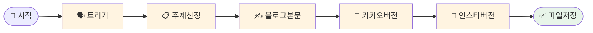

# 나의 워크샵 스킬 설계서

> 📋 **이 설계서는 [사전설문응답.md](사전설문응답.md) 인터뷰를 바탕으로 작성되었습니다.**

> ⚠️ **이 설계서는 초안입니다!**
>
> 정답이 아니에요. 워크샵 당일 강사님과 함께 범위를 더 좁히거나, 더 구체화할 수 있습니다.
>
> **사전과제의 목적**:
> 1. 스킬을 설치해서 한 번 써본 것 ✅
> 2. 나만의 스킬 설계서를 만들어서 "아, 내 작업이 이렇게 자동화되겠구나", "이런 흐름이겠구나" 감 잡기 ✅
>
> 이 정도면 충분해요! 나머지는 워크샵에서 함께 다듬어봐요 😊

## 목차
- [0. 선언](#0-선언)
- [한눈에 보기](#한눈에-보기)
- [Core (필수)](#core-필수)
  - [1. 언제 쓰나요?](#1-언제-쓰나요)
  - [2. 사용법](#2-사용법)
  - [3. 입력/출력 명세](#3-입력출력-명세)
  - [4. 범위](#4-범위)
  - [5. 데이터/도구/권한](#5-데이터도구권한)
  - [6. 실패/예외 처리](#6-실패예외-처리)
  - [7. 대화 시나리오](#7-대화-시나리오)
  - [8. 테스트 & 완료 기준](#8-테스트--완료-기준)
- [Optional](#optional)
  - [A. 파일 기반](#a-파일-기반)
  - [C. 다단계 워크플로우](#c-다단계-워크플로우)
- [나중에 더 발전시킬 아이디어](#나중에-더-발전시킬-아이디어)
- [배포 준비](#배포-준비-워크샵-후)

---

## 0. 선언

- **스킬 이름**: `dental-content-writer`
- **한 줄 설명**: 치과 심미치료(라미네이트) 관련 블로그 글을 말 한 마디로 네이버/카카오/인스타 버전까지 한 번에 생성
- **만드는 사람**: 디자인·마케팅 담당자
- **스킬 유형**: [x] 텍스트 변환  [x] 파일 기반  [ ] 외부 API  [x] 다단계 워크플로우
- **MVP 목표**: "블로그 글 써줘" 한 마디에 네이버 블로그 본문 + 카카오 채널 버전 + 인스타 캡션이 파일 3개로 저장된다

---

## 한눈에 보기

### 외부 연동

별도 설정 없이 바로 시작할 수 있어요! 외부 API 연동이 없습니다.

### 워크플로 시각화

> 💡 **다이어그램이 안 보이나요?**
>
> VSCode에서 Mermaid 다이어그램을 보려면 확장 프로그램이 필요해요:
> 1. VSCode 왼쪽 사이드바에서 **확장(Extensions)** 아이콘 클릭 (또는 `Cmd+Shift+X`)
> 2. `Markdown Preview Mermaid Support` 검색
> 3. **Install** 클릭
> 4. 이 파일을 다시 열고 **미리보기**(`Cmd+Shift+V`)로 확인!



---

## Core (필수)

### 1. 언제 쓰나요?

**대표 상황**:
매주 2회, 치과 심미치료(라미네이트 등) 관련 블로그 글을 써야 할 때. 기존엔 ChatGPT/Gemini로 주제 잡고, 글 쓰고, 피그마에서 디자인까지 해서 네이버 블로그 + 카카오 플러스친구 + 인스타 세 곳에 올리는 작업.

**왜 필요한가** (불편/비용/시간):
- 주 2회, 매번 10분씩 → 한 달에 약 80분 소요
- AI 켜고 → 주제 고르고 → 글 쓰고 → 각 채널용으로 다시 다듬는 과정이 번거로움
- 채널별로 톤/길이를 따로 조정해야 해서 사실상 3번 쓰는 것과 같음

### 2. 사용법

**이렇게 부르면**:
- `/dental-content-writer`
- "블로그 글 써줘"
- "라미네이트 글 써줘"
- "오늘 포스팅 만들어줘"

**결과물 형태**: [ ] 메시지  [x] 파일  [ ] 링크/리포트  [ ] 기타

**결과물 예시**:
```
출력 파일:
📄 20260218-네이버블로그.md   ← SEO 최적화 본문 (800~1000자)
📄 20260218-카카오채널.md     ← 짧고 친근한 버전 (200자 내외)
📄 20260218-인스타그램.md     ← 캡션 + 해시태그 30개
```

### 3. 입력/출력 명세

| 구분 | 내용 |
|------|------|
| **사용자 입력** | 트리거 문장 (주제 지정 선택) |
| **필수 옵션** | 없음 (주제 자동 선정) |
| **선택 옵션** | 특정 주제 지정 가능 (예: "라미네이트 가격 글 써줘") |
| **출력 규칙** | 날짜-채널명.md 형식으로 3개 파일 저장, 복사해서 각 채널에 붙여넣기 |

### 4. 범위

**하는 것** (3개 이내):
1. 라미네이트/심미치료 관련 주제 자동 선정 (이전에 다룬 주제 피하기)
2. 네이버 블로그용 본문 생성 (SEO 키워드 포함, 800~1000자)
3. 카카오 채널용 + 인스타그램 캡션&해시태그 생성

**안 하는 것** (2개 이내):
1. 피그마 디자인 자동화 (복잡도 높음, 수동 유지)
2. 블로그/SNS 직접 포스팅 (복사+붙여넣기로 해결)

### 5. 데이터/도구/권한

| 항목 | 내용 |
|------|------|
| **읽는 데이터** | 이전 포스팅 기록 (topics.txt 또는 폴더 내 파일 목록) |
| **쓰는 위치** | `output/` 폴더, 날짜-채널명.md 형식 |
| **외부 서비스** | 없음 |
| **민감정보** | 없음 |

### 6. 실패/예외 처리

**예상되는 실패 상황**:
1. 주제가 이미 다 다뤄진 경우 → "비슷한 주제인데 각도를 바꿔서 써드릴까요?" 제안
2. 특정 주제를 지정했는데 치과와 무관한 경우 → "치과 심미치료와 연결된 방향으로 바꿔드릴게요!" 안내
3. 출력 폴더가 없는 경우 → 자동으로 `output/` 폴더 생성

**실패 시 안내 원칙**:
항상 대안을 제시. "안 돼요" 대신 "이렇게 해볼까요?" 방식으로 안내.

### 7. 대화 시나리오

**정상 케이스**:

**나**: "블로그 글 써줘"

**스킬**:
> 오늘의 주제: **라미네이트 시술 전 꼭 알아야 할 3가지**
>
> 📄 `output/20260218-네이버블로그.md` 저장 완료
> 📄 `output/20260218-카카오채널.md` 저장 완료
> 📄 `output/20260218-인스타그램.md` 저장 완료
>
> 복사해서 각 채널에 붙여넣기 하시면 돼요!

**주제 지정 케이스**:

**나**: "라미네이트 가격 글 써줘"

**스킬**:
> 주제: **라미네이트 비용, 얼마나 들까? 솔직하게 알려드려요**
>
> 📄 파일 3개 저장 완료!

**실패 케이스**:

**나**: "오늘은 임플란트 글 써줘"

**스킬**:
> 임플란트는 제 전문 분야가 아니라서요 😊
> 심미치료(라미네이트, 치아미백, 올세라믹) 관련 글로 바꿔드릴까요?

### 8. 테스트 & 완료 기준

**테스트 체크리스트**:
- [ ] "블로그 글 써줘" 실행 시 파일 3개가 output/ 폴더에 생성된다
- [ ] 네이버 블로그 파일이 800자 이상, SEO 키워드 포함이다
- [ ] 인스타 파일에 해시태그 15개 이상이 포함된다
- [ ] 같은 주제가 중복 생성되지 않는다

**Done 기준**:
"블로그 글 써줘" 한 마디로 3개 파일이 자동 생성되고, 그 내용을 바로 복사해서 각 채널에 올릴 수 있는 상태

---

## Optional

### A. 파일 기반

| 항목 | 내용 |
|------|------|
| **지원 형식** | .md |
| **예시 입력 파일** | `topics.txt` (이전에 쓴 주제 목록, 없으면 자동 생성) |
| **출력 파일 예시** | `output/20260218-네이버블로그.md`, `output/20260218-카카오채널.md`, `output/20260218-인스타그램.md` |

### C. 다단계 워크플로우

**단계 목록**:
1. **주제 선정** → 산출물: 오늘의 블로그 주제 1개 (topics.txt 참고해서 중복 피하기)
2. **네이버 블로그 본문 작성** → 산출물: SEO 최적화 본문 (800~1000자, 키워드 자연스럽게 포함)
3. **채널별 변환** → 산출물: 카카오 버전 (200자 내외) + 인스타 캡션+해시태그

**중단/재개 방법**:
특정 단계 지정 가능. 예: "주제만 선정해줘", "이 주제로 인스타 버전만 써줘"

---

## 나중에 더 발전시킬 아이디어

- [ ] 작성된 글 주제를 topics.txt에 자동 기록 (중복 방지)
- [ ] 계절/이벤트 맞춤 주제 추천 (예: 결혼 시즌 → 웨딩 스마일)
- [ ] 피그마 썸네일 텍스트 자동 생성 (복사해서 피그마에 붙이기)
- [ ] 월간 콘텐츠 캘린더 자동 생성 (8개 주제 미리 뽑기)

---

## 배포 준비 (워크샵 후)

워크샵에서 스킬을 완성한 후, GitHub에 배포하여 다른 사람도 사용할 수 있게 합니다.

### 필요한 파일

| 파일 | 상태 | 설명 |
|------|------|------|
| `SKILL.md` | [ ] 미완성 | 스킬 정의 (워크샵에서 작성) |
| `README.md` | [ ] 자동생성 예정 | 설치 가이드 (배포 시 자동 생성) |
| `.gitignore` | [x] 완료 | 불필요 파일 제외 설정 |

### 배포 방법

워크샵에서 스킬을 완성한 후, Claude Code에게 말하세요:

```
이 스킬 배포해줘
```

Claude Code가 자동으로:
1. README.md 생성 (설치 방법 + 사용법)
2. GitHub 레포 생성
3. 설치 명령어 안내

---

**워크샵 당일 이 설계서 가져오세요!**
