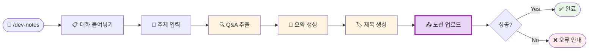

# 나의 워크샵 스킬 설계서

> 📋 **이 설계서는 [사전설문응답.md](사전설문응답.md) 인터뷰를 바탕으로 작성되었습니다.**

> ⚠️ **이 설계서는 초안입니다!**
>
> 정답이 아니에요. 워크샵 당일 강사님과 함께 범위를 더 좁히거나, 더 구체화할 수 있습니다.
>
> **사전과제의 목적**:
> 1. 스킬을 설치해서 한 번 써본 것 ✅
> 2. 나만의 스킬 설계서를 만들어서 "아, 내 작업이 이렇게 자동화되겠구나", "이런 흐름이겠구나" 감 잡기 ✅
>
> 이 정도면 충분해요! 나머지는 워크샵에서 함께 다듬어봐요 😊

## 목차
- [0. 선언](#0-선언)
- [한눈에 보기](#한눈에-보기)
- [Core (필수)](#core-필수)
  - [1. 언제 쓰나요?](#1-언제-쓰나요)
  - [2. 사용법](#2-사용법)
  - [3. 입력/출력 명세](#3-입력출력-명세)
  - [4. 범위](#4-범위)
  - [5. 데이터/도구/권한](#5-데이터도구권한)
  - [6. 실패/예외 처리](#6-실패예외-처리)
  - [7. 대화 시나리오](#7-대화-시나리오)
  - [8. 테스트 & 완료 기준](#8-테스트--완료-기준)
- [Optional](#optional)
  - [B. 외부 API 연동](#b-외부-api-연동인-경우)
  - [C. 다단계 워크플로우](#c-다단계-워크플로우인-경우)
- [나중에 더 발전시킬 아이디어](#나중에-더-발전시킬-아이디어)

---

## 0. 선언

- **스킬 이름**: `dev-notes`
- **한 줄 설명**: AI 대화 내용을 붙여넣으면 요약 + Q&A 토글로 노션 데이터베이스에 자동 저장
- **만드는 사람**: 프론트엔드 개발자
- **스킬 유형**: [x] 외부 API  [x] 다단계 워크플로우
- **MVP 목표**: "Cursor 대화 붙여넣고 주제 말하면, 노션 DB에 요약 + Q&A 토글 항목이 자동 생성된다"

---

## 한눈에 보기

### 외부 연동

| 서비스 | 용도 | 연동 방식 | 복잡도 | 가이드 |
|--------|------|----------|--------|--------|
| Notion | 데이터베이스에 항목 추가 (요약 + Q&A 토글) | MCP | 쉬움 | [📘 설정 가이드](연동가이드/notion.md) |

> 📁 상세 설정 가이드: [연동가이드/](연동가이드/) 폴더 참조

### 워크플로 시각화

> 💡 **다이어그램이 안 보이나요?**
>
> VSCode에서 Mermaid 다이어그램을 보려면 확장 프로그램이 필요해요:
> 1. VSCode 왼쪽 사이드바에서 **확장(Extensions)** 아이콘 클릭 (또는 `Cmd+Shift+X`)
> 2. `Markdown Preview Mermaid Support` 검색
> 3. **Install** 클릭
> 4. 이 파일을 다시 열고 **미리보기**(`Cmd+Shift+V`)로 확인!



---

## Core (필수)

### 1. 언제 쓰나요?

**대표 상황**:
- PR 올리고 나서 작업 내용을 노션에 기록할 때
- 새 기술/라이브러리 공부하다가 AI한테 물어봤던 내용 정리할 때
- 디버깅 과정에서 질문했던 것들을 나중에 찾아볼 수 있게 저장할 때

**왜 필요한가**:
- Cursor에서 매번 "md로 정리해줘" 요청하는 게 귀찮음
- ChatGPT 노션 연동이 원하는 토글 형식으로 안 나와서 결국 손으로 다듬는 시간 낭비
- 긴 대화에서 관련 내용만 골라서 노션에 올리는 과정이 번거로움

### 2. 사용법

**이렇게 부르면**:
- `/dev-notes`
- "대화 내용 노션에 저장해줘"
- "오늘 공부한 거 노션에 정리해줘"

**결과물 형태**: [x] 링크/리포트 (노션 페이지 URL 반환)

**결과물 예시**:
> ✅ 노션에 저장했어요!
> 📄 **2026-02-21 TypeScript 제네릭**
> 🔗 https://notion.so/...
>
> - 요약: TypeScript 제네릭 기초 개념 학습
> - Q&A 토글: 3개 생성

### 3. 입력/출력 명세

| 구분 | 내용 |
|------|------|
| **사용자 입력 1** | Cursor/AI 대화 내용 전체 (복붙) |
| **사용자 입력 2** | 저장할 주제 키워드 (예: "TypeScript 제네릭") |
| **필수 옵션** | 대화 내용, 주제 키워드 |
| **선택 옵션** | 없음 |
| **출력 규칙** | 노션 항목 생성 + 페이지 URL 반환 |

**노션 항목 구조**:
```
[제목] 2026-02-21 TypeScript 제네릭
[본문]
  📝 작업 요약
  (2-3줄 자동 요약)

  ▶ 질문 1 제목 (토글)
    └ 답변 내용 (마크다운)

  ▶ 질문 2 제목 (토글)
    └ 답변 내용 (마크다운)
```

### 4. 범위

**하는 것**:
1. 대화 내용에서 주제 관련 Q&A 쌍 자동 추출
2. 전체 내용 2-3줄 요약 자동 생성
3. 노션 DB에 `날짜 + 주제` 제목으로 항목 생성 (요약 + Q&A 토글 포함)

**안 하는 것**:
1. 스크린샷/이미지 첨부 (텍스트만 처리)
2. 기존 노션 항목 수정 (새 항목 생성만)

### 5. 데이터/도구/권한

| 항목 | 내용 |
|------|------|
| **읽는 데이터** | 사용자가 붙여넣는 AI 대화 텍스트 |
| **쓰는 위치** | 노션 데이터베이스 (`NOTION_DATABASE_ID`) |
| **외부 서비스** | Notion (MCP) |
| **민감정보** | `NOTION_TOKEN` — `.env` 파일 보관, 절대 공유 금지 |

### 6. 실패/예외 처리

**예상되는 실패 상황**:
1. 노션 API 토큰이 만료되거나 잘못된 경우
2. 데이터베이스에 통합이 연결되지 않은 경우 (권한 오류)
3. 붙여넣은 내용에 입력한 주제와 관련된 Q&A가 없는 경우

**실패 시 안내 원칙**:
- API 오류 시: "노션 연결이 안 돼요. [연동가이드/notion.md](연동가이드/notion.md) Step 2 확인해주세요!"
- 관련 내용 없을 시: "붙여넣은 대화에서 '[주제]' 관련 내용을 못 찾겠어요. 주제 키워드를 바꿔볼까요?"

### 7. 대화 시나리오

**정상 케이스**:

**나**: `/dev-notes`

**스킬**:
> 대화 내용을 여기에 붙여넣어 주세요! (Cursor나 ChatGPT 대화 전체 괜찮아요)

**나**: *(긴 대화 내용 붙여넣기)*

**스킬**:
> 어떤 주제 관련 내용을 저장할까요?

**나**: TypeScript 제네릭

**스킬**:
> ✅ 노션에 저장했어요!
> 📄 **2026-02-21 TypeScript 제네릭**
> 🔗 [노션 페이지 링크]
>
> Q&A 3개 추출해서 토글로 만들었어요!

---

**실패 케이스**:

**나**: `/dev-notes` → 대화 붙여넣기 → "리액트 훅"

**스킬**:
> 붙여넣은 대화에서 '리액트 훅' 관련 내용을 못 찾겠어요 😅
> 다른 키워드로 다시 시도해볼까요? (예: "useState", "useEffect", "훅")

### 8. 테스트 & 완료 기준

**테스트 체크리스트**:
- [ ] `/dev-notes` 실행 → 대화 붙여넣기 → 주제 입력 → 노션에 항목 생성 확인
- [ ] 노션 항목 열었을 때 요약 + Q&A 토글 구조 확인
- [ ] 관련 없는 주제 입력 시 친절한 오류 메시지 확인
- [ ] 짧은 대화 (Q&A 1개)도 정상 동작 확인

**Done 기준**:
"Cursor 대화 붙여넣고 주제 말하면, 노션 DB에 `날짜+주제` 제목으로 요약과 Q&A 토글이 담긴 항목이 자동 생성된다."

---

## Optional

### B. 외부 API 연동인 경우

1개의 외부 서비스 연동이 필요합니다.

#### 환경변수 요약

| 변수명 | 서비스 | 발급 방법 |
|--------|--------|----------|
| `NOTION_TOKEN` | Notion | [notion.so/my-integrations](https://www.notion.so/my-integrations) |
| `NOTION_DATABASE_ID` | Notion | 데이터베이스 URL에서 추출 |

> **Tip**: `.env` 파일에 이미 설정되어 있어요! ✅

#### B-1. Notion

| 항목 | 내용 |
|------|------|
| **Context7 Library ID** | `/makenotion/notion-mcp-server` |
| **필요한 credential** | Internal Integration Token |
| **환경변수** | `NOTION_TOKEN`, `NOTION_DATABASE_ID` |
| **복잡도** | 쉬움 (API 키만 필요) |
| **예상 설정 시간** | 10-15분 (당일 설정 가능) |

**설정 가이드 요약**:
1. [notion.so/my-integrations](https://www.notion.so/my-integrations) → 내부 통합 생성
2. 토큰(`ntn_...`) 복사 → `.env`에 저장
3. 노션 데이터베이스 → `...` → 연결 추가 → 통합 선택
4. Claude Code `.claude.json`에 MCP 서버 설정

> 상세 가이드: [연동가이드/notion.md](연동가이드/notion.md)

---

### C. 다단계 워크플로우인 경우

**단계 목록**:
1. **대화 수집** → 산출물: 붙여넣은 원본 텍스트
2. **주제 필터링** → 산출물: 관련 Q&A 쌍 목록
3. **요약 + 제목 생성** → 산출물: 요약문, 날짜+주제 제목
4. **노션 업로드** → 산출물: 노션 항목 URL

**중단/재개 방법**:
노션 업로드 실패 시 추출된 내용을 다시 보여주고, "다시 시도할까요?" 물어보기

---

## 나중에 더 발전시킬 아이디어

- [ ] Figma → 컴포넌트 코드 자동 생성 스킬 추가 (인터뷰에서 언급한 두 번째 니즈!)
- [ ] 노션 기존 항목 검색해서 중복 체크 후 업데이트
- [ ] 태그/카테고리 자동 분류 (예: "React", "TypeScript", "CSS")
- [ ] 주간 학습 요약 자동 생성 (저장된 항목들 취합)

---

## 배포 준비 (워크샵 후)

워크샵에서 스킬을 완성한 후, GitHub에 배포하여 다른 사람도 사용할 수 있게 합니다.

### 필요한 파일

| 파일 | 상태 | 설명 |
|------|------|------|
| `SKILL.md` | [ ] 미완성 | 스킬 정의 (워크샵에서 작성) |
| `README.md` | [ ] 자동생성 예정 | 설치 가이드 (배포 시 자동 생성) |
| `.env.example` | [x] 완료 | 환경변수 예시 |
| `.gitignore` | [x] 완료 | .env 제외 설정 |

### 배포 방법

워크샵에서 스킬을 완성한 후, Claude Code에게 말하세요:

```
이 스킬 배포해줘
```

Claude Code가 자동으로:
1. README.md 생성 (설치 방법 + 환경변수 가이드)
2. GitHub 레포 생성
3. 설치 명령어 안내

---

**워크샵 당일 이 설계서 가져오세요!**
