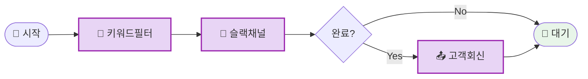

# 나의 워크샵 스킬 설계서

> 📋 **이 설계서는 [사전설문응답.md](사전설문응답.md) 인터뷰를 바탕으로 작성되었습니다.**

> ⚠️ **이 설계서는 초안입니다!**
>
> 정답이 아니에요. 워크샵 당일 강사님과 함께 범위를 더 좁히거나, 더 구체화할 수 있습니다.
>
> **사전과제의 목적**:
>
> 1. 스킬을 설치해서 한 번 써본 것 ✅
> 2. 나만의 스킬 설계서를 만들어서 "아, 내 작업이 이렇게 자동화되겠구나", "이런 흐름이겠구나" 감 잡기 ✅
>
> 이 정도면 충분해요! 나머지는 워크샵에서 함께 다듬어봐요 😊

## 목차

- [0. 선언](#0-선언)
- [한눈에 보기](#한눈에-보기) (외부 연동 + 워크플로 시각화)
- [Core (필수)](#core-필수)
- [Optional - 외부 API 연동](#optional---외부-api-연동)
- [나중에 더 발전시킬 아이디어](#나중에-더-발전시킬-아이디어)
- [배포 준비 (워크샵 후)](#배포-준비-워크샵-후)

---

## 0. 선언

- **스킬 이름**: email-task-tracker
- **한 줄 설명**: "user creation / user activation / user access" 관련 이메일만 골라 태스크를 슬랙 채널에 올리고(이메일 체인 포함), 태스크 완료 시 고객에게 자동 이메일 회신까지
- **만드는 사람**: 프로젝트 관리 담당
- **스킬 유형**: [ ] 텍스트 변환 [ ] 파일 기반 [x] 외부 API [x] 다단계 워크플로우
- **MVP 목표**: "해당 키워드 메일만 필터 → 슬랙 채널에 태스크 포스트(이메일 체인 포함) → 완료 시 고객 자동 회신"

---

## 한눈에 보기

### 외부 연동

| 서비스 | 용도                                          | 연동 방식    | 복잡도 | 가이드                                |
| ------ | --------------------------------------------- | ------------ | ------ | ------------------------------------- |
| Gmail  | 키워드 메일 조회·필터, 완료 시 고객 회신 발송 | MCP/스크립트 | 중간   | [📘 설정 가이드](연동가이드/Gmail.md) |
| Slack  | 지정 채널에 태스크·이메일 체인 요약 포스팅    | 스크립트     | 중간   | [📘 설정 가이드](연동가이드/Slack.md) |

> 📁 상세 설정 가이드: [연동가이드/](연동가이드/) 폴더 참조

> **참고**: Slack Canvas는 API 제한이 있어, 우선 **슬랙 채널** 연동으로 설계합니다. (나중에 Canvas 지원 추가 가능)

> **사전 준비 안내**: Gmail·Slack 두 연동 **워크샵 전에 미리 설정해두시면** 당일 구현이 수월해요.

### 워크플로 시각화

---

## Core (필수)

### 1. 언제 쓰나요?

**대표 상황**:

- **user creation**, **user activation**, **user access** 관련 이메일이 올 때마다 태스크로 남기고, 이메일 체인을 한곳에서 보면서 슬랙에서도 팀과 공유하고 싶을 때
- 태스크 완료 시 고객에게 "처리 완료" 회신을 매번 수동으로 보내기 번거로울 때

**왜 필요한가** (불편/비용/시간):

- 해당 키워드 메일을 수동으로 골라 슬랙에 태스크로 올리고, 이메일 스레드 링크를 복붙하는 반복
- 완료할 때마다 고객에게 회신 타이핑·발송하는 시간 절감 필요

### 2. 사용법

**이렇게 부르면**:

- `/email-task-tracker`
- "user creation / activation / access 메일에서 태스크 로그 만들어줘"
- "이 메일 태스크로 등록하고 슬랙에 올려줘"
- "이 태스크 완료했어 → 고객한테 회신 보내줘"

**결과물 형태**: [ ] 메시지 [x] 슬랙 채널 포스트 [x] 이메일 회신(완료 시)

**결과물 예시**:

> - 슬랙: 지정 채널에 "새 태스크: user activation – [요청자], [이메일 요약]" 포스트 (스레드에 이메일 체인 요약 포함)
> - 완료 시: 해당 고객에게 완료 안내 이메일 자동 발송

### 3. 입력/출력 명세

| 구분            | 내용                                         |
| --------------- | -------------------------------------------- |
| **사용자 입력** | 트리거 문장 + (선택) 기간·특정 메일 지정     |
| **필수 옵션**   | Gmail·Slack 연동 완료                        |
| **선택 옵션**   | "오늘만", "이 메일만", 회신 문구 템플릿 지정 |
| **출력 규칙**   | 슬랙 메시지 포맷 일관, 회신 톤은 설정 가능   |

### 4. 범위

**하는 것**:

1. Gmail에서 **user creation / user activation / user access** 포함 메일만 필터해 조회
2. 해당 메일을 **지정 슬랙 채널**에 태스크로 포스트(이메일 체인 요약·링크 포함)
3. 사용자가 "이 태스크 완료" 하면 **고객에게 이메일 회신 자동 발송**

**안 하는 것**:

1. Slack Canvas 연동은 이번 버전에서는 제외(채널 연동만). 나중에 API 지원 시 확장 가능
2. Workfront·Zoom 등 다른 툴 연동은 별도 확장 아이디어

### 5. 데이터/도구/권한

| 항목            | 내용                                        |
| --------------- | ------------------------------------------- |
| **읽는 데이터** | Gmail(제목·본문 키워드 필터)                |
| **쓰는 위치**   | Slack 채널(태스크 메시지), Gmail(회신 발송) |
| **외부 서비스** | Gmail, Slack                                |
| **민감정보**    | Google OAuth, Slack Bot Token (.env에 보관) |

### 6. 실패/예외 처리

**예상되는 실패 상황**:

1. Gmail/Slack 연동 만료 또는 권한 부족
2. 해당 키워드 메일이 0통인 경우
3. 회신 발송 시 수신자 주소 오류 또는 전송 실패

**실패 시 안내 원칙**:

- 연동 실패 → 해당 서비스 연동가이드 링크 + .env 확인 안내
- 매칭 메일 없음 → "해당 키워드 메일 없어요" 안내 후 종료
- 회신 실패 → "고객 회신 전송에 실패했어요. Gmail에서 수동 발송해 주세요" + 원인 요약

### 7. 대화 시나리오

**정상 케이스**

**나**: "user creation, activation, access 메일에서 태스크 만들어줘"

**스킬**:

> 해당 키워드 메일 4통 찾았어요. 슬랙 #user-requests 채널에 4건 올려뒀어요. (이메일 체인 요약 포함)

**나**: "두 번째 거 완료했어. 고객한테 회신 보내줘"

**스킬**:

> 태스크 "user activation – 김고객" 완료 처리했어요. 김고객님에게 완료 안내 메일 보냈어요.

**실패 케이스**

**나**: "오늘 user creation 메일 정리해줘" (Gmail 연동 안 됨)

**스킬**:

> Gmail 연동이 안 되어 있어요. [Gmail 설정 가이드](연동가이드/Gmail.md) 보고 .env 설정한 뒤 다시 시도해 주세요.

### 8. 테스트 & 완료 기준

**테스트 체크리스트**:

- [ ] user creation / user activation / user access 포함 메일만 필터되는지
- [ ] 지정 슬랙 채널에 태스크가 이메일 체인 요약과 함께 포스트되는지
- [ ] "이 태스크 완료 → 고객 회신" 시 해당 고객에게만 이메일 발송되는지
- [ ] 연동 실패 시 위와 같은 안내가 나오는지

**Done 기준**:
"키워드 메일만 골라 슬랙 채널에 태스크(이메일 체인 포함) 올라가고, 완료하면 고객에게 자동 회신까지 되면 성공"

---

## Optional - 외부 API 연동

2개의 외부 서비스 연동이 필요합니다.

### 환경변수 요약

| 변수명                 | 서비스 | 발급 방법                                                                   |
| ---------------------- | ------ | --------------------------------------------------------------------------- |
| `GOOGLE_CLIENT_ID`     | Gmail  | [Google Cloud Console](https://console.cloud.google.com/apis/credentials)   |
| `GOOGLE_CLIENT_SECRET` | Gmail  | 위와 동일                                                                   |
| `SLACK_BOT_TOKEN`      | Slack  | [Slack API – Create App](https://api.slack.com/apps) → Bot Token (xoxb-...) |

> **Tip**: Claude Code에게 API 키를 알려주면 자동으로 `.env`에 설정해줘요!

### B-1. Gmail

| 항목                  | 내용                                          |
| --------------------- | --------------------------------------------- |
| **용도**              | 키워드 메일 조회·필터, 완료 시 고객 회신 발송 |
| **필요한 credential** | OAuth 2.0 (Gmail 읽기 + 발송 권한)            |
| **환경변수**          | `GOOGLE_CLIENT_ID`, `GOOGLE_CLIENT_SECRET`    |
| **복잡도**            | 중간                                          |
| **예상 설정 시간**    | 약 20~30분                                    |

**설정 요약**: Google Cloud 프로젝트 → Gmail API 사용 → OAuth 동의 화면 → 클라이언트 ID/비밀 발급. 상세는 [연동가이드/Gmail.md](연동가이드/Gmail.md) 참조.

### B-2. Slack

| 항목                  | 내용                                                  |
| --------------------- | ----------------------------------------------------- |
| **용도**              | 지정 채널에 태스크 포스트(이메일 체인 연계 내용 포함) |
| **필요한 credential** | Bot Token (chat:write, channels:read 등)              |
| **환경변수**          | `SLACK_BOT_TOKEN`                                     |
| **복잡도**            | 중간                                                  |
| **예상 설정 시간**    | 약 10~15분                                            |

**설정 요약**: Slack App 생성 → Bot Token Scopes에 `chat:write`, 채널 조회 권한 추가 → 워크스페이스에 설치. 상세는 [연동가이드/Slack.md](연동가이드/Slack.md) 참조.

---

## 나중에 더 발전시킬 아이디어

- [ ] Slack Canvas 연동(API 지원 시)
- [ ] Workfront에 태스크 자동 생성/업데이트
- [ ] 완료 회신 문구 템플릿을 설정에서 선택

---

## 배포 준비 (워크샵 후)

| 파일           | 상태              | 설명                            |
| -------------- | ----------------- | ------------------------------- |
| `SKILL.md`     | [ ] 미완성        | 스킬 정의 (워크샵에서 작성)     |
| `README.md`    | [ ] 자동생성 예정 | 설치 가이드 (배포 시 자동 생성) |
| `.env.example` | [x] 완료          | 환경변수 예시                   |
| `.gitignore`   | [x] 완료          | .env 제외 설정                  |

워크샵에서 스킬을 완성한 후, "이 스킬 배포해줘"라고 하면 README 생성·GitHub 레포·설치 명령어까지 안내받을 수 있어요.

---

**워크샵 당일 이 설계서 가져오세요!**
