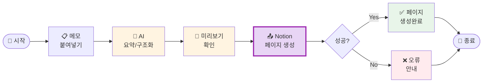

# 나의 워크샵 스킬 설계서

> 📋 **이 설계서는 [사전설문응답.md](사전설문응답.md) 인터뷰를 바탕으로 작성되었습니다.**

> ⚠️ **이 설계서는 초안입니다!**
>
> 정답이 아니에요. 워크샵 당일 강사님과 함께 범위를 더 좁히거나, 더 구체화할 수 있습니다.
>
> **사전과제의 목적**:
> 1. 스킬을 설치해서 한 번 써본 것 ✅
> 2. 나만의 스킬 설계서를 만들어서 "아, 내 작업이 이렇게 자동화되겠구나", "이런 흐름이겠구나" 감 잡기 ✅
>
> 이 정도면 충분해요! 나머지는 워크샵에서 함께 다듬어봐요 😊

## 목차
- [0. 선언](#0-선언)
- [한눈에 보기](#한눈에-보기)
- [Core (필수)](#core-필수)
  - [1. 언제 쓰나요?](#1-언제-쓰나요)
  - [2. 사용법](#2-사용법)
  - [3. 입력/출력 명세](#3-입력출력-명세)
  - [4. 범위](#4-범위)
  - [5. 데이터/도구/권한](#5-데이터도구권한)
  - [6. 실패/예외 처리](#6-실패예외-처리)
  - [7. 대화 시나리오](#7-대화-시나리오)
  - [8. 테스트 & 완료 기준](#8-테스트--완료-기준)
- [Optional](#optional)
  - [B. 외부 API 연동](#b-외부-api-연동인-경우)
  - [C. 다단계 워크플로우](#c-다단계-워크플로우인-경우)
- [나중에 더 발전시킬 아이디어](#나중에-더-발전시킬-아이디어)

---

## 0. 선언

- **스킬 이름**: `meeting-note-generator`
- **한 줄 설명**: 회의 중 적은 메모를 붙여넣으면 구조화된 회의록으로 정리해 Notion에 자동 업로드
- **만드는 사람**: PM
- **스킬 유형**: [x] 다단계 워크플로우 / [x] 외부 API
- **MVP 목표**: "날것의 회의 메모를 넣으면 정리된 회의록이 Notion 페이지로 생성된다"

---

## 한눈에 보기

### 외부 연동

| 서비스 | 용도 | 연동 방식 | 복잡도 | 가이드 |
|--------|------|----------|--------|--------|
| Notion | 회의록 페이지 생성 | MCP | 쉬움 | [📘 설정 가이드](연동가이드/notion.md) |

> 📁 상세 설정 가이드: [연동가이드/](연동가이드/) 폴더 참조

### 워크플로 시각화

> 💡 **다이어그램이 안 보이나요?**
>
> VSCode에서 Mermaid 다이어그램을 보려면 확장 프로그램이 필요해요:
> 1. VSCode 왼쪽 사이드바에서 **확장(Extensions)** 아이콘 클릭 (또는 `Cmd+Shift+X`)
> 2. `Markdown Preview Mermaid Support` 검색
> 3. **Install** 클릭
> 4. 이 파일을 다시 열고 **미리보기**(`Cmd+Shift+V`)로 확인!



---

## Core (필수)

### 1. 언제 쓰나요?

**대표 상황**:
회의가 끝난 직후, 회의 중 타이핑해둔 날것의 메모를 Claude Code에 붙여넣으면 구조화된 회의록으로 정리해주고 Notion에 바로 올려주는 상황.

**왜 필요한가** (불편/비용/시간):
- 하루 2~3건의 회의, 매번 30분씩 회의록 정리에 소요
- 하루 최대 **1시간 30분**을 회의록에만 사용 중
- AI에게 요약 요청 → 복붙 → Notion 접속 → 올리기의 반복 과정

### 2. 사용법

**이렇게 부르면**:
- `/meeting-note-generator`
- "회의록 정리해줘"
- "이 메모 회의록으로 만들어줘"
- "방금 회의 내용 올려줘"

**결과물 형태**: [x] Notion 페이지

**결과물 예시**:
> **📋 [2026-02-21] 스킨케어 라인 기획 회의**
>
> **참석자**: 홍길동, 김철수, 이영희
>
> **결정사항**
> - 신규 라인 런칭일: 3월 15일 확정
> - 패키지 디자인 수정 불가, 기존 안으로 진행
>
> **액션아이템**
> - [ ] 홍길동: 마케팅 플랜 초안 작성 (~ 2/25)
> - [ ] 김철수: 공급사 단가 재협상 (~ 2/28)
>
> **다음 회의**: 2월 28일 오전 10시

### 3. 입력/출력 명세

| 구분 | 내용 |
|------|------|
| **사용자 입력** | 회의 중 타이핑한 날것의 메모 텍스트 |
| **필수 옵션** | 없음 (메모만 있으면 됨) |
| **선택 옵션** | 회의명, 참석자 명단, 날짜 (없으면 AI가 추론) |
| **출력 규칙** | 결정사항/액션아이템/다음 회의 형식, Notion 페이지로 생성 |

### 4. 범위

**하는 것** (3개 이내):
1. 날것의 메모를 구조화된 회의록으로 변환 (결정사항, 액션아이템, 다음 회의)
2. 변환 결과를 사용자에게 미리 보여주고 확인
3. 확인 후 Notion 지정 페이지 하위에 회의록 페이지 자동 생성

**안 하는 것** (2개 이내):
1. 녹음 파일 자동 변환 (텍스트 메모만 지원)
2. 기존 Notion 페이지 수정/삭제

### 5. 데이터/도구/권한

| 항목 | 내용 |
|------|------|
| **읽는 데이터** | 사용자가 붙여넣는 회의 메모 텍스트 |
| **쓰는 위치** | Notion 지정 페이지 하위 (NOTION_PARENT_PAGE_ID로 설정) |
| **외부 서비스** | Notion MCP (`@notionhq/notion-mcp-server`) |
| **민감정보** | `NOTION_TOKEN` (.env에 저장) |

### 6. 실패/예외 처리

**예상되는 실패 상황**:
1. Notion 토큰이 없거나 잘못됨 → "NOTION_TOKEN을 확인해주세요. 연동가이드를 참고해서 다시 설정해볼까요?"
2. 부모 페이지 ID가 설정되지 않음 → "어느 페이지 아래에 올릴까요? Notion 페이지 URL에서 ID를 확인해주세요."
3. 메모가 너무 짧거나 내용이 없음 → "메모 내용이 너무 짧아요. 회의 내용을 좀 더 붙여넣어주세요!"

**실패 시 안내 원칙**:
무엇이 문제인지 명확히 알려주고, 해결 방법을 함께 안내. Notion 업로드 실패 시 정리된 텍스트는 그대로 출력해서 수동 복붙 가능하도록 안내.

### 7. 대화 시나리오

**정상 케이스**:

**나**: "회의록 정리해줘 [메모 붙여넣기]"

**스킬**:
> 📋 회의록을 정리했어요! 확인해주세요:
>
> **[2026-02-21] 기획 회의**
> 참석자: ...
> 결정사항: ...
> 액션아이템: ...
>
> Notion에 올릴까요? (네 / 수정할게요)

**나**: "네"

**스킬**:
> ✅ Notion에 업로드 완료! 페이지 링크: https://notion.so/...

---

**실패 케이스**:

**나**: "회의록 정리해줘 오늘 회의 별로 없었음"

**스킬**:
> 메모 내용이 너무 짧아요 😅 회의에서 나온 주요 내용, 결정사항, 다음 할 일 등을 좀 더 적어서 붙여넣어주세요!

### 8. 테스트 & 완료 기준

**테스트 체크리스트**:
- [ ] 날것의 메모 → 구조화된 회의록으로 변환 확인
- [ ] 미리보기 확인 후 Notion 업로드 성공
- [ ] 토큰 없을 때 친절한 에러 메시지 출력

**Done 기준**:
"회의 메모를 붙여넣고 '네'라고 하면, Notion에 구조화된 회의록 페이지가 자동 생성된다."

---

## Optional

### B. 외부 API 연동인 경우

1개의 외부 서비스 연동이 필요합니다. **당일 워크샵에서 설정 가능해요! (약 10-15분)**

#### 환경변수 요약

이 스킬에 필요한 환경변수 목록입니다. (`.env.example` 참조)

| 변수명 | 서비스 | 발급 방법 |
|--------|--------|----------|
| `NOTION_TOKEN` | Notion | notion.so/my-integrations에서 발급 |

> **Tip**: Claude Code에게 토큰을 알려주면 자동으로 `.env`에 설정해줘요!
> 예: "노션 토큰은 ntn_xxxxxx야"

#### B-1. Notion

| 항목 | 내용 |
|------|------|
| **Context7 Library ID** | `/makenotion/notion-mcp-server` |
| **필요한 credential** | Integration Token (`ntn_`으로 시작) |
| **환경변수** | `NOTION_TOKEN` |
| **복잡도** | 쉬움 |
| **예상 설정 시간** | 10-15분 |

**설정 가이드 요약**:
Notion Integrations 페이지에서 새 인테그레이션 생성 후 토큰 발급. 회의록을 올릴 Notion 페이지에 해당 인테그레이션 연결 필요.

> **참고**: 상세 가이드는 [연동가이드/notion.md](연동가이드/notion.md) 확인하세요.

### C. 다단계 워크플로우인 경우

**단계 목록** (3단계):
1. **메모 입력** → 산출물: 날것의 텍스트
2. **AI 구조화** → 산출물: 결정사항/액션아이템/다음 회의 형식의 회의록
3. **확인 & 업로드** → 산출물: Notion 페이지 (링크 반환)

**중단/재개 방법**:
AI 구조화 결과를 보고 "수정할게요"라고 하면 원하는 부분 수정 후 재업로드 가능.

---

## 나중에 더 발전시킬 아이디어

- [ ] 녹음 파일(.m4a, .mp3) → 자동 텍스트 변환 후 회의록 생성
- [ ] 액션아이템을 Notion 데이터베이스에 별도 태스크로 자동 추가
- [ ] 주간 회의 요약 리포트 자동 생성

---

## 배포 준비 (워크샵 후)

워크샵에서 스킬을 완성한 후, GitHub에 배포하여 다른 사람도 사용할 수 있게 합니다.

### 필요한 파일

| 파일 | 상태 | 설명 |
|------|------|------|
| `SKILL.md` | [ ] 미완성 | 스킬 정의 (워크샵에서 작성) |
| `README.md` | [ ] 자동생성 예정 | 설치 가이드 (배포 시 자동 생성) |
| `.env.example` | [x] 완료 | 환경변수 예시 |
| `.gitignore` | [x] 완료 | .env 제외 설정 |

### 배포 방법

워크샵에서 스킬을 완성한 후, Claude Code에게 말하세요:

```
이 스킬 배포해줘
```

---

**워크샵 당일 이 설계서 가져오세요!**
