# 나의 워크샵 스킬 설계서

> 📋 **이 설계서는 [사전설문응답.md](사전설문응답.md) 인터뷰를 바탕으로 작성되었습니다.**

> ⚠️ **이 설계서는 초안입니다!**
>
> 정답이 아니에요. 워크샵 당일 강사님과 함께 범위를 더 좁히거나, 더 구체화할 수 있습니다.
>
> **사전과제의 목적**:
> 1. 스킬을 설치해서 한 번 써본 것 ✅
> 2. 나만의 스킬 설계서를 만들어서 "아, 내 작업이 이렇게 자동화되겠구나", "이런 흐름이겠구나" 감 잡기 ✅
>
> 이 정도면 충분해요! 나머지는 워크샵에서 함께 다듬어봐요 😊

## 목차
- [0. 선언](#0-선언)
- [한눈에 보기](#한눈에-보기)
- [Core (필수)](#core-필수)
  - [1. 언제 쓰나요?](#1-언제-쓰나요)
  - [2. 사용법](#2-사용법)
  - [3. 입력/출력 명세](#3-입력출력-명세)
  - [4. 범위](#4-범위)
  - [5. 데이터/도구/권한](#5-데이터도구권한)
  - [6. 실패/예외 처리](#6-실패예외-처리)
  - [7. 대화 시나리오](#7-대화-시나리오)
  - [8. 테스트 & 완료 기준](#8-테스트--완료-기준)
- [Optional](#optional)
  - [B. 외부 API 연동](#b-외부-api-연동인-경우)
  - [C. 다단계 워크플로우](#c-다단계-워크플로우인-경우)
- [나중에 더 발전시킬 아이디어](#나중에-더-발전시킬-아이디어)

---

## 0. 선언

- **스킬 이름**: `needs-survey-analyzer`
- **한 줄 설명**: 교육/해커톤 참가자 니즈 파악 설문을 자동 설계하고, 응답을 분석해서 노션에 저장 + 슬랙으로 보고까지 원클릭으로
- **만드는 사람**: 교육 및 해커톤 기획 담당자
- **스킬 유형**: [x] 외부 API  [x] 다단계 워크플로우
- **MVP 목표**: "교육 주제를 입력하면 타이폼 설문을 자동 생성하고, 응답 분석 결과를 노션과 슬랙에 자동으로 올린다"

---

## 한눈에 보기

### 외부 연동

| 서비스 | 용도 | 연동 방식 | 복잡도 | 가이드 |
|--------|------|----------|--------|--------|
| Typeform | 설문 폼 생성 + 응답 읽기 | 스크립트 (API) | 쉬움 | [📘 설정 가이드](연동가이드/Typeform.md) |
| Notion | 분석 결과 페이지 생성 | MCP | 쉬움 | [📘 설정 가이드](연동가이드/Notion.md) |
| Slack | 요약 보고 메시지 발송 | 스크립트 (API) | 중간 | [📘 설정 가이드](연동가이드/Slack.md) |

> ⏰ **사전 설정 권장** - 3개 연동이 있어요. 워크샵 전에 미리 설정해두시면 당일에 바로 만들 수 있어요! (총 약 40-50분 예상)
>
> 📁 상세 설정 가이드: [연동가이드/](연동가이드/) 폴더 참조

### 워크플로 시각화

> 💡 **다이어그램이 안 보이나요?**
>
> VSCode에서 Mermaid 다이어그램을 보려면 확장 프로그램이 필요해요:
> 1. VSCode 왼쪽 사이드바에서 **확장(Extensions)** 아이콘 클릭 (또는 `Cmd+Shift+X`)
> 2. `Markdown Preview Mermaid Support` 검색
> 3. **Install** 클릭
> 4. 이 파일을 다시 열고 **미리보기**(`Cmd+Shift+V`)로 확인!

```mermaid
flowchart LR
    Start([🚀 시작]) --> Input[📝 주제입력]
    Input --> Design[🤖 질문설계]
    Design --> Form[📋 폼생성]
    Form --> FormAPI[🔗 타이폼]
    FormAPI --> Wait[⏳ 응답대기]
    Wait --> Collect[📥 응답수집]
    Collect --> Analyze[🔍 니즈분석]
    Analyze --> Notion[📄 노션저장]
    Notion --> Slack[💬 슬랙보고]
    Slack --> End([🏁 완료])

    style Design fill:#fff4e1
    style Analyze fill:#fff4e1
    style FormAPI fill:#e8d5f5,stroke:#9c27b0,stroke-width:3px
    style Notion fill:#e8d5f5,stroke:#9c27b0,stroke-width:3px
    style Slack fill:#e8d5f5,stroke:#9c27b0,stroke-width:3px
    style End fill:#e8f5e9
```



---

## Core (필수)

### 1. 언제 쓰나요?

**대표 상황**:
교육 프로그램이나 해커톤을 기획할 때, 참가자의 니즈를 파악하기 위한 사전 설문이 필요한 경우.
"이번 AI 해커톤 참가자들 대상으로 니즈 파악 설문 만들어야 해" 싶을 때 한마디면 끝.

**왜 필요한가**:
- 현재: 설문 질문 설계 → 타이폼 수동 입력 → 응답 하나씩 읽기 → 노션 정리 → 슬랙 보고 = **3시간**
- 스킬 쓰면: **10분**
- 프로젝트마다 반복되는 업무라 누적 시간 절약이 크다

### 2. 사용법

**이렇게 부르면**:
- `/needs-survey-analyzer`
- "이번 [행사명] 참가자 니즈 파악 설문 만들어줘"
- "사전 설문 분석해줘 [타이폼 폼ID]"

**결과물 형태**: [x] 링크/리포트  [x] 파일 (노션 페이지 + 슬랙 메시지)

**결과물 예시**:
> ✅ 타이폼 설문 생성 완료!
> 🔗 설문 링크: https://forms.typeform.com/to/xxxxx
>
> ---
> (응답 분석 후)
>
> 📊 **니즈 분석 결과** (응답 23명)
>
> **TOP 3 니즈**:
> 1. AI 툴 활용법 실습 (78%)
> 2. 팀빌딩/네트워킹 (65%)
> 3. 멘토링/피드백 (52%)
>
> **교육 방향 제안**: AI 실습 중심 + 팀 협업 세션 강화
>
> 📄 노션 페이지 생성됨 | 💬 슬랙 #기획팀 채널에 공유됨

### 3. 입력/출력 명세

| 구분 | 내용 |
|------|------|
| **사용자 입력** | 교육/행사 주제 (텍스트), 타겟 대상 (선택), 타이폼 폼 ID (분석 시) |
| **필수 옵션** | 주제 (예: "AI 해커톤", "신입 온보딩 교육") |
| **선택 옵션** | 대상 설명, 질문 수 (기본 7개), 슬랙 채널명 |
| **출력 규칙** | 타이폼 링크 + 분석 리포트 (마크다운) + 노션 페이지 URL + 슬랙 전송 확인 |

### 4. 범위

**하는 것**:
1. 교육 주제 기반 니즈 파악 설문 질문 자동 설계 + 타이폼 폼 생성
2. 타이폼 응답 수집 + AI 분석 (핵심 니즈 요약, 트렌드 파악)
3. 노션에 분석 결과 페이지 자동 생성 + 슬랙에 요약 보고

**안 하는 것**:
1. 설문 응답 실시간 모니터링 (응답 수집 완료 후 수동으로 분석 트리거)
2. 교육 커리큘럼 자동 설계 (분석 결과를 참고해 사람이 직접 설계)

### 5. 데이터/도구/권한

| 항목 | 내용 |
|------|------|
| **읽는 데이터** | Typeform 응답 데이터 (API) |
| **쓰는 위치** | Notion 페이지 (MCP), Slack 채널 (API) |
| **외부 서비스** | Typeform, Notion, Slack |
| **민감정보** | API 토큰 3개 필요 (.env 파일에 저장, .gitignore로 보호) |

### 6. 실패/예외 처리

**예상되는 실패 상황**:
1. 타이폼 API 키가 없거나 만료됨 → "타이폼 API 키를 확인해주세요. .env 파일의 TYPEFORM_API_KEY를 재발급해주세요."
2. 응답이 0개인데 분석 요청 → "아직 응답이 없어요! 설문 링크를 공유하고 응답을 기다려주세요."
3. 노션/슬랙 연동 실패 → "노션/슬랙 연동에 실패했어요. 분석 결과는 이 대화창에 출력할게요."

**실패 시 안내 원칙**:
외부 서비스 연동 실패 시에도 핵심 결과물(분석 리포트)은 반드시 화면에 출력. 저장/공유만 실패한 것이니 결과물을 잃지 않도록.

### 7. 대화 시나리오

**정상 케이스 (설문 생성)**:

**나**: "이번 주니어 개발자 해커톤 참가자 니즈 파악 설문 만들어줘"

**스킬**:
> 🤖 주니어 개발자 해커톤에 맞는 설문을 설계할게요!
>
> 설계한 질문 7개:
> 1. 해커톤 참가 동기는 무엇인가요?
> 2. 가장 배우고 싶은 기술 스택은?
> ...
>
> 📋 타이폼 폼 생성 중...
> ✅ 완료! 설문 링크: https://forms.typeform.com/to/abc123
>
> 응답 수집 후 "사전 설문 분석해줘 abc123" 이라고 말씀해주세요!

**정상 케이스 (분석)**:

**나**: "사전 설문 분석해줘 abc123"

**스킬**:
> 📊 23개 응답 분석 완료!
>
> **핵심 니즈 TOP 3**: ...
>
> 📄 노션 페이지 생성됨: [링크]
> 💬 #기획팀 슬랙 채널에 공유됨

**실패 케이스**:

**나**: "사전 설문 분석해줘 abc123"

**스킬**:
> 타이폼에서 응답을 가져오는 데 실패했어요.
> TYPEFORM_API_KEY가 올바른지 확인해주세요.
> 분석은 응답 데이터를 직접 붙여넣어도 진행할 수 있어요!

### 8. 테스트 & 완료 기준

**테스트 체크리스트**:
- [ ] "AI 부트캠프 참가자 니즈 설문 만들어줘" → 타이폼 폼 생성 + 링크 출력
- [ ] 실제 폼 ID로 응답 분석 → 니즈 요약 리포트 출력
- [ ] 노션 페이지 생성 확인 (워크스페이스에서 직접 확인)
- [ ] 슬랙 메시지 수신 확인
- [ ] 응답 0개일 때 적절한 안내 메시지 출력

**Done 기준**:
"교육 주제를 입력하면 5분 안에 타이폼 설문 링크가 생성되고, 응답 분석 결과가 노션과 슬랙에 자동으로 올라간다."

---

## Optional

### B. 외부 API 연동인 경우

3개의 외부 서비스 연동이 필요합니다.

#### 환경변수 요약

| 변수명 | 서비스 | 발급 방법 |
|--------|--------|----------|
| `TYPEFORM_API_KEY` | Typeform | https://admin.typeform.com/account#/section/tokens |
| `NOTION_API_KEY` | Notion | https://www.notion.so/my-integrations |
| `SLACK_BOT_TOKEN` | Slack | https://api.slack.com/apps |

> **Tip**: Claude Code에게 API 키를 알려주면 자동으로 `.env`에 설정해줘요!
> 예: "타이폼 키는 tfp_xxxx야"

#### B-1. Typeform

| 항목 | 내용 |
|------|------|
| **필요한 credential** | Personal Access Token |
| **환경변수** | `TYPEFORM_API_KEY` |
| **복잡도** | 쉬움 |
| **예상 설정 시간** | 10-15분 |

**설정 가이드 요약**: [📘 Typeform 설정 가이드](연동가이드/Typeform.md) 참조

#### B-2. Notion

| 항목 | 내용 |
|------|------|
| **필요한 credential** | Integration Token |
| **환경변수** | `NOTION_API_KEY` |
| **복잡도** | 쉬움 |
| **예상 설정 시간** | 10-15분 |

**설정 가이드 요약**: [📘 Notion 설정 가이드](연동가이드/Notion.md) 참조

#### B-3. Slack

| 항목 | 내용 |
|------|------|
| **필요한 credential** | Bot User OAuth Token |
| **환경변수** | `SLACK_BOT_TOKEN` |
| **복잡도** | 중간 |
| **예상 설정 시간** | 20-30분 |

**설정 가이드 요약**: [📘 Slack 설정 가이드](연동가이드/Slack.md) 참조

---

> **참고**: 상세 가이드는 `연동가이드/` 폴더의 개별 파일을 확인하세요.

### C. 다단계 워크플로우인 경우

**단계 목록**:
1. **설문 설계** → 산출물: 질문 목록 (7개)
2. **타이폼 폼 생성** → 산출물: 타이폼 링크 + 폼 ID
3. **응답 수집** → 산출물: 응답 데이터 (사용자가 수동 트리거)
4. **AI 분석** → 산출물: 니즈 요약 리포트
5. **저장 & 공유** → 산출물: 노션 페이지 URL + 슬랙 메시지

**중단/재개 방법**:
폼 생성 후 응답 수집은 시간이 필요하므로 자연스럽게 중단됨. 응답이 충분히 모이면 "사전 설문 분석해줘 [폼ID]"로 재개.

---

## 나중에 더 발전시킬 아이디어

- [ ] 응답 마감일 설정 → 자동 분석 트리거 (특정 날짜에 자동 실행)
- [ ] 분석 결과 기반으로 교육 커리큘럼 초안 자동 생성
- [ ] 이전 행사 데이터와 비교 분석 ("작년 해커톤이랑 어떻게 달라졌어?")
- [ ] 노션 템플릿 자동 생성 (교육 기획서 틀 자동화)

---

## 배포 준비 (워크샵 후)

| 파일 | 상태 | 설명 |
|------|------|------|
| `SKILL.md` | [ ] 미완성 | 스킬 정의 (워크샵에서 작성) |
| `README.md` | [ ] 자동생성 예정 | 설치 가이드 (배포 시 자동 생성) |
| `.env.example` | [x] 완료 | 환경변수 예시 |
| `.gitignore` | [x] 완료 | .env 제외 설정 |

워크샵에서 스킬을 완성한 후, Claude Code에게 말하세요:
```
이 스킬 배포해줘
```

---

**워크샵 당일 이 설계서 가져오세요!**
