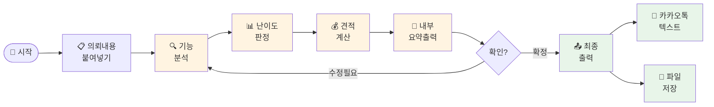

# 나의 워크샵 스킬 설계서

> 📋 **이 설계서는 [사전설문응답.md](사전설문응답.md) 인터뷰를 바탕으로 작성되었습니다.**

> ⚠️ **이 설계서는 초안입니다!**
>
> 정답이 아니에요. 워크샵 당일 강사님과 함께 범위를 더 좁히거나, 더 구체화할 수 있습니다.
>
> **사전과제의 목적**:
> 1. 스킬을 설치해서 한 번 써본 것 ✅
> 2. 나만의 스킬 설계서를 만들어서 "아, 내 작업이 이렇게 자동화되겠구나", "이런 흐름이겠구나" 감 잡기 ✅
>
> 이 정도면 충분해요! 나머지는 워크샵에서 함께 다듬어봐요 😊

## 목차
- [0. 선언](#0-선언)
- [한눈에 보기](#한눈에-보기)
- [Core (필수)](#core-필수)
  - [1. 언제 쓰나요?](#1-언제-쓰나요)
  - [2. 사용법](#2-사용법)
  - [3. 입력/출력 명세](#3-입력출력-명세)
  - [4. 범위](#4-범위)
  - [5. 데이터/도구/권한](#5-데이터도구권한)
  - [6. 실패/예외 처리](#6-실패예외-처리)
  - [7. 대화 시나리오](#7-대화-시나리오)
  - [8. 테스트 & 완료 기준](#8-테스트--완료-기준)
- [Optional](#optional)
  - [C. 다단계 워크플로우](#c-다단계-워크플로우)
- [나중에 더 발전시킬 아이디어](#나중에-더-발전시킬-아이디어)

---

## 0. 선언

- **스킬 이름**: `notion-estimate`
- **한 줄 설명**: 노션 작업 의뢰 내용을 붙여넣으면 난이도를 분석하고 견적 범위를 자동으로 뽑아주는 스킬
- **만드는 사람**: 노션 페이지 제작 프리랜서
- **스킬 유형**: [x] 다단계 워크플로우
- **MVP 목표**: "의뢰 내용을 붙여넣으면 난이도 분석과 견적 범위가 바로 나온다"

---

## 한눈에 보기

### 외부 연동

없음 — 별도 설정 없이 워크샵 당일 바로 시작할 수 있어요!

### 워크플로 시각화

> 💡 **다이어그램이 안 보이나요?**
>
> VSCode에서 Mermaid 다이어그램을 보려면 확장 프로그램이 필요해요:
> 1. VSCode 왼쪽 사이드바에서 **확장(Extensions)** 아이콘 클릭 (또는 `Cmd+Shift+X`)
> 2. `Markdown Preview Mermaid Support` 검색
> 3. **Install** 클릭
> 4. 이 파일을 다시 열고 **미리보기**(`Cmd+Shift+V`)로 확인!



---

## Core (필수)

### 1. 언제 쓰나요?

**대표 상황**:
크몽 또는 카카오톡 오픈채팅으로 노션 페이지 제작 의뢰가 들어왔을 때. 의뢰자의 요구사항 텍스트를 붙여넣으면 바로 사용.

**왜 필요한가** (불편/비용/시간):
- 견적 작업에서 **가장 오래 걸리는 단계**가 의뢰 내용을 읽고 난이도를 판단하는 것
- 텍스트, DB, 디자인, 외부 연동 등 복합적인 요소를 머릿속에서 하나씩 분해해야 함
- 이 분석이 끝나야 금액 계산이 가능하고, 금액이 정해져야 견적서 작성이 가능

### 2. 사용법

**이렇게 부르면**:
- `/notion-estimate`
- "견적 분석해줘"
- "이 의뢰 견적 뽑아줘"
- 의뢰 내용을 붙여넣고 "이거 얼마야?"

**결과물 형태**: [x] 메시지 (단계별 출력)

**결과물 예시 (1단계 — 내부 분석 요약)**:
> **📊 의뢰 분석 결과**
>
> **감지된 작업 유형**
> - DB 작업: 관계형 DB 1개 (멤버 ↔ 프로젝트 연결)
> - 디자인: 헤더 커버 + 아이콘 커스텀
> - 페이지 수: 총 3페이지
>
> **난이도**: Lv.5 — DB + 디자인 복합
>
> **견적 범위 (VAT 별도)**
> - 관계형 DB 1개: 10만원~
> - 페이지 3개 (디자인 포함): 9만~15만원
> - **합계: 19만~25만원**
>
> ---
> 수정할 부분 있으면 말씀해주세요. 확정이면 "카카오톡용으로 뽑아줘" 또는 "파일로 저장해줘"라고 해주세요!

### 3. 입력/출력 명세

| 구분 | 내용 |
|------|------|
| **사용자 입력** | 의뢰자가 보낸 요구사항 텍스트 (카카오톡 메시지, 크몽 의뢰서 등) |
| **필수 옵션** | 의뢰 내용 텍스트 |
| **선택 옵션** | 추가 케이스 설명 ("이 경우 단가를 더 올려야 해" 등 상황별 보정) |
| **출력 규칙** | 1차: 내부 분석 요약 / 확정 후: 카카오톡용 텍스트 또는 마크다운 파일 |

### 4. 범위

**하는 것** (3개):
1. 의뢰 내용에서 필요한 노션 기능 파악 및 난이도 분류 (6단계 기준)
2. 난이도 + 페이지 수 + DB 수 기반으로 견적 범위 계산 (VAT 별도 명시)
3. 확정 후 카카오톡용 텍스트 또는 파일로 최종 출력

**안 하는 것** (2개):
1. 노션 클라이언트 DB에 자동 기록 (수기 선호)
2. 미리캔버스 견적서 자동 생성 (포맷은 직접 입력)

### 5. 데이터/도구/권한

| 항목 | 내용 |
|------|------|
| **읽는 데이터** | 사용자가 붙여넣는 의뢰 텍스트 |
| **쓰는 위치** | 필요 시 마크다운 파일로 로컬 저장 |
| **외부 서비스** | 없음 |
| **민감정보** | 없음 |

### 6. 실패/예외 처리

**예상되는 실패 상황**:
1. 의뢰 내용이 너무 짧거나 모호해서 기능 파악이 안 되는 경우
2. "DB 쓸 것 같은데 확실히 모르겠는" 애매한 케이스
3. 단가 기준에 없는 새로운 유형의 작업 요청

**실패 시 안내 원칙**:
- 모호한 경우: "이 부분이 명확하지 않아요 — [질문]을 의뢰자에게 확인해보시겠어요?"
- 새로운 유형: "기존 단가 기준에 없는 작업이에요. 직접 금액을 알려주시면 반영할게요!"
- 짧은 입력: "내용이 부족해요. 의뢰자에게 더 물어볼 질문 목록을 드릴까요?"

### 7. 대화 시나리오

**정상 케이스**:

**나**: "견적 분석해줘 / [의뢰 내용 붙여넣기]"

**스킬**:
> **📊 의뢰 분석 결과**
>
> **감지된 작업 유형**
> - 텍스트 + 기본 디자인: 소개 페이지 1개
> - 간단한 DB: 포트폴리오 리스트 1개 (속성 5개 이하)
> - 페이지 수: 총 2페이지
>
> **난이도**: Lv.3 — DB 작업 포함
>
> **견적 범위 (VAT 별도)**
> - 간단한 DB 1개: 8만원~
> - 페이지 2개 (디자인 포함): 6만~10만원
> - **합계: 14만~18만원**
>
> 수정할 부분 있으면 말씀해주세요!

**나**: "확정. 카카오톡용으로 뽑아줘"

**스킬**:
> 📋 아래 내용을 카카오톡에 복붙해주세요!
>
> ---
> 안녕하세요! 말씀해주신 내용 검토했습니다 😊
>
> **견적 안내 (VAT 별도)**
> ✅ 소개 페이지 + 포트폴리오 DB: 14만~18만원
>
> 작업 범위에 따라 금액이 달라질 수 있으며, 최종 견적은 상세 협의 후 확정됩니다.
> 궁금한 점 있으시면 편하게 말씀해주세요!

**실패 케이스**:

**나**: "견적 분석해줘 / 노션 페이지 만들어주세요"

**스킬**:
> 내용이 조금 부족해서 정확한 견적을 내기 어렵네요!
>
> 의뢰자에게 아래 내용을 확인해보시겠어요?
> 1. 어떤 용도의 페이지인가요? (포트폴리오, 업무 관리, 일정 관리 등)
> 2. 페이지가 몇 개 정도 필요하신가요?
> 3. 데이터를 정리하거나 필터/분류가 필요한 기능이 있나요?

### 8. 테스트 & 완료 기준

**테스트 체크리스트**:
- [ ] 텍스트 전용 의뢰 → 정확한 난이도 Lv.1~2 판정
- [ ] DB 포함 의뢰 → 간단/관계형 구분 및 금액 계산 정확
- [ ] 모호한 의뢰 → 추가 질문 목록 출력
- [ ] "카카오톡용으로 뽑아줘" → 바로 복붙 가능한 텍스트 출력

**Done 기준**:
"의뢰 내용을 붙여넣으면 30초 안에 난이도와 견적 범위가 나오고, 확정 후 카카오톡에 바로 붙여넣을 수 있는 텍스트가 출력된다."

---

## Optional

### C. 다단계 워크플로우

**단계 목록**:
1. **입력** — 의뢰 내용 텍스트 붙여넣기 → 산출물: 원본 텍스트
2. **분석** — 기능 파악 + 난이도 판정 + 금액 계산 → 산출물: 내부 분석 요약
3. **확인** — 사용자 검토 및 수정 요청 → 산출물: 확정된 견적
4. **출력** — 카카오톡용 텍스트 또는 마크다운 파일 → 산출물: 최종 견적 메시지

**중단/재개 방법**:
분석 결과 확인 후 "이 부분 수정해줘" 라고 하면 해당 항목만 재계산. 처음부터 다시 할 필요 없음.

---

## 나중에 더 발전시킬 아이디어

- [ ] 자주 쓰는 추가 케이스를 스킬에 학습시키기 (예: "러시 작업이면 20% 추가" 등)
- [ ] 크몽 의뢰서 형식을 자동 인식해서 필요한 부분만 추출
- [ ] 견적 이력을 마크다운 파일로 누적 저장해서 나중에 참고하기
- [ ] 바이브코딩 작업 의뢰도 분석할 수 있도록 난이도 기준 확장

---

## 배포 준비 (워크샵 후)

워크샵에서 스킬을 완성한 후, GitHub에 배포하여 다른 사람도 사용할 수 있게 합니다.

### 필요한 파일

| 파일 | 상태 | 설명 |
|------|------|------|
| `SKILL.md` | [ ] 미완성 | 스킬 정의 (워크샵에서 작성) |
| `README.md` | [ ] 자동생성 예정 | 설치 가이드 (배포 시 자동 생성) |

### 배포 방법

워크샵에서 스킬을 완성한 후, Claude Code에게 말하세요:

```
이 스킬 배포해줘
```

---

**워크샵 당일 이 설계서 가져오세요!**
