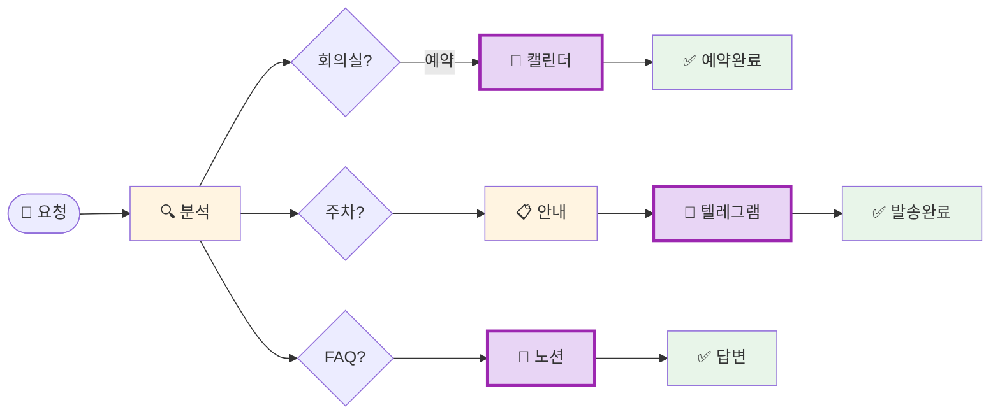

# 나의 워크샵 스킬 설계서

> 📋 **이 설계서는 [사전설문응답.md](사전설문응답.md) 인터뷰를 바탕으로 작성되었습니다.**

> ⚠️ **이 설계서는 초안입니다!**
>
> 정답이 아니에요. 워크샵 당일 강사님과 함께 범위를 더 좁히거나, 더 구체화할 수 있습니다.
>
> **사전과제의 목적**:
> 1. 스킬을 설치해서 한 번 써본 것 ✅
> 2. 나만의 스킬 설계서를 만들어서 "아, 내 작업이 이렇게 자동화되겠구나", "이런 흐름이겠구나" 감 잡기 ✅
>
> 이 정도면 충분해요! 나머지는 워크샵에서 함께 다듬어봐요 😊

## 목차
- [0. 선언](#0-선언)
- [한눈에 보기](#한눈에-보기)
- [Core (필수)](#core-필수)
  - [1. 언제 쓰나요?](#1-언제-쓰나요)
  - [2. 사용법](#2-사용법)
  - [3. 입력/출력 명세](#3-입력출력-명세)
  - [4. 범위](#4-범위)
  - [5. 데이터/도구/권한](#5-데이터도구권한)
  - [6. 실패/예외 처리](#6-실패예외-처리)
  - [7. 대화 시나리오](#7-대화-시나리오)
  - [8. 테스트 & 완료 기준](#8-테스트--완료-기준)
- [Optional](#optional-스킬-유형에-따라-선택)
  - [B. 외부 API 연동](#b-외부-api-연동인-경우)
  - [C. 다단계 워크플로우](#c-다단계-워크플로우인-경우)
- [나중에 더 발전시킬 아이디어](#나중에-더-발전시킬-아이디어)

---

## 0. 선언

- **스킬 이름**: ops-assistant
- **한 줄 설명**: 회의실 예약, 주차등록 안내, FAQ 검색, 주차 확인 메세지 발송을 한 번에 해주는 사내 운영 에이전트
- **만드는 사람**: 최고전략책임자(CSO)
- **스킬 유형**: [x] 외부 API  [x] 다단계 워크플로우
- **MVP 목표**: "회의실 예약, 주차 안내 + 확인 메세지 발송, FAQ 답변이 한 에이전트에서 되는 것"

---

## 한눈에 보기

### 외부 연동

| 서비스 | 용도 | 연동 방식 | 복잡도 | 가이드 |
|--------|------|----------|--------|--------|
| Google Calendar | 회의실 예약 (조회+생성) | MCP | 중간 | [📘 설정 가이드](연동가이드/google-calendar.md) |
| Notion | FAQ 데이터 검색 | MCP | 쉬움 | [📘 설정 가이드](연동가이드/notion.md) |
| Telegram | 주차등록 확인 메세지 발송 | 스크립트 | 중간 | [📘 설정 가이드](연동가이드/telegram.md) |

> 📁 상세 설정 가이드: [연동가이드/](연동가이드/) 폴더 참조
>
> 이 연동은 **워크샵 전에 미리 설정해두시면 좋아요.** 예상 소요 시간: 약 40-50분

### 워크플로 시각화

> 💡 **다이어그램이 안 보이나요?**
>
> VSCode에서 Mermaid 다이어그램을 보려면 확장 프로그램이 필요해요:
> 1. VSCode 왼쪽 사이드바에서 **확장(Extensions)** 아이콘 클릭 (또는 `Cmd+Shift+X`)
> 2. `Markdown Preview Mermaid Support` 검색
> 3. **Install** 클릭
> 4. 이 파일을 다시 열고 **미리보기**(`Cmd+Shift+V`)로 확인!



---

## Core (필수)

### 1. 언제 쓰나요?

**대표 상황**:
- 직원이 회의실을 예약하고 싶을 때
- 방문자나 직원이 주차등록 방법을 알고 싶을 때
- 주차등록 후 운영진에게 확인 메세지를 보내야 할 때 (악용 방지)
- 사내 FAQ(복지, 절차, 규정 등)를 빠르게 찾고 싶을 때

**왜 필요한가**:
- 매번 담당자에게 물어보거나 여러 시스템을 왔다갔다 해야 함
- 주차등록 후 운영진에게 수동으로 메세지 보내는 게 번거로움
- FAQ가 노션에 있지만 찾기 귀찮아서 그냥 사람한테 물어봄

### 2. 사용법

**이렇게 부르면**:
- `/ops-assistant`
- "회의실 예약해줘"
- "주차등록 어떻게 해?"
- "연차 사용 방법 알려줘"
- "주차등록 했어, 운영진한테 알려줘"

**결과물 형태**: [x] 메시지  [x] 링크/리포트

**결과물 예시**:
> 🏢 **회의실 예약 완료!**
> - 장소: 3층 회의실A
> - 시간: 2025-02-19 14:00-15:00
> - 참석자: 기획팀 3명

### 3. 입력/출력 명세

| 구분 | 내용 |
|------|------|
| **사용자 입력** | 자연어 요청 (예: "내일 2시 회의실 잡아줘", "주차 어떻게 해?") |
| **필수 옵션** | 회의실: 날짜/시간/회의실명. 주차확인: 이름/차량번호 |
| **선택 옵션** | 회의실: 참석자 목록. 주차: 방문 목적 |
| **출력 규칙** | 친근하고 간결한 톤. 이모지 활용. 핵심 정보만 |

### 4. 범위

**하는 것** (3개):
1. 구글 캘린더로 회의실 예약 (조회 + 생성)
2. 주차등록 절차 안내 + 텔레그램으로 운영진 확인 메세지 발송
3. 노션 FAQ 검색 후 답변

**안 하는 것** (2개):
1. 주차등록 외부 사이트 직접 로그인/폼 제출 (링크 안내만)
2. 회의실 예약 취소/변경 (MVP에서 제외, 나중에 추가)

### 5. 데이터/도구/권한

| 항목 | 내용 |
|------|------|
| **읽는 데이터** | 구글 캘린더 (회의실 예약 현황), 노션 (FAQ 페이지) |
| **쓰는 위치** | 구글 캘린더 (새 예약 생성), 텔레그램 채널 (확인 메세지) |
| **외부 서비스** | Google Calendar, Notion, Telegram Bot |
| **민감정보** | Google OAuth 토큰, Notion API Key, Telegram Bot Token |

### 6. 실패/예외 처리

**예상되는 실패 상황**:
1. 회의실이 이미 예약된 시간대에 요청
2. 노션 FAQ에 해당 내용이 없을 때
3. 텔레그램 봇 토큰이 만료되거나 채널 접근 불가

**실패 시 안내 원칙**:
- 회의실 충돌: "그 시간에는 이미 예약이 있어요! 다른 시간대를 추천해드릴까요?"
- FAQ 미검색: "해당 내용은 FAQ에 아직 없네요. 운영팀에 문의해보시는 건 어떨까요?"
- 텔레그램 오류: "메세지 발송에 실패했어요. 직접 운영 채널에 알려주시겠어요? [채널 링크]"

### 7. 대화 시나리오

**정상 케이스 - 회의실 예약**:

**나**: "내일 오후 2시에 3층 회의실A 예약해줘"

**스킬**:
> 📅 **회의실 예약 완료!**
> - 장소: 3층 회의실A
> - 일시: 2025-02-19(수) 14:00-15:00
>
> 다른 도움 필요하신 거 있으세요?

**정상 케이스 - 주차등록 + 확인 메세지**:

**나**: "주차등록 했어. 홍길동, 12가3456"

**스킬**:
> ✅ **운영진에게 주차등록 확인 메세지를 보냈어요!**
> - 이름: 홍길동
> - 차량번호: 12가3456
> - 발송 채널: 텔레그램 운영채널

**정상 케이스 - FAQ**:

**나**: "연차 신청 어떻게 해?"

**스킬**:
> 📖 **연차 신청 방법**
>
> [노션 FAQ에서 가져온 답변 내용]
>
> 더 궁금한 거 있으세요?

**실패 케이스**:

**나**: "지금 바로 3층 회의실A 잡아줘"

**스킬**:
> ⚠️ 3층 회의실A는 지금 사용 중이에요! (14:00-15:00 기획 회의)
>
> 이런 시간은 어떠세요?
> - 15:00-16:00 (비어있음)
> - 4층 회의실B 14:00-15:00 (비어있음)

### 8. 테스트 & 완료 기준

**테스트 체크리스트**:
- [ ] 회의실 예약: 빈 시간대에 정상 예약 생성
- [ ] 회의실 충돌: 이미 예약된 시간대에 대체 시간 제안
- [ ] 주차 안내: 주차등록 절차 + 외부 사이트 링크 제공
- [ ] 주차 확인: 텔레그램 채널에 확인 메세지 정상 발송
- [ ] FAQ 검색: 노션에서 관련 FAQ 찾아서 답변
- [ ] FAQ 미검색: 없는 내용에 대해 안내 메세지 제공

**Done 기준**:
"직원이 회의실 예약, 주차등록 확인, FAQ 질문을 에이전트 하나에서 해결할 수 있고, 주차등록 시 텔레그램으로 운영진에게 자동 알림이 가는 상태"

---

## Optional (스킬 유형에 따라 선택)

### B. 외부 API 연동인 경우

3개의 외부 서비스 연동이 필요합니다.

#### 환경변수 요약

이 스킬에 필요한 환경변수 목록입니다. (`.env.example` 참조)

| 변수명 | 서비스 | 발급 방법 |
|--------|--------|----------|
| `GOOGLE_CLIENT_ID` | Google Calendar | [Google Cloud Console](https://console.cloud.google.com/) |
| `GOOGLE_CLIENT_SECRET` | Google Calendar | [Google Cloud Console](https://console.cloud.google.com/) |
| `NOTION_API_KEY` | Notion | [Notion Integrations](https://www.notion.so/my-integrations) |
| `TELEGRAM_BOT_TOKEN` | Telegram | [BotFather](https://t.me/BotFather) |
| `TELEGRAM_CHAT_ID` | Telegram | 운영 채널 Chat ID |

> **Tip**: Claude Code에게 API 키를 알려주면 자동으로 `.env`에 설정해줘요!
> 예: "노션 키는 secret_xxxx야"

#### B-1. Google Calendar

| 항목 | 내용 |
|------|------|
| **Context7 Library ID** | /pashpashpash/google-calendar-mcp |
| **필요한 credential** | OAuth 2.0 (Client ID + Secret) |
| **환경변수** | `GOOGLE_CLIENT_ID`, `GOOGLE_CLIENT_SECRET` |
| **복잡도** | 중간 (OAuth 설정) |
| **예상 설정 시간** | 20-30분 |

**설정 가이드 요약**:
Google Cloud Console에서 프로젝트 생성 후 OAuth 2.0 자격증명을 발급받고, Google Calendar MCP 서버를 설정합니다. 상세 가이드는 [연동가이드/google-calendar.md](연동가이드/google-calendar.md) 참조.

#### B-2. Notion

| 항목 | 내용 |
|------|------|
| **Context7 Library ID** | /makenotion/notion-mcp-server |
| **필요한 credential** | Integration Token |
| **환경변수** | `NOTION_API_KEY` |
| **복잡도** | 쉬움 (API 키만 필요) |
| **예상 설정 시간** | 10-15분 |

**설정 가이드 요약**:
Notion에서 Integration을 생성하고, FAQ 페이지에 연결 권한을 부여합니다. 상세 가이드는 [연동가이드/notion.md](연동가이드/notion.md) 참조.

#### B-3. Telegram

| 항목 | 내용 |
|------|------|
| **Context7 Library ID** | /websites/core_telegram_bots |
| **필요한 credential** | Bot Token + Chat ID |
| **환경변수** | `TELEGRAM_BOT_TOKEN`, `TELEGRAM_CHAT_ID` |
| **복잡도** | 중간 |
| **예상 설정 시간** | 15-20분 |

**설정 가이드 요약**:
Telegram BotFather에서 봇을 생성하고, 운영 채널에 봇을 추가한 뒤 Chat ID를 확인합니다. 상세 가이드는 [연동가이드/telegram.md](연동가이드/telegram.md) 참조.

---

> **참고**: 상세 가이드는 `연동가이드/` 폴더의 개별 파일을 확인하세요.

### C. 다단계 워크플로우인 경우

**단계 목록**:
1. **요청 분석** → 산출물: 요청 유형 분류 (회의실 / 주차 / FAQ)
2. **기능 실행** → 산출물: 각 기능별 처리 결과
3. **결과 전달** → 산출물: 사용자에게 결과 메세지 + (주차 시) 텔레그램 발송

**중단/재개 방법**:
각 요청이 독립적이므로 중단/재개 불필요. 새 요청마다 처음부터 처리.

---

## 나중에 더 발전시킬 아이디어

- [ ] 회의실 예약 취소/변경 기능 추가
- [ ] 주차등록 외부 사이트 직접 자동화 (RPA 연동)
- [ ] 회의 참석자 자동 초대 (이메일/캘린더)
- [ ] FAQ 자주 묻는 질문 TOP 10 자동 업데이트
- [ ] 슬랙/텔레그램에서 직접 에이전트 호출 (챗봇화)

---

## 배포 준비 (워크샵 후)

워크샵에서 스킬을 완성한 후, GitHub에 배포하여 다른 사람도 사용할 수 있게 합니다.

### 필요한 파일

| 파일 | 상태 | 설명 |
|------|------|------|
| `SKILL.md` | [ ] 미완성 | 스킬 정의 (워크샵에서 작성) |
| `README.md` | [ ] 자동생성 예정 | 설치 가이드 (배포 시 자동 생성) |
| `.env.example` | [x] 완료 | 환경변수 예시 |
| `.gitignore` | [x] 완료 | .env 제외 설정 |

### 배포 방법

워크샵에서 스킬을 완성한 후, Claude Code에게 말하세요:

```
이 스킬 배포해줘
```

Claude Code가 자동으로:
1. README.md 생성 (설치 방법 + 환경변수 가이드)
2. GitHub 레포 생성
3. 설치 명령어 안내

---

**워크샵 당일 이 설계서 가져오세요!**
