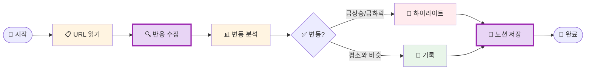

# 나의 워크샵 스킬 설계서

> 📋 **이 설계서는 [사전설문응답.md](사전설문응답.md) 인터뷰를 바탕으로 작성되었습니다.**

> ⚠️ **이 설계서는 초안입니다!**
>
> 정답이 아니에요. 워크샵 당일 강사님과 함께 범위를 더 좁히거나, 더 구체화할 수 있습니다.
>
> **사전과제의 목적**:
> 1. 스킬을 설치해서 한 번 써본 것 ✅
> 2. 나만의 스킬 설계서를 만들어서 "아, 내 작업이 이렇게 자동화되겠구나", "이런 흐름이겠구나" 감 잡기 ✅
>
> 이 정도면 충분해요! 나머지는 워크샵에서 함께 다듬어봐요 😊

## 목차
- [0. 선언](#0-선언)
- [한눈에 보기](#한눈에-보기)
- [Core (필수)](#core-필수)
  - [1. 언제 쓰나요?](#1-언제-쓰나요)
  - [2. 사용법](#2-사용법)
  - [3. 입력/출력 명세](#3-입력출력-명세)
  - [4. 범위](#4-범위)
  - [5. 데이터/도구/권한](#5-데이터도구권한)
  - [6. 실패/예외 처리](#6-실패예외-처리)
  - [7. 대화 시나리오](#7-대화-시나리오)
  - [8. 테스트 & 완료 기준](#8-테스트--완료-기준)
- [Optional](#optional-스킬-유형에-따라-선택)
  - [B. 외부 API 연동](#b-외부-api-연동인-경우)
  - [C. 다단계 워크플로우](#c-다단계-워크플로우인-경우)
- [나중에 더 발전시킬 아이디어](#나중에-더-발전시킬-아이디어)

---

## 0. 선언

- **스킬 이름**: `post-performance-tracker`
- **한 줄 설명**: 내가 올린 게시글(네이버 카페/블로그, 커뮤니티, 쓰레드, 인스타그램)의 조회수/반응을 자동 추적하여 노션 DB에 기록
- **만드는 사람**: 1인기업 CEO / 마케팅·기획 전반
- **스킬 유형**: [x] 외부 API  [x] 다단계 워크플로우
- **MVP 목표**: "게시글 URL 목록을 기반으로 각 글의 조회수/반응 변동을 확인하고, 노션 DB에 자동 업데이트하는 것"

---

## 한눈에 보기

### 외부 연동

| 서비스 | 용도 | 연동 방식 | 복잡도 | 가이드 |
|--------|------|----------|--------|--------|
| Notion | 게시글 URL 목록 읽기 + 실적 결과 저장 | MCP | 쉬움 | [📘 설정 가이드](연동가이드/Notion.md) |

> 📁 상세 설정 가이드: [연동가이드/](연동가이드/) 폴더 참조

### 워크플로 시각화

> 💡 **다이어그램이 안 보이나요?**
>
> VSCode에서 Mermaid 다이어그램을 보려면 확장 프로그램이 필요해요:
> 1. VSCode 왼쪽 사이드바에서 **확장(Extensions)** 아이콘 클릭 (또는 `Cmd+Shift+X`)
> 2. `Markdown Preview Mermaid Support` 검색
> 3. **Install** 클릭
> 4. 이 파일을 다시 열고 **미리보기**(`Cmd+Shift+V`)로 확인!



---

## Core (필수)

### 1. 언제 쓰나요?

**대표 상황**:
매일 아침, 여러 플랫폼(네이버 카페, 블로그, 커뮤니티, 쓰레드, 인스타그램)에 올린 마케팅 게시글들의 조회수와 반응을 확인하고 싶을 때.

**왜 필요한가**:
- 매일 5개 플랫폼을 하나하나 들어가서 조회수/반응을 확인하는 건 **시간 낭비**
- 숫자만 보면 변동이 있는지 없는지 감이 안 옴 → **비교 데이터가 필요**
- 1인기업이라 모든 걸 혼자 해야 하므로 **반복 작업은 줄여야** 함

### 2. 사용법

**이렇게 부르면**:
- `/post-performance-tracker`
- "게시글 실적 확인해줘"
- "오늘 게시글 반응 어때?"

**결과물 형태**: [x] 메시지  [x] 노션 DB 업데이트

**결과물 예시**:
> 📊 **게시글 실적 리포트** (2026-02-21)
>
> 🔥 **급상승**
> - [블로그] "1인기업 창업 후기" - 조회수 1,240 (+380, +44%)
>
> 📈 **상승**
> - [네이버카페] "신제품 소개글" - 조회수 520 (+85, +19%)
> - [인스타] "제품 언박싱" - 좋아요 89 (+23, +35%)
>
> ➡️ **변동 없음**
> - [쓰레드] "마케팅 팁 공유" - 조회수 210 (+5, +2%)
>
> 💡 **추천**: "1인기업 창업 후기" 글이 급상승 중! 댓글 달면서 소통하면 효과 극대화!
>
> ✅ 노션 DB 업데이트 완료

### 3. 입력/출력 명세

| 구분 | 내용 |
|------|------|
| **사용자 입력** | 트리거 문장 (별도 입력 없음, 노션 DB에서 URL 자동 읽기) |
| **필수 옵션** | 노션 DB에 게시글 URL이 등록되어 있어야 함 |
| **선택 옵션** | 특정 플랫폼만 확인 ("블로그만 확인해줘") |
| **출력 규칙** | 플랫폼별 그룹핑, 변동률 기준 정렬 (급상승 > 상승 > 변동없음 > 하락) |

### 4. 범위

**하는 것** (3개 이내):
1. 노션 DB에 등록된 게시글 URL의 조회수/좋아요/댓글 수 수집
2. 이전 기록 대비 변동 분석 (급상승/상승/변동없음/하락)
3. 결과를 노션 DB에 업데이트 + 요약 메시지 출력

**안 하는 것** (2개 이내):
1. 게시글 자동 작성/발행 (수집·분석만)
2. 광고 대시보드 연동 (메타 광고, GA 등은 포함 안 함)

### 5. 데이터/도구/권한

| 항목 | 내용 |
|------|------|
| **읽는 데이터** | 노션 DB (게시글 URL 목록 + 이전 실적 기록) |
| **쓰는 위치** | 노션 DB (실적 수치 업데이트) |
| **외부 서비스** | Notion (MCP), 각 플랫폼 웹페이지 (스크래핑/API) |
| **민감정보** | Notion API Key 필요 (`NOTION_API_KEY`) |

### 6. 실패/예외 처리

**예상되는 실패 상황**:
1. **URL 접근 불가** - 게시글이 삭제되었거나 비공개 전환
2. **플랫폼 차단** - 너무 자주 접근하면 일시 차단될 수 있음
3. **노션 DB 연결 실패** - API 키 만료 또는 DB 공유 설정 누락

**실패 시 안내 원칙**:
- 접근 불가 URL은 건너뛰고 나머지 결과 먼저 보여주기
- 어떤 URL이 실패했는지 목록으로 안내
- "이 URL은 접근이 안 돼요. 삭제되었거나 비공개인지 확인해주세요!"

### 7. 대화 시나리오

**정상 케이스**:

**나**: "게시글 실적 확인해줘"

**스킬**:
> 📋 노션 DB에서 게시글 12개를 읽었어요. 각 플랫폼 반응을 확인 중...
>
> 📊 **게시글 실적 리포트** (2026-02-21)
>
> 🔥 급상승: 2개 | 📈 상승: 5개 | ➡️ 변동없음: 3개 | 📉 하락: 2개
>
> (상세 내용...)
>
> ✅ 노션 DB 업데이트 완료!

**실패 케이스**:

**나**: "게시글 실적 확인해줘"

**스킬**:
> ⚠️ 노션 DB에 접근할 수 없어요!
>
> 확인해주세요:
> 1. Notion API Key가 설정되어 있는지 (`.env` 파일 확인)
> 2. 노션 DB가 Integration과 공유되어 있는지
>
> 설정 방법은 [연동가이드/Notion.md](연동가이드/Notion.md)를 참고하세요!

### 8. 테스트 & 완료 기준

**테스트 체크리스트**:
- [ ] 노션 DB에서 게시글 URL 목록 읽기 성공
- [ ] 네이버 블로그 조회수 수집 성공
- [ ] 네이버 카페 조회수 수집 성공
- [ ] 인스타그램 좋아요/댓글 수집 성공
- [ ] 쓰레드 반응 수집 성공
- [ ] 이전 기록 대비 변동률 계산 정확
- [ ] 결과 노션 DB 업데이트 성공
- [ ] 요약 메시지 출력 성공

**Done 기준**:
"트리거 한 번에 등록된 모든 게시글의 최신 반응을 수집하고, 변동 분석 결과가 노션 DB에 자동 저장되는 상태"

---

## Optional (스킬 유형에 따라 선택)

### B. 외부 API 연동인 경우

1개의 외부 서비스 연동이 필요합니다.

#### 환경변수 요약

이 스킬에 필요한 환경변수 목록입니다. (`.env.example` 참조)

| 변수명 | 서비스 | 발급 방법 |
|--------|--------|----------|
| `NOTION_API_KEY` | Notion | [https://www.notion.so/my-integrations](https://www.notion.so/my-integrations) |

> **Tip**: Claude Code에게 API 키를 알려주면 자동으로 `.env`에 설정해줘요!
> 예: "노션 키는 secret_xxxxx야"

#### B-1. Notion

| 항목 | 내용 |
|------|------|
| **Context7 Library ID** | `/makenotion/notion-mcp-server` |
| **필요한 credential** | Notion Internal Integration Token |
| **환경변수** | `NOTION_API_KEY` |
| **복잡도** | 쉬움 (API 키만 필요) |
| **예상 설정 시간** | 10~15분 |

**설정 가이드 요약**:
1. [notion.so/my-integrations](https://www.notion.so/my-integrations) 접속
2. "새 API 통합" 클릭
3. 이름 입력 (예: "post-tracker") → 저장
4. Internal Integration Token 복사 (`secret_`으로 시작)
5. 추적할 노션 DB에서 "연결" → 만든 Integration 추가

> 상세 가이드: [연동가이드/Notion.md](연동가이드/Notion.md)

---

### C. 다단계 워크플로우인 경우

**단계 목록**:
1. **URL 수집** → 노션 DB에서 추적 대상 게시글 URL 목록 읽기
2. **반응 수집** → 각 URL 접속하여 조회수/좋아요/댓글 수 스크래핑
3. **변동 분석** → 이전 기록과 비교하여 변동률 계산 + 등급 분류
4. **결과 저장** → 노션 DB 업데이트 + 요약 메시지 출력

**중단/재개 방법**:
- 특정 플랫폼이 실패해도 나머지는 계속 진행
- 실패한 URL만 별도 표시하여 다음에 재시도 가능

---

## 나중에 더 발전시킬 아이디어

- [ ] 채널 전체 실적 대시보드 추가 (메타 광고, GA, 틱톡 등)
- [ ] 주간/월간 트렌드 리포트 자동 생성
- [ ] 성과 좋은 게시글 패턴 분석 ("이런 제목이 잘 먹혀요")
- [ ] 슬랙/카톡 알림 연동 (급상승 글 즉시 알림)

---

## 배포 준비 (워크샵 후)

워크샵에서 스킬을 완성한 후, GitHub에 배포하여 다른 사람도 사용할 수 있게 합니다.

### 필요한 파일

| 파일 | 상태 | 설명 |
|------|------|------|
| `SKILL.md` | [ ] 미완성 | 스킬 정의 (워크샵에서 작성) |
| `README.md` | [ ] 자동생성 예정 | 설치 가이드 (배포 시 자동 생성) |
| `.env.example` | [x] 완료 | 환경변수 예시 |
| `.gitignore` | [x] 완료 | .env 제외 설정 |

### 배포 방법

워크샵에서 스킬을 완성한 후, Claude Code에게 말하세요:

```
이 스킬 배포해줘
```

Claude Code가 자동으로:
1. README.md 생성 (설치 방법 + 환경변수 가이드)
2. GitHub 레포 생성
3. 설치 명령어 안내

---

**워크샵 당일 이 설계서 가져오세요!**
