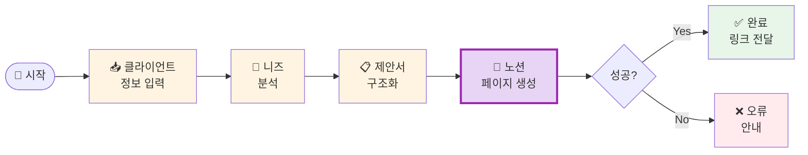

# 나의 워크샵 스킬 설계서

> 📋 **이 설계서는 [사전설문응답.md](사전설문응답.md) 인터뷰를 바탕으로 작성되었습니다.**

> ⚠️ **이 설계서는 초안입니다!**
>
> 정답이 아니에요. 워크샵 당일 강사님과 함께 범위를 더 좁히거나, 더 구체화할 수 있습니다.
>
> **사전과제의 목적**:
> 1. 스킬을 설치해서 한 번 써본 것 ✅
> 2. 나만의 스킬 설계서를 만들어서 "아, 내 작업이 이렇게 자동화되겠구나", "이런 흐름이겠구나" 감 잡기 ✅
>
> 이 정도면 충분해요! 나머지는 워크샵에서 함께 다듬어봐요 😊

## 목차
- [0. 선언](#0-선언)
- [한눈에 보기](#한눈에-보기)
- [Core (필수)](#core-필수)
  - [1. 언제 쓰나요?](#1-언제-쓰나요)
  - [2. 사용법](#2-사용법)
  - [3. 입력/출력 명세](#3-입력출력-명세)
  - [4. 범위](#4-범위)
  - [5. 데이터/도구/권한](#5-데이터도구권한)
  - [6. 실패/예외 처리](#6-실패예외-처리)
  - [7. 대화 시나리오](#7-대화-시나리오)
  - [8. 테스트 & 완료 기준](#8-테스트--완료-기준)
- [Optional](#optional)
  - [B. 외부 API 연동](#b-외부-api-연동인-경우)
  - [C. 다단계 워크플로우](#c-다단계-워크플로우인-경우)
- [나중에 더 발전시킬 아이디어](#나중에-더-발전시킬-아이디어)

---

## 0. 선언

- **스킬 이름**: `proposal-generator`
- **한 줄 설명**: 클라이언트 정보를 입력하면 논리적인 제안서를 노션 페이지로 자동 생성
- **만드는 사람**: get100 커뮤니티 리더 / SNS 대행·커뮤니티 운영 사업체 대표
- **스킬 유형**: [x] 외부 API  [x] 다단계 워크플로우
- **MVP 목표**: "클라이언트 니즈와 서비스 범위를 입력하면 노션에 제안서 페이지가 자동으로 생성된다"

---

## 한눈에 보기

### 외부 연동

| 서비스 | 용도 | 연동 방식 | 복잡도 | 가이드 |
|--------|------|----------|--------|--------|
| Notion | 제안서 페이지 생성 | MCP | 쉬움 | [📘 설정 가이드](연동가이드/notion.md) |

> 📁 상세 설정 가이드: [연동가이드/](연동가이드/) 폴더 참조

**준비 안내**: 당일 워크샵에서 설정 가능해요 (약 10-15분)

### 워크플로 시각화

> 💡 **다이어그램이 안 보이나요?**
>
> VSCode에서 Mermaid 다이어그램을 보려면 확장 프로그램이 필요해요:
> 1. VSCode 왼쪽 사이드바에서 **확장(Extensions)** 아이콘 클릭 (또는 `Ctrl+Shift+X`)
> 2. `Markdown Preview Mermaid Support` 검색
> 3. **Install** 클릭
> 4. 이 파일을 다시 열고 **미리보기**(`Ctrl+Shift+V`)로 확인!



---

## Core (필수)

### 1. 언제 쓰나요?

**대표 상황**:
브랜드·인플루언서로부터 SNS 대행, 커뮤니티 운영, 이벤트 기획 문의가 들어왔을 때. 클라이언트가 원하는 것과 내가 제공 가능한 서비스 범위를 파악한 직후, 정식 제안서를 만들어야 할 때.

**왜 필요한가** (불편/비용/시간):
- 현재 매달 1~2개의 제안서를 각각 2~3일씩 소요하여 제작
- 레퍼런스 찾기 + 논리적 전개 구성 + 노션 디자인 작업이 모두 처음부터 창작
- 월 최대 6일을 제안서에만 사용 → 이 시간을 30분~1시간으로 단축 목표

---

### 2. 사용법

**이렇게 부르면**:
- `/proposal-generator`
- "제안서 만들어줘"
- "클라이언트 제안서 써줘"
- "견적 제안서 만들어줘"

**결과물 형태**: [x] 링크/리포트 (노션 페이지 URL)

**결과물 예시**:
> 제안서가 노션에 생성되었어요!
>
> 📄 **[뷰티 브랜드 A - SNS 커뮤니티 성장 제안서](https://notion.so/...)**
>
> 주요 구성:
> - 현황 분석 & 문제 정의
> - 제안 전략 (SNS 콘텐츠 + 커뮤니티 운영)
> - 기대 효과 & 성과 지표
> - 진행 일정 & 견적

---

### 3. 입력/출력 명세

| 구분 | 내용 |
|------|------|
| **사용자 입력** | 클라이언트명, 니즈/목표, 원하는 서비스, 예산(선택), 기간(선택) |
| **필수 옵션** | 클라이언트명, 클라이언트 니즈 |
| **선택 옵션** | 예산 규모, 진행 기간, 특이사항 |
| **출력 규칙** | 노션 페이지로 생성, 제안서 URL 반환, 논리적 5단 구조 |

---

### 4. 범위

**하는 것** (3개 이내):
1. 클라이언트 정보 기반 논리적 제안서 구조 자동 생성
2. 노션에 깔끔하게 포맷된 제안서 페이지 생성
3. 생성된 노션 페이지 URL 전달

**안 하는 것** (2개 이내):
1. PPT 변환 (노션 완성 후 별도 작업)
2. 자동 발송 (링크는 직접 공유)

---

### 5. 데이터/도구/권한

| 항목 | 내용 |
|------|------|
| **읽는 데이터** | 사용자가 대화로 입력하는 클라이언트 정보 |
| **쓰는 위치** | Notion 워크스페이스 (지정 페이지 하위) |
| **외부 서비스** | Notion MCP |
| **민감정보** | NOTION_API_KEY 필요 (.env 파일로 관리) |

---

### 6. 실패/예외 처리

**예상되는 실패 상황**:
1. Notion API 키 미설정 또는 만료 → 키 재발급 안내
2. 입력 정보 부족 (클라이언트 니즈 불명확) → 추가 질문으로 보완
3. Notion 권한 없는 페이지에 생성 시도 → 권한 있는 페이지 선택 안내

**실패 시 안내 원칙**:
구체적인 해결 방법을 함께 안내. "노션 API 키가 없는 것 같아요! [연동가이드/notion.md](연동가이드/notion.md)를 참고해서 설정해보세요."

---

### 7. 대화 시나리오

**정상 케이스**:

**나**: "제안서 만들어줘. 클라이언트는 뷰티 브랜드 A고, 인스타 팔로워 10만 달성하고 싶대. 예산은 월 300만원, 기간 3개월이야."

**스킬**:
> 알겠어요! 제안서 구조 잡고 노션에 만들게요.
>
> 📋 구성 중...
> - 현황 분석 & 목표 정의
> - 전략 제안 (콘텐츠 기획 + 커뮤니티 활용)
> - 기대 효과 & KPI
> - 월별 진행 일정
> - 견적 (월 300만원 기준)
>
> ✅ 노션 페이지 생성 완료!
> 👉 [뷰티 브랜드 A 제안서 보기](https://notion.so/...)

**실패 케이스**:

**나**: "제안서 만들어줘"

**스킬**:
> 제안서를 만들려면 몇 가지 정보가 필요해요!
>
> - 클라이언트 이름 또는 업종은요?
> - 클라이언트가 원하는 게 뭔가요? (팔로워 증가, 행사 기획, 커뮤니티 활성화 등)
> - 예산이나 기간이 정해져 있나요? (없어도 괜찮아요!)

---

### 8. 테스트 & 완료 기준

**테스트 체크리스트**:
- [ ] 클라이언트 정보 입력 → 노션 페이지 자동 생성되는지 확인
- [ ] 정보가 부족할 때 → 추가 질문을 하는지 확인
- [ ] 생성된 노션 페이지 → 5단 논리 구조가 맞는지 확인
- [ ] API 키 없을 때 → 친절한 에러 안내가 나오는지 확인

**Done 기준**:
"클라이언트 이름과 니즈만 말하면 노션에 제안서 페이지가 생기고, 그 링크를 바로 받을 수 있다."

---

## Optional

### B. 외부 API 연동인 경우

1개의 외부 서비스 연동이 필요합니다.

#### 환경변수 요약

| 변수명 | 서비스 | 발급 방법 |
|--------|--------|----------|
| `NOTION_API_KEY` | Notion | https://www.notion.so/my-integrations |

> **Tip**: Claude Code에게 API 키를 알려주면 자동으로 `.env`에 설정해줘요!
> 예: "노션 키는 secret_xxxx야"

#### B-1. Notion

| 항목 | 내용 |
|------|------|
| **필요한 credential** | Internal Integration Token |
| **환경변수** | `NOTION_API_KEY` |
| **복잡도** | 쉬움 |
| **예상 설정 시간** | 10-15분 |

**설정 가이드 요약**:
[📘 Notion 연동 가이드 보기](연동가이드/notion.md)

---

### C. 다단계 워크플로우인 경우

**단계 목록**:
1. 클라이언트 정보 수집 → 산출물: 구조화된 입력 데이터
2. 논리적 제안서 구조 생성 → 산출물: 제안서 초안 (문제→전략→효과→일정→견적)
3. 노션 페이지 생성 → 산출물: 노션 URL

**중단/재개 방법**:
노션 생성 전에 초안을 먼저 보여주고, "이대로 노션에 올릴까요?"로 확인 후 진행

---

## 나중에 더 발전시킬 아이디어

- [ ] 과거 제안서 노션 페이지를 레퍼런스로 참고하여 스타일 통일
- [ ] 클라이언트 유형별 템플릿 분기 (브랜드 / 인플루언서 / 커뮤니티)
- [ ] 제안서 완성 후 PDF로 자동 내보내기
- [ ] 수락된 제안서를 기반으로 계약서 초안 자동 생성

---

## 배포 준비 (워크샵 후)

워크샵에서 스킬을 완성한 후, GitHub에 배포하여 다른 사람도 사용할 수 있게 합니다.

### 필요한 파일

| 파일 | 상태 | 설명 |
|------|------|------|
| `SKILL.md` | [ ] 미완성 | 스킬 정의 (워크샵에서 작성) |
| `README.md` | [ ] 자동생성 예정 | 설치 가이드 (배포 시 자동 생성) |
| `.env.example` | [x] 완료 | 환경변수 예시 |
| `.gitignore` | [x] 완료 | .env 제외 설정 |

### 배포 방법

워크샵에서 스킬을 완성한 후, Claude Code에게 말하세요:

```
이 스킬 배포해줘
```

Claude Code가 자동으로:
1. README.md 생성 (설치 방법 + 환경변수 가이드)
2. GitHub 레포 생성
3. 설치 명령어 안내

---

**워크샵 당일 이 설계서 가져오세요!**
