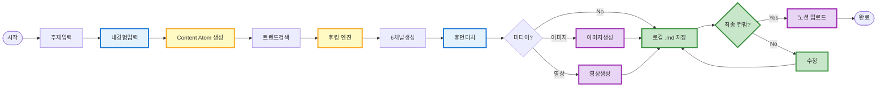

# SOPA Content Engine 설계서 v2.0

> **이 설계서는 [사전설문응답.md](사전설문응답.md) 인터뷰를 바탕으로 작성되었습니다.**
>
> v2.0 업그레이드: 후킹 엔진(200+), 채널별 알고리즘 프록시 모델, Content Atom 프레임워크, 바이럴 루프, 채널 성장 전략, SOPA 브랜드 보이스 톤 가이드 전면 통합

---

## 목차

- [Part 1: 스킬 정의](#part-1-스킬-정의)
  - [0. 선언](#0-선언)
  - [한눈에 보기](#한눈에-보기)
  - [1. 언제 쓰나요?](#1-언제-쓰나요)
  - [2. 사용법](#2-사용법)
  - [3. 입력/출력 명세](#3-입력출력-명세)
  - [4. 범위](#4-범위)
  - [5. 데이터/도구/권한](#5-데이터도구권한)
  - [6. 실패/예외 처리](#6-실패예외-처리)
  - [7. 대화 시나리오](#7-대화-시나리오)
  - [8. 테스트 & 완료 기준](#8-테스트--완료-기준)
- [Part 2: 콘텐츠 엔진 코어 시스템](#part-2-콘텐츠-엔진-코어-시스템)
  - [A. Content Atom Sheet](#a-content-atom-sheet-콘텐츠-원자)
  - [B. 후킹 엔진](#b-후킹-엔진)
  - [C. SOPA 브랜드 보이스 톤 가이드](#c-sopa-브랜드-보이스-톤-가이드)
  - [D. 휴먼터치 엔진](#d-휴먼터치-엔진)
- [Part 3: 채널별 전략 & 알고리즘](#part-3-채널별-전략--알고리즘)
  - [공통 알고리즘 파이프라인](#공통-피드추천-알고리즘-표준-파이프라인)
  - [3-1. X](#3-1-x-구-twitter)
  - [3-2. Threads](#3-2-threads)
  - [3-3. Instagram](#3-3-instagram)
  - [3-4. LinkedIn](#3-4-linkedin)
  - [3-5. 네이버 블로그](#3-5-네이버-블로그)
  - [3-6. YouTube](#3-6-youtube)
- [Part 4: 바이럴 루프 & 성장 전략](#part-4-바이럴-루프--성장-전략)
- [Part 5: OSMU 마스터 프롬프트](#part-5-osmu-마스터-프롬프트)
- [Part 6: Optional & 확장](#part-6-optional--확장)

---

# Part 1: 스킬 정의

## 0. 선언

- **스킬 이름**: `sopa-content-engine`
- **버전**: v2.0
- **한 줄 설명**: SOPA 개인 브랜드의 AI 트렌드/꿀팁 콘텐츠를 6개 채널에 최적화하여 한 번에 생성하는 OSMU 콘텐츠 엔진
- **만드는 사람**: SOPA (AI 트렌드 크리에이터)
- **스킬 유형**: [x] 텍스트 변환  [x] 파일 기반  [x] 외부 API  [x] 다단계 워크플로우
- **MVP 목표**: "하나의 AI 트렌드 주제를 입력하면 SOPA의 진짜 목소리가 담긴 6개 채널 최적화 콘텐츠가 로컬 파일로 저장되고, 사용자 컨펌 후 노션에 업로드된다"
- **타겟**: AI 입문자 / 비개발자
- **성장 단계**: 신규 시작 (0~1K 팔로워)

---

## 한눈에 보기

### 대상 채널 (6개)

| 우선순위 | 채널 | 역할 | 핵심 지표 |
|---------|------|------|----------|
| 1 | X | 빠른 확산 + 관점 선점 | 답글/리포스트 |
| 2 | Threads | 대화형 확산 + 팔로우 전환 | 답글 수/대댓글 깊이 |
| 3 | Instagram | 도달 + 저장 기반 확산 + DM 전환 | 저장/공유/완시율 |
| 4 | LinkedIn | 권위 구축 + B2B 리드 | 체류/의미있는 댓글 |
| 5 | 네이버 블로그 | 검색 기반 장기 자산 (SEO) | 검색 유입/체류 |
| 6 | YouTube | 숏폼/롱폼 영상 자산 | CTR/시청시간/구독전환 |

> 카카오톡, 틱톡은 [나중에 발전시킬 아이디어](#나중에-더-발전시킬-아이디어)로 이동

### 외부 연동

| 서비스 | 용도 | 연동 방식 | 상태 |
|--------|------|----------|------|
| Notion | 콘텐츠 업로드/관리 (사용자 컨펌 후) | MCP (Claude.ai 원격 연동 완료) | 완료 |
| Gemini (nanobanana) | 이미지 생성 | MCP (설치됨) | 완료 |
| Veo3 | 영상 생성 | MCP (설치됨) | 완료 |
| n8n | 크론잡 스케줄링 | MCP (설치됨) | 가이드 완성 |

### 워크플로 시각화



> 파란색 = 휴먼터치 레이어 / 노란색 = v2.0 신규 엔진 / 초록색 = 로컬 저장 & 컨펌 레이어

---

## 1. 언제 쓰나요?

**대표 상황**:
- 매일 AI 트렌드 뉴스나 개인 꿀팁을 6개 SNS 채널에 올려야 할 때
- 하나의 소스 콘텐츠를 채널별 알고리즘과 전략에 맞게 최적화해야 할 때
- 팔로우하는 크리에이터의 새 콘텐츠를 놓치지 않고 수집/분석하고 싶을 때

**왜 필요한가**:
- AI 없이 하면 **매일 3시간 이상** 소요
- 6개 채널마다 알고리즘, 톤, 포맷이 전부 다름
- 후킹 문장 하나가 도달률을 10배 바꿈 — 체계적 후킹 엔진 필요
- 채널별 최신 알고리즘 변화를 매번 확인하기 어려움

## 2. 사용법

**이렇게 부르면**:
- `/sopa-content-engine`
- "오늘 콘텐츠 만들어줘"
- "SOPA 콘텐츠"
- "AI 트렌드 콘텐츠 생성해줘"

**결과물 형태**: [x] 메시지  [x] 파일  [ ] 링크/리포트  [ ] 기타

**결과물 예시**:
> **SOPA 콘텐츠 생성 완료!** (2026-02-20)
>
> **주제**: "Claude Code로 반복 업무 자동화하기"
>
> | 채널 | 상태 | 미리보기 |
> |------|------|---------|
> | X | 완료 | 임팩트 트윗 + 쓰레드 (답글/리포스트 최적화) |
> | Threads | 완료 | 대화형 포스트 (댓글 유도 질문 포함) |
> | Instagram | 완료 | 캐러셀 7장 + 릴스 대본 + 해시태그 |
> | LinkedIn | 완료 | 전문가 인사이트 (체류/저장 최적화) |
> | 네이버블로그 | 완료 | SEO 장문 2,500자 + FAQ 5개 |
> | YouTube | 완료 | 숏폼 스크립트 + 제목/설명/태그/챕터 |
>
> `contents/01_2026-02-20 Claude Code 4.6 출시.md`에 저장 완료. 노션에 업로드할까요?

## 3. 입력/출력 명세

| 구분 | 내용 |
|------|------|
| **사용자 입력** | AI 트렌드 주제 (텍스트) 또는 내 꿀팁 내용 |
| **필수 옵션** | 콘텐츠 유형: `트렌드뉴스` / `꿀팁` |
| **필수 입력: 내 목소리** | 이 주제에 대한 나의 경험, 생각, 의견 (1~3문장 이상) |
| **선택 옵션** | 참고 URL, 특정 채널만 생성, 이미지/영상 생성 여부 |
| **내부 처리** | Content Atom 생성 → 후킹 엔진으로 채널별 최적 후킹 선택 → 알고리즘 프록시 반영 |
| **출력 파일** | `contents/{번호}_{날짜} {주제요약}.md` (예: `contents/01_2026-02-20 Claude Code 4.6 출시.md`) |
| **출력 규칙** | 채널별 최적 포맷 / SOPA 브랜드 톤 / 알고리즘 프록시 모델 반영 / **AI 작성 티 제거 필수** |

> **핵심 원칙**: 모든 콘텐츠에 SOPA의 개인 경험/생각/의견이 반드시 포함되어야 합니다.
> 스킬은 주제 입력 후 "이 주제에 대한 나의 경험이나 생각을 알려주세요"라고 반드시 물어봅니다.

## 4. 범위

**하는 것**:
1. 6개 채널에 최적화된 OSMU 콘텐츠 생성 (후킹 엔진 + 알고리즘 프록시 + 바이럴루프 + 브랜드 보이스 적용)
2. 이미지/영상 필요시 Gemini (nanobanana MCP) / Veo3 (MCP)로 자동 생성
3. 로컬 .md 파일 생성 후 사용자 컨펌을 거쳐 노션에 업로드

**안 하는 것**:
1. 각 채널에 직접 업로드 (콘텐츠 생성까지만, 복붙은 직접)
2. 유료 광고 캠페인 세팅 (퍼포먼스 마케팅은 별도)

## 5. 데이터/도구/권한

| 항목 | 내용 |
|------|------|
| **읽는 데이터** | 웹 검색 결과 (AI 트렌드), 크리에이터 콘텐츠 URL, 사용자 입력 텍스트 |
| **쓰는 위치** | 로컬 `contents/` 폴더 (.md 파일), 노션 데이터베이스 (사용자 컨펌 후 업로드), 로컬 이미지/영상 파일 |
| **외부 서비스** | Notion (Claude.ai 원격 MCP), Gemini nanobanana (MCP), Veo3 (MCP), n8n (MCP) |
| **민감정보** | 없음 |

## 6. 실패/예외 처리

| 실패 상황 | 안내 |
|----------|------|
| 트렌드 검색 실패 | "검색 결과가 부족해요. 주제를 좀 더 구체적으로 알려주시거나, 참고 URL을 붙여주세요!" |
| 이미지 생성 실패 | "이미지 생성이 안 됐어요. 텍스트 콘텐츠는 정상 생성됐으니, 이미지는 다시 시도해주세요!" |
| 노션 업로드 실패 | "노션 연결이 안 돼요. 로컬 파일은 정상 저장됐으니 나중에 다시 업로드해드릴게요!" |
| 사용자 컨펌 거절 | "수정할 부분을 알려주세요! 수정 후 다시 저장해드릴게요." |
| 후킹 엔진 매칭 실패 | "이 주제에 딱 맞는 후킹이 없어서, 범용 후킹으로 생성했어요. 직접 수정하셔도 좋아요!" |

## 7. 대화 시나리오

**정상 케이스**:

**나**: "오늘 콘텐츠 만들어줘. 주제는 Claude Code 4.6 출시 소식이야"

**스킬**:
> "Claude Code 4.6" 관련 최신 트렌드를 검색할게요...
> 5개의 관련 소스를 찾았어요!
>
> **이 주제에 대한 SOPA의 경험이나 생각을 알려주세요!**
> 예: "직접 써봤는데 코드 리뷰 속도가 체감 2배 빨라짐", "팀에 도입했더니 이런 반응이었다" 등
> (구체적일수록 콘텐츠가 진짜 내 글처럼 나와요!)

**나**: "어제 밤에 바로 업데이트해서 써봤는데, 이전 버전에서 답답했던 멀티파일 수정이 한 번에 되더라. 팀원한테 보여줬더니 '이거 사람이 한 거 아니냐'고 했음ㅋㅋ 진짜 AI 코딩 도구의 게임체인저인 듯"

**스킬**:
> Content Atom 생성 중...
> - 대상: AI 입문자/비개발자
> - 상황: AI 코딩 도구 선택/업데이트 고민
> - 한 줄 결론: 멀티파일 수정 한 방이면 AI 코딩 도구 갈아타야 할 이유 충분
> - 오해: AI 코딩 도구는 개발자만 쓰는 거다
> - 반전 진실: 비개발자도 자동화에 바로 쓸 수 있다
>
> 후킹 엔진 가동...
> - X: [강한 자극 × 반전] "팀원이 '이거 사람이 한 거 아니냐'고 했음. 실화임"
> - Threads: [공감 × 질문] "AI 코딩 도구 써봤는데 답답했던 적 있어요?"
> - Instagram: [Before&After × 숫자] "멀티파일 수정 3시간 → 10초로 줄인 방법"
> - LinkedIn: [권위 × 교육] "Claude Code 4.6 실사용 후기 — 비개발자 관점"
> - 네이버블로그: [교육 × 체크리스트] "Claude Code 4.6 업데이트 총정리 + 꼭 써봐야 할 기능 3가지"
> - YouTube: [반전 × 숫자] "코딩 1도 모르는 내가 AI로 자동화한 후기"
>
> 6채널 콘텐츠 생성 완료! `contents/01_2026-02-20 Claude Code 4.6 출시.md`에 저장했어요. 확인 후 노션에 업로드할까요?

**나**: "응 올려줘"

**스킬**:
> 노션에 업로드 완료!
> 📄 https://www.notion.so/01_2026-02-20-Claude-Code-4.6-출시-xxxxx
>
> 노션 페이지 제목도 파일명과 동일하게 맞췄어요.

**수정 케이스**:

**나**: "인스타 캐러셀 톤 좀 더 가볍게 바꿔줘"

**스킬**:
> Instagram 캐러셀 톤을 수정했어요!
> `contents/01_2026-02-20 Claude Code 4.6 출시.md` 업데이트 완료. 다시 확인해보시고, 노션에 올릴까요?

## 8. 테스트 & 완료 기준

**테스트 체크리스트**:
- [ ] 트렌드 주제 입력 → 6개 채널 콘텐츠 모두 생성되는지
- [ ] 꿀팁 주제 입력 → 6개 채널 콘텐츠 모두 생성되는지
- [ ] Content Atom Sheet가 정상 생성되는지
- [ ] 후킹 엔진이 채널별로 다른 후킹을 선택하는지
- [ ] 각 채널 콘텐츠가 해당 채널의 알고리즘 프록시에 맞는지
- [ ] 이미지 생성 요청 시 Gemini로 이미지가 만들어지는지
- [ ] 로컬 .md 파일이 `contents/` 폴더에 올바른 네이밍(`{번호}_{날짜} {주제요약}.md`)으로 저장되는지
- [ ] 사용자 컨펌 후에만 노션에 업로드되는지
- [ ] 생성된 콘텐츠가 AI가 쓴 느낌 없이 자연스러운지 (휴먼터치 3단계 기준)
- [ ] SOPA의 입력한 경험/생각이 콘텐츠에 자연스럽게 녹아 있는지
- [ ] SOPA 브랜드 보이스(친근한/쉬운/솔직한)가 일관되게 유지되는지

**Done 기준**:
"하나의 AI 트렌드 주제와 나의 경험을 입력했을 때, AI가 쓴 티 없이 SOPA의 진짜 목소리가 담긴 6개 채널 최적화 콘텐츠가 생성되고, 로컬 파일로 저장된 뒤 사용자 컨펌 후 노션에 업로드된다"

---

# Part 2: 콘텐츠 엔진 코어 시스템

## A. Content Atom Sheet (콘텐츠 원자)

> OSMU의 운영 단위는 "포스트"가 아니라 **콘텐츠 원자(Atom)**이다.
> 원본 1개마다 아래 시트를 1회 작성하면, 6개 채널로 자동 분기된다.

**원본 1개당 생성하는 Content Atom Sheet:**

```
[Content Atom Sheet]

- 대상(누구): {AI 입문자/비개발자/마케터/직장인/크리에이터}
- 상황(언제): {막 시작함/정체기/도구 선택 중/업무 자동화 고민/성과 하락}
- 한 줄 결론(1문장): {결론}
- 핵심 포인트 3개:
  1. {포인트1}
  2. {포인트2}
  3. {포인트3}
- 오해(사람들이 보통 믿는 것 1개): {오해 문장}
- 반전 진실(SOPA가 주장하는 것 1개): {진실 문장}
- 프로세스(3단계):
  1. {Step1}
  2. {Step2}
  3. {Step3}
- 증거(수치/사례/관찰 1개): {숫자, 기간, 전후, 케이스}
- 주의/리스크(하면 안 되는 것 1개): {금지/실수}
- CTA 1개: {저장/댓글/DM/팔로우/링크클릭/구독}
```

---

## B. 후킹 엔진

> "후킹 문장"이 아니라 **후킹-본문-CTA의 정합성**이 성과를 만든다.
> 후킹 엔진은 3가지를 조합해서 채널별 최적 후킹을 자동 선택한다.

### B-1. 후킹 모드(WHY) — 퍼널 기준 선택

콘텐츠의 목적(퍼널 위치)에 따라 후킹 모드를 선택한다.

| 퍼널 단계 | 목적 | 추천 후킹 모드 |
|----------|------|---------------|
| **인지(Awareness)** | 스크롤 멈춤, 첫 인상 | 강한 자극 / 공감 / 오해깨기 / 유머 |
| **신뢰(Trust)** | 전문성 입증, 관계 형성 | 교육 / 권위 / 공통점 분석 / Before&After |
| **전환(Conversion)** | 행동 유도 (저장/DM/팔로우) | Step-by-step / Do&Don't / 체크리스트 / 실수 교정 |
| **유지(Retention)** | 재방문, 시리즈 소비 | 루틴 공개 / 시리즈 / Q&A / 사례 분해 |

> SOPA 신규 시작 단계에서는 **인지(60%) + 신뢰(30%) + 전환(10%)** 비율 권장

### B-2. 오프너 구조(HOW) — 4개 중 1개만 선택

| 구조 | 패턴 | 예시 (SOPA 톤) |
|------|------|----------------|
| **선언** | "지금부터 {기간} 안에 {목표} 하겠다" | "이번 주 안에 AI 자동화 3개 만들어볼게요" |
| **질문** | "{조건}인 내가 {결과}가 가능할까?" | "코딩 1도 모르는 내가 AI로 업무 자동화 가능할까?" |
| **반전** | "{A}가 없는데도 {결과}가 났다" | "프로그래밍 경험 0인데 AI로 보고서 자동화했음" |
| **문제제기** | "{문제상황}이면 {이것}부터 점검하세요" | "AI 도구 써봤는데 효과 없다고요? 이거부터 확인해보세요" |

### B-3. 앰프(증폭장치) — 1개만 추가

후킹에 임팩트를 더하는 증폭장치. 1개만 선택해서 붙인다.

| 앰프 | 효과 | 예시 |
|------|------|------|
| **숫자** | 구체성 → 신뢰 | "3시간 → 10분", "87%가 모르는" |
| **비교(A vs B)** | 선택 갈등 → 클릭 | "ChatGPT vs Claude, 뭐가 다를까?" |
| **권위(경력/사례)** | 전문성 → 신뢰 | "마케터 3년차가 직접 써본" |
| **감정(고백)** | 진정성 → 공감 | "솔직히 이거 알려주기 아까운데" |
| **금지(하지 마세요)** | 손실회피 → 주의 | "이거 먼저 하지 마세요" |

### B-4. 채널별 후킹 자동 선택 규칙

| 채널 | 최적 후킹 모드 | 최적 오프너 | 이유 |
|------|---------------|------------|------|
| **X** | 강한 자극 / 오해깨기 / 숫자 | 반전 / 문제제기 | 답글(논쟁) + 리포스트 유도 |
| **Threads** | 공감 / 스토리 / 교육 | 질문 / 반전 | 댓글/답글 유도 최적 |
| **Instagram** | Before&After / 실수 / 숫자 | 반전 / 선언 | 저장/공유 유도 |
| **LinkedIn** | 권위 / 교육 / 공통점 분석 | 선언 / 문제제기 | 체류 + 전문성 |
| **네이버블로그** | 교육 / Step-by-step / 체크리스트 | 문제제기 / 선언 | 검색의도 만족 + D.I.A |
| **YouTube** | 강한 자극 / 반전 / 숫자 | 질문 / 반전 | CTR + 첫 3초 |

### B-5. 후킹 데이터베이스 — 검증된 100가지 후킹멘트

> 아래 템플릿의 {{빈칸}}에 SOPA의 주제/키워드를 넣어 사용한다.
> AI 트렌드/꿀팁 맥락에서 **대상 = AI 입문자/비개발자**로 자동 치환한다.

#### EDUCATION (교육형 / 정보전달형)

1. 60초 만에 {{업계 핵심 포인트}} 이해시키는 법
2. 대부분 이거 잘못 알고 있어요. {{업계 개념}} 진짜 의미는 이겁니다.
3. 제가 {{기간}} 동안 {{업계}} 하면서 터득한 진짜 핵심만 알려드릴게요.
4. {{결과}} 얻는 데 필요한 핵심 루틴 3단계, 바로 공개합니다.
5. {{도구/방법}} 제대로 쓰는 사람 거의 없습니다. 오늘 확실히 배워가세요.
6. 이건 교과서에서 절대 안 알려주는 내용입니다.
7. {{결과}} 만들고 싶다면, 이걸 먼저 이해해야 합니다.
8. {{업계}} 초보자들이 꼭 알아야 할 기본기 3가지
9. 전문가들이 실제로 이렇게 합니다 — 이유가 있습니다.
10. {{주제}} 공부를 시작하는 사람이라면, 이건 꼭 보세요.

#### MYTHS (오해/편견 깨기형)

11. 아직도 {{업계 속설}} 믿어요? 그건 진짜 큰 착각이에요.
12. {{유명한 말/트렌드}} 완전 틀렸어요. 제가 증명해드릴게요.
13. "{{잘못된 습관}}" 하면 잘 될 거라 생각하죠? 현실은 반대예요.
14. 이건 진짜 업계 사람들도 잘 모릅니다.
15. 솔직히 {{이 행동}} 하는 사람치고 성공한 사람 거의 없습니다.
16. {{업계 신화/트렌드}} 이건 진짜 마케팅용이에요. 속지 마세요.
17. {{OO}} 해야 성공한다고요? 전혀요. 오히려 망합니다.
18. 나도 예전엔 그렇게 믿었어요. 근데 해보니까 완전 달랐어요.
19. 이건 부모님, 선생님, 심지어 전문가들도 틀렸습니다.
20. {{업계 루머}} 믿고 시간 버리는 사람 너무 많아요.

#### STEP-BY-STEP SYSTEMS (실전 노하우 / 방법 공개형)

21. 제가 {{결과}} 낸 정확한 루틴, 공개합니다.
22. {{결과}} 만들고 싶다면 오늘부터 이 3단계만 하세요.
23. {{기간}} 만에 {{성과}} 낸 실제 프로세스, 이겁니다.
24. {{문제상황}}일 때 이 순서대로 하세요.
25. {{업계}} 전문가들이 쓰는 실전 공식, 이렇게 합니다.
26. {{도구/앱}} 이렇게 써야 진짜 효과 납니다.
27. {{결과}} 10배 빨리 만드는 루틴 — 진짜 간단해요.
28. {{업계}} 제대로 하고 싶다면, 이 순서 꼭 지키세요.
29. {{시간제한}} 안에 {{결과}} 만드는 초간단 루틴
30. {{문제}} 생길 때마다 이 3단계로 바로 해결하세요.

#### COMMON MISTAKES (흔한 실수 / 반전 유도형)

31. 대부분 이거부터 해요. 근데 그게 제일 큰 실수입니다.
32. {{업계 초보자}}들이 망하는 이유는 딱 하나예요.
33. {{결과}} 안 나오는 이유? 사실 이 행동 때문이에요.
34. {{이런 행동}} 하면 진짜 시간 낭비입니다.
35. {{결과}} 안 나는 사람들의 공통점 TOP 3
36. 이거 먼저 하지 마세요. 순서가 완전 반대입니다.
37. {{OO}} 믿는 순간, {{결과}}는 멀어집니다.
38. 나도 한때 이거 몰라서 {{실패}}했어요.
39. {{이 행동}} 하는 사람은 평생 {{결과}} 못 냅니다.
40. 이건 하지 마세요. 차라리 아무것도 하지 마세요.

#### AUTHORITY (전문가/권위 강조형)

41. 제가 {{직업/전문분야}}로 일한 지 {{기간}} 됐습니다. 이건 진짜 팩트예요.
42. {{클라이언트/사례}}도 이걸로 {{결과}} 냈습니다.
43. {{유명인/전문가}}도 이 방식 씁니다. 이유가 있어요.
44. 제가 실제로 {{성과}} 낸 방법 그대로 알려드립니다.
45. 이건 제가 컨설팅할 때 돈 받고 알려주는 내용이에요.
46. {{직업}}으로 일하면서 얻은 가장 큰 교훈 하나, 오늘 공개합니다.
47. {{유명인/책/연구결과}}에서도 이 원리를 강조합니다.
48. {{업계 베테랑}} 10명이 공통으로 말한 한 가지 진실
49. 제가 {{기간}}간 수백 명을 봤는데, {{결과}} 나는 사람들은 전부 이걸 합니다.
50. {{업계}} 진짜 프로들은 절대 이렇게 안 합니다.

#### BONUS — 바이럴형 감정/스토리 후킹

51. 나 이거 말하면 욕먹을 수도 있는데, 진짜로요.
52. 이건 좀 충격일 수도 있어요.
53. 저 진짜 이거 알려드려도 되나 고민했어요.
54. 이건 솔직히 말해서 제가 유료로 알려주는 팁이에요.
55. {{문제상황}} 겪는 사람, 이 글 끝까지 보세요.
56. {{결과}} 내고 싶은 사람, 지금부터 집중하세요.
57. {{기간}} 동안 이걸 꾸준히 했더니 진짜 달라졌어요.
58. {{결과}} 나오는 사람 vs 안 나오는 사람의 결정적 차이
59. 나도 예전엔 {{실수}} 했어요. 근데 이걸 바꾸고 인생 바뀜.
60. {{업계}} 사람이라면 이 글 꼭 저장해두세요.

#### 숫자 & 비교 강조형

61. {{기간}} 동안 {{결과}} 낸 정확한 루틴 3단계
62. {{숫자}}명 중 {{퍼센트}}%가 이거 잘못하고 있습니다.
63. {{결과}} 얻고 싶다면, 이 3가지만 하세요.
64. {{기간}} 만에 {{결과}} 얻는 진짜 루틴
65. {{결과}} 10배 빠르게 만드는 단 한 가지 습관
66. 제가 {{클라이언트 수}}명에게 공통으로 해준 조언입니다.
67. 이 3가지 중 하나라도 해당된다면, 당신은 {{결과}} 못 냅니다.
68. 100명 중 단 1명만 아는 진짜 비밀
69. {{업계}} 전문가 10명 중 9명이 이걸 추천합니다.
70. {{기간}} 만에 인생 바뀐 이유, 숫자로 보여드릴게요.

#### 유머 & 반전형

71. {{업계 루머}} 믿는 건 산타 믿는 거랑 똑같아요.
72. {{결과}} 얻고 싶다면 차라리 로또를 사세요. 그게 더 빠를 수도 있어요.
73. {{이 행동}} 하는 건 진짜 '헬스장 가서 햄버거 먹는 수준'이에요.
74. {{트렌드}}요? 그거 이미 끝났습니다.
75. {{결과}} 얻으려면? 네, 역발상 하세요.
76. {{이 행동}} 하는 건 진짜 "칼 들고 총싸움 나가는 수준"이에요.
77. {{OO}} 믿는 사람치고 {{결과}} 난 사람, 본 적 없습니다.
78. {{업계 밈/유행어}} 이게 왜 틀렸는지 아세요?
79. {{문제}} 해결하려다 오히려 망하는 이유, 웃기지만 진짜입니다.
80. {{업계 미신}} 믿는 순간, 인생이 개고생 모드로 들어갑니다.

#### 공감 유도형 (시청자 상황 대변)

81. "저는 {{문제상황}}이 제일 싫어요…" 하는 분들, 이 글 꼭 보세요.
82. 솔직히 {{결과}} 안 나는 거, 당신 잘못 아닙니다.
83. {{업계 초보자}}라면 누구나 겪는 문제입니다.
84. "왜 나는 안 되지?" 싶은 분들, 이유가 있습니다.
85. {{결과}} 안 나오는 사람들의 공통점은 생각보다 단순해요.
86. {{문제상황}} 때문에 힘든 분들, 제가 해드릴 말 있어요.
87. {{결과}} 내는 사람들은 절대 이 말을 안 믿습니다.
88. "이거 진짜 될까?" 싶은 분들, 직접 보여드릴게요.
89. {{업계}} 시작하려는 분들, 이 글이 첫 단추예요.
90. {{문제상황}} 겪는 분이라면 이거 진짜 필수입니다.

#### 강한 자극형 (스크롤 멈춤용)

91. 진짜 이건 몰랐을 걸요?
92. 이건 말하면 좀 위험할 수도 있는데요…
93. {{업계 사람들}} 이거 보면 싫어할 거예요.
94. 이걸 알면, 절대 예전으로 못 돌아갑니다.
95. 솔직히 이건 알고도 안 하는 게 죄예요.
96. 당신이 {{결과}} 못 내는 이유, 진짜는 따로 있습니다.
97. 이거 보면 {{문제}} 한 방에 이해됩니다.
98. {{업계}}에서 살아남으려면, 지금 이걸 해야 합니다.
99. 이건 제가 {{기간}} 동안 실패하면서 얻은 결론입니다.
100. 이 글, 저장 안 하면 진짜 후회합니다.

### B-6. 후킹 데이터베이스 — 상황별 101가지 후킹멘트

> 아래는 상황/구조별 후킹 템플릿이다. {{빈칸}}에 주제를 넣어 사용한다.

#### 공용: 선언하기

| # | 후킹 템플릿 | SOPA 적용 예시 |
|---|-----------|---------------|
| 1 | 저는 지금부터 {{기간}} 안에, {{목표}}를 할 겁니다 | "저는 지금부터 30일 안에, AI 자동화 꿀팁 30개를 공유할 겁니다" |
| 2 | 내 나이 {{나이}}, {{결심}}하기로 했다 | "마케터 3년차, AI 크리에이터로 전향하기로 했다" |
| 3 | 팔로워 1명당 {{행동}} 하겠습니다 | "팔로워 1명당 AI 꿀팁 1개를 공유하겠습니다" |
| 4 | 오늘부터 {{방법}}으로 {{도전}} 해보겠습니다 | "오늘부터 하루에 AI 도구 1개씩 총 100개를 리뷰해보겠습니다" |
| 5 | 저는 {{기존 방식}} 대신 {{나만의 방식}}으로 살기로 했습니다 | "저는 3시간 콘텐츠 노가다 대신 AI로 10분에 끝내기로 했습니다" |

#### 공용: 질문하기

| # | 후킹 템플릿 | SOPA 적용 예시 |
|---|-----------|---------------|
| 6 | {{나의 상태}}가 {{행동}}을 하면 어떻게 될까요? | "코딩 1도 모르는 마케터가 AI 자동화를 하면 어떻게 될까요?" |
| 7 | 과연 {{나의 조건}}으로 {{결과}}를 낼 수 있을까요? | "과연 비개발자가 AI만으로 업무 시간 절반을 줄일 수 있을까요?" |
| 8 | {{나의 상태}}가 {{상황}}을 하면 어떻게 될까요? | "AI 초보가 ChatGPT로 마케팅 자동화를 하면 어떻게 될까요?" |
| 9 | 제가 {{기간}} 동안 {{행동}}만 하면 인생이 바뀔까요? | "한 달 동안 AI 도구만 파면 업무 방식이 어떻게 바뀔까요?" |
| 10 | 평범한 {{나의 직업}}인 제가 {{목표}}를 이룰 수 있을까요? | "평범한 직장인인 제가 AI로 월 부수입을 만들 수 있을까요?" |

#### 공용: 반전주기

| # | 후킹 템플릿 | SOPA 적용 예시 |
|---|-----------|---------------|
| 11 | {{나의 부족한 상태}}인데, {{놀라운 결과}}가 생겼습니다 | "코딩 경험 0인데, AI로 업무 자동화 시스템을 만들었습니다" |
| 12 | {{나의 과거}} vs {{나의 현재}} | "콘텐츠 3시간 노가다 vs AI로 10분 완성" |
| 13 | {{나의 행동}}을 잠깐 멈춰주세요 | "AI 도구 결제를 잠깐 멈춰주세요" |
| 14 | 남들은 {{A}}할 때, 저는 {{나만의 방식}}을 선택했습니다 | "남들 다 ChatGPT만 쓸 때, 저는 Claude를 선택했습니다" |
| 15 | 제가 {{결과}}를 낸 진짜 이유는 {{의외의 사실}}이었습니다 | "제가 콘텐츠 생산성 10배 올린 진짜 이유는 '프롬프트'가 아니었습니다" |

#### 공용: 문제제기

| # | 후킹 템플릿 | SOPA 적용 예시 |
|---|-----------|---------------|
| 16 | {{나의 상태}}, {{장소}}에 왔는데 {{결핍된 상황}} | "AI 시대 한복판에 왔는데 뭐부터 해야 할지 모르겠다" |
| 17 | 나는 {{나의 정체성}}이다. {{나의 콤플렉스}} | "나는 문과 출신 마케터다. 코딩은 1도 모른다" |
| 18 | 제가 {{행동}}을 포기하려 했던 결정적인 이유 | "제가 AI 공부를 포기하려 했던 진짜 이유를 고백합니다" |
| 19 | 언제까지 {{나와 같은 상황}}으로 사실 건가요? | "언제까지 수작업으로 콘텐츠 만드실 건가요?" |

#### 정보성: 흔한 실수 (통념 반박)

| # | 후킹 템플릿 | SOPA 적용 예시 |
|---|-----------|---------------|
| 20 | 아직도 {{대상}}할 때 {{행동}}하시나요? | "아직도 AI 쓴다고 무작정 ChatGPT부터 여시나요?" |
| 21 | {{행동}}이 정답인 줄 알았죠? 사실은... | "프롬프트 길게 쓰는 게 정답인 줄 알았죠? 사실은..." |
| 22 | {{분야}} 초보가 가장 많이 하는 실수 | "AI 초보가 가장 많이 하는 치명적 실수" |
| 23 | 남들 다 하는 {{행동}}, 당신만 망하는 이유 | "남들 다 하는 AI 활용, 당신만 효과 없는 이유" |
| 24 | {{결과}}를 원한다면 당장 {{행동}} 멈추세요 | "AI 생산성 올리고 싶다면 당장 무료 도구 멈추세요" |
| 25 | {{전문가}}는 절대 하지 않는 {{행동}} | "AI 고수는 절대 안 하는 프롬프트 습관" |
| 26 | 당신이 {{행동}}해도 효과가 없었던 진짜 이유 | "당신이 AI를 써도 업무가 안 줄어든 진짜 이유" |
| 27 | {{상식}}이 당신의 {{분야}}를 망치고 있습니다 | "무료 AI면 충분하다는 상식이 당신의 생산성을 망치고 있습니다" |
| 28 | 제발 {{행동}} 좀 하지 마세요 | "제발 AI한테 '아무거나 써줘' 좀 하지 마세요" |

#### 정보성: Before & After (변화 증명)

| # | 후킹 템플릿 | SOPA 적용 예시 |
|---|-----------|---------------|
| 29 | {{기간}} 만에 {{결과}} 만든 비결 | "2주 만에 콘텐츠 생산량 5배 만든 비결" |
| 30 | {{과거 상태}}에서 {{현재 상태}}가 된 과정 | "수작업 3시간에서 AI 10분 완성이 된 과정" |
| 31 | 딱 {{N}}주 만에 {{변화}}가 나타납니다 | "딱 1주 만에 업무 방식이 완전히 바뀝니다" |
| 32 | 아무도 안 믿던 {{대상}}의 대반전 | "코딩 0 마케터의 AI 자동화 대반전" |
| 33 | {{행동}} 하나로 {{결과}}가 이렇게 바뀝니다 | "프롬프트 하나로 콘텐츠 퀄리티가 이렇게 바뀝니다" |
| 34 | {{방법}}을 바꿨더니 {{결과}}가 {{N}}배 뛰었습니다 | "AI 도구를 바꿨더니 생산성이 5배 뛰었습니다" |
| 35 | 단 {{N}}분 투자로 {{결과}}를 바꿨습니다 | "단 10분 세팅으로 매일 3시간을 아꼈습니다" |

#### 정보성: 비교하기 (A vs B)

| # | 후킹 템플릿 | SOPA 적용 예시 |
|---|-----------|---------------|
| 36 | {{A}} vs {{B}}, 아직도 고민된다면? | "ChatGPT vs Claude, 아직도 고민된다면?" |
| 37 | {{대상}}에게 딱 맞는 건 {{A}}일까 {{B}}일까? | "마케터에게 딱 맞는 건 ChatGPT일까 Claude일까?" |
| 38 | 비싼 {{A}} 대신 가성비 {{B}} 쓰세요 | "비싼 유료 AI 대신 가성비 무료 조합 쓰세요" |
| 39 | {{A}}와 {{B}}의 결정적인 차이점 | "GPT-5와 Claude 4의 결정적 차이" |
| 40 | {{상황}}일 땐 {{A}} 말고 {{B}}를 선택하세요 | "글쓰기엔 ChatGPT 말고 Claude를 선택하세요" |
| 41 | {{결과}}를 내고 싶다면 {{A}}보다 {{B}}에 집중하세요 | "AI 활용도를 높이려면 도구보다 워크플로우에 집중하세요" |

#### 정보성: Do & Don't

| # | 후킹 템플릿 | SOPA 적용 예시 |
|---|-----------|---------------|
| 42 | {{분야}} 고수는 절대 안 하는 {{행동}} | "AI 고수는 절대 안 하는 프롬프트 실수" |
| 43 | {{결과}}를 원한다면 {{A}}는 하고 {{B}}는 버리세요 | "AI 생산성을 원한다면 자동화는 하고 수작업은 버리세요" |
| 44 | {{대상}}이 꼭 지켜야 할 {{N}}가지 원칙 | "AI 입문자가 꼭 지켜야 할 3가지 원칙" |
| 45 | 성공하는 {{대상}} vs 실패하는 {{대상}} | "AI 잘 쓰는 사람 vs 못 쓰는 사람 한 끗 차이" |
| 46 | {{상황}}에서 절대 하면 안 되는 {{행동}} | "AI 처음 쓸 때 절대 하면 안 되는 실수" |
| 47 | {{목표}}를 위해 매일 해야 할 {{N}}가지 습관 | "AI 활용 능력 키우려면 매일 해야 할 3가지 습관" |
| 48 | {{행동}}하기 전에 반드시 {{이것}}부터 하세요 | "AI 도구 결제 전에 반드시 무료 체험부터 하세요" |

#### 정보성: 꿀팁 N가지

| # | 후킹 템플릿 | SOPA 적용 예시 |
|---|-----------|---------------|
| 49 | {{대상}}만 모르는 {{효과}} 꿀팁 {{N}}가지 | "비개발자만 모르는 AI 자동화 꿀팁 3가지" |
| 50 | 삶의 질 {{N}}배 수직 상승하는 {{아이템}} | "업무 효율 3배 수직 상승하는 AI 도구 조합" |
| 51 | {{분야}} 전문가가 숨겨온 {{비법}} 공개 | "AI 파워유저가 숨겨온 프롬프트 비법 공개" |
| 52 | {{시간}} 아껴주는 {{N}}가지 치트키 | "출근 후 1시간 아껴주는 AI 치트키 5가지" |
| 53 | 모르면 손해 보는 {{분야}} 정보 모음 | "모르면 손해 보는 무료 AI 도구 5가지 모음" |
| 54 | {{문제}} 해결해주는 마법의 {{아이템}} | "반복 업무 해결해주는 마법의 AI 워크플로우" |
| 55 | {{N}}분 만에 끝내는 {{분야}} 노하우 | "5분 만에 끝내는 AI 이미지 생성 노하우" |

#### 정보성: ~하면 생기는 일

| # | 후킹 템플릿 | SOPA 적용 예시 |
|---|-----------|---------------|
| 56 | 매일 {{행동}}하면 생기는 놀라운 변화 | "매일 AI 도구 1개씩 써보면 생기는 변화" |
| 57 | {{행동}} 한 번 했을 뿐인데 {{결과}}가? | "프롬프트 하나 바꿨을 뿐인데 결과물이?" |
| 58 | {{기간}} 동안 {{행동}}해본 리얼 후기 | "한 달 동안 AI만으로 콘텐츠 만들어본 리얼 후기" |
| 59 | 지금 {{행동}} 안 하면 나중에 {{결과}} 됩니다 | "지금 AI 안 배우면 나중에 진짜 뒤처집니다" |
| 60 | {{방법}}대로 했더니 조회수가 터졌습니다 | "알려드린 방법대로 했더니 조회수가 터졌습니다" |

#### 정보성: 점수/티어/랭킹

| # | 후킹 템플릿 | SOPA 적용 예시 |
|---|-----------|---------------|
| 61 | {{분야}} 전문가가 뽑은 {{기준}} TOP 3 | "현직 마케터가 뽑은 필수 AI 도구 TOP 3" |
| 62 | {{대상}}들이 가장 선호하는 {{아이템}} 순위 | "직장인이 가장 선호하는 AI 도구 순위" |
| 63 | 내 {{분야}} 실력은 몇 점? (체크리스트) | "내 AI 활용 실력은 몇 점? (체크리스트)" |
| 64 | 무조건 써야 할 {{아이템}} 추천 티어표 | "무조건 써야 할 AI 도구 추천 티어표" |
| 65 | {{가격대}}별 가성비 {{아이템}} 추천 | "무료부터 월 2만원까지 가성비 AI 도구 추천" |

#### 정보성: 공통점 분석

| # | 후킹 템플릿 | SOPA 적용 예시 |
|---|-----------|---------------|
| 66 | 잘나가는 {{대상}}들의 의외의 공통점 | "AI 잘 쓰는 사람들의 의외의 공통점" |
| 67 | {{결과}}를 낸 사람들은 모두 {{이것}}을 합니다 | "AI로 성과 낸 사람들은 모두 이것을 합니다" |
| 68 | {{인물}}이 성공할 수밖에 없었던 이유 | "이 크리에이터가 AI로 터질 수밖에 없었던 이유" |
| 69 | 떡상하는 콘텐츠들의 {{N}}가지 특징 | "떡상하는 AI 콘텐츠들의 3가지 소름 돋는 특징" |
| 70 | 망하는 {{분야}}에는 반드시 {{이것}}이 있습니다 | "망하는 AI 활용에는 반드시 이것이 있습니다" |

#### 정보성: 단계별 설명 (Step by Step)

| # | 후킹 템플릿 | SOPA 적용 예시 |
|---|-----------|---------------|
| 71 | {{목표}}를 위한 가장 쉬운 {{N}}단계 | "AI 자동화를 위한 가장 쉬운 3단계" |
| 72 | {{결과}} 만드는 {{N}}분 완성 가이드 | "AI 이미지 만드는 5분 완성 가이드" |
| 73 | 따라만 하세요! {{대상}} 탈출 로드맵 | "따라만 하세요! AI 왕초보 탈출 로드맵" |
| 74 | {{행동}}부터 {{결과}}까지 한 번에 끝내기 | "AI 가입부터 첫 자동화까지 한 번에 끝내기" |
| 75 | 초보자도 가능한 {{분야}} 시작하는 법 | "초보자도 가능한 AI 활용 시작하는 법" |
| 76 | {{상황}} 대처하는 전문가의 프로세스 | "AI가 이상한 답변할 때 대처하는 프로세스" |
| 77 | {{결과}}를 내기 위한 매일의 루틴 | "AI 활용 능력을 키우기 위한 매일 10분 루틴" |
| 78 | {{목표}} 달성을 위한 마지막 체크리스트 | "AI 도구 도입 전 반드시 확인해야 할 체크리스트" |

---

## C. SOPA 브랜드 보이스 톤 가이드

> 브랜드 보이스는 "감성"이 아니라 **문장 규격**이다.

### C-1. 보이스 정체성 3요소

| 요소 | 정의 |
|------|------|
| **내가 믿는 것 (신념)** | AI는 누구나 쓸 수 있다. 직접 써봐야 진짜를 안다. |
| **내가 싫어하는 것 (금기)** | 근거 없는 과장, 따라하기 어려운 추상적 조언, AI 공포심 조성, 뜬구름 잡는 말 |
| **내가 파는 것 (약속)** | 따라하면 바로 써먹을 수 있는 AI 활용법을 쉽고 솔직하게 전달 |

### C-2. 보이스 키워드 3개

> **친근한 / 쉬운 / 솔직한**
> 운영 규칙: 글마다 이 3개가 느껴지면 합격

- **친근한**: 동네 형/누나가 알려주는 느낌. "이거 진짜 좋으니까 한번 해봐"
- **쉬운**: 토스처럼 소비자 언어. 초등학교 5학년도 이해 가능
- **솔직한**: 장점만 말하지 않음. "근데 이건 좀 별로야", "아직 써보진 못했지만"

### C-3. 문장 규칙

| 규칙 | 내용 |
|------|------|
| **첫 문장** | 결론 먼저 (항상 1문장) |
| **근거 방식** | {수치} 또는 {관찰} 또는 {사례} 중 1개만 |
| **지시문** | "해보세요/하지 마세요" 허용 (친근하게) |
| **전문 용어** | 쓸 경우 반드시 괄호 안에 쉬운 설명 추가. 예: "LLM(대형 언어 모델, 쉽게 말해 AI 두뇌)" |
| **문장 길이** | 길고 짧은 문장 섞기. 한 문장 최대 40자 권장 |
| **이모지** | 채널별로 조절 (보이스는 유지, 포장만 변경) |

### C-4. 시그니처 문장 12개 (복붙용)

1. "결론부터 말하면 {{결론}}이에요."
2. "대부분 {{오해}}인데, 실제로 해보니까 {{진실}}이더라고요."
3. "이건 {{대상}}한테 특히 중요해요."
4. "핵심은 3개뿐이에요: {{1}}, {{2}}, {{3}}."
5. "순서가 바뀌면 효과가 확 떨어져요."
6. "이 방법의 장점은 {{장점}}, 단점은 {{단점}}이에요."
7. "지금 할 일은 딱 하나: {{행동}}."
8. "체크리스트로 정리하면 이래요."
9. "이 케이스에서 배울 건 {{교훈}} 하나예요."
10. "반대로 하면 {{리스크}}가 나요."
11. "저라면 {{선택}}해요. 이유는 {{이유}}."
12. "여기서부터가 진짜 실전이에요."

### C-5. 금지 문장 8개 (신뢰 훼손)

| 금지 | 이유 |
|------|------|
| "무조건 됩니다" | 과장 → 신뢰 하락 |
| "100%" | 보장 불가 |
| "누구나" | 조건 무시 |
| "단기간에 인생 역전" | 낚시 |
| "비밀 공개 (근거 없음)" | 허세 |
| "이거 하나면 끝" | 과대포장 |
| "전부 알고 있습니다" | 교만 |
| "설명은 생략" | 불친절 |

### C-6. 채널별 톤 보정

> 보이스(친근한/쉬운/솔직한)는 유지하고, **포장만 채널에 맞게 조정**한다.

| 채널 | 톤 보정 | 예시 |
|------|---------|------|
| **X** | 문장 압축, 명령형 OK, 임팩트 | "이거 안 쓰면 손해임. 실화." |
| **Threads** | 질문/대화 추가, 공감 문장 1개 삽입 | "혹시 이거 써봤어요? 저는 써보고 깜짝 놀랐는데" |
| **LinkedIn** | 공격성 낮추고 트레이드오프 문장 필수 | "물론 한계도 있지만, 이 부분에서는 확실한 강점이 있습니다" |
| **Instagram** | 짧은 문장 + 시각 언어 (슬라이드 제목형) | 슬라이드 1장 = 문장 1개, 크게 |
| **네이버블로그** | 정의/예시/FAQ로 신뢰 강화 | "Q. AI 자동화가 뭔가요? A. 쉽게 말해..." |
| **YouTube** | 구어체 극대화, 시청자 호명 | "지금 보고 계신 분들, 이거 한번 따라해보세요" |

---

## D. 휴먼터치 엔진

> **절대 원칙: AI가 작성한 티가 나면 안 된다.**
> 모든 콘텐츠는 SOPA가 직접 쓴 것처럼 읽혀야 한다.

### 왜 중요한가?

- AI 느낌 나는 콘텐츠는 알고리즘에서 도달률 저하
- 팔로워가 "이거 AI가 쓴 거 아냐?" 느끼는 순간 신뢰 붕괴
- 개인 브랜드 = 나의 목소리. 목소리가 없으면 브랜드가 아님

### 작동 방식 (3단계)

**1단계: 내 경험 수집 (필수)**
- 스킬이 주제 입력 후 반드시 물어봄:
  - "이 주제에 대해 직접 경험하거나 느낀 점이 있어요?"
  - "이걸 보고 든 솔직한 생각은?"
  - "주변에서 어떤 반응이었어요?"
- 사용자가 1~3문장이라도 입력하면, 이것이 콘텐츠의 **뼈대**가 됨
- 입력이 없으면 → "간단해도 좋아요! 예: '써봤는데 좋았다', '아직 안 써봤지만 기대된다' 정도만이라도!"

**2단계: 콘텐츠 생성 시 개인 목소리 주입**
- 사용자의 경험/생각/의견을 콘텐츠 곳곳에 자연스럽게 배치
- **"내가 써보니까~", "솔직히 말하면~", "근데 이건 좀~"** 같은 1인칭 화법
- 채널별 목소리 강도 조절:
  - 블로그/링크드인: 전문적 경험담 ("직접 도입해본 결과...")
  - 인스타/쓰레드: 캐주얼 체험담 ("써봤는데 진짜...")
  - X: 임팩트 한마디 ("이거 안 쓰면 손해임. 실화.")
  - 유튜브: 설명적 체험담 ("직접 써본 결과를 정리해봤습니다")

**3단계: AI 티 제거 체크리스트**

| 체크 항목 | AI 티 나는 패턴 (금지) | SOPA 스타일 (권장) |
|----------|----------------------|-------------------|
| 서두 | "오늘은 ~에 대해 알아보겠습니다" | "어제 이거 써봤는데 진짜 놀랐음" |
| 나열 | "첫째, 둘째, 셋째..." 기계적 나열 | 자연스러운 흐름 + 중간에 내 생각 끼워넣기 |
| 마무리 | "이상으로 ~에 대해 알아보았습니다" | "궁금한 거 있으면 댓글 ㄱㄱ" |
| 톤 | 균일하게 정제된 문장 | 길고 짧은 문장 섞기, 구어체 |
| 감정 | 중립적 서술 | 솔직한 감정 ("이건 좀 별로였고", "근데 이건 미쳤음") |
| 구체성 | "다양한 기능이 있습니다" | "멀티파일 수정이 한 방에 됨" |
| 불완전성 | 완벽하게 정리된 글 | 약간의 날것 느낌 ("아직 다 못 써봤지만") |

---

# Part 3: 채널별 전략 & 알고리즘

## 공통: 피드/추천 알고리즘 표준 파이프라인

모든 소셜/검색 플랫폼은 형태만 다르고 구조는 거의 동일하다.

```
(1) 후보 생성(Recall)
→ (2) 필터링(정책/스팸/블록/중복)
→ (3) 1차 랭킹(가벼운 모델)
→ (4) 2차 랭킹(무거운 모델, engagement/attention 예측)
→ (5) 믹싱/다양성/탐험-활용(explore/exploit)
→ (6) 재랭킹 루프(새 댓글/공유/체류 데이터 반영)
```

**공통 프록시 점수 공식:**
```
Score ≈ w1×P(댓글/답글) + w2×P(공유/리포스트) + w3×Dwell/Watch + w4×P(저장/북마크) - w5×P(숨김/신고)
```

각 채널은 이 가중치(w)가 다르다. 아래에서 채널별로 정리한다.

---

## 3-1. X (구 Twitter)

### 채널 역할
**빠른 확산 + 관점 선점(포지셔닝)**. 짧게 던지고, 리포스트/인용으로 2차 확산을 노린다.

### 알고리즘 프록시 모델
```
X Score = 0.45×Replies + 0.35×Reposts + 0.10×Bookmarks + 0.10×ProfileClicks - Penalties
```

| 핵심 신호 | 가중치 | 이유 |
|----------|--------|------|
| 답글/대화 | 높음 | 답글이 길게 이어지면 재노출 루프 |
| 리포스트/인용 | 높음 | 확산의 1차 엔진 |
| 북마크 | 중간 | 저장성 콘텐츠 생존성 |
| 신고/숨김 | 페널티 | 논쟁형 훅은 좋지만 신고 늘면 급락 |

> 2026-01: X 추천 알고리즘 오픈소스 공개. Home 타임라인은 Following(팔로잉)과 For You(추천) 2트랙.

### 포맷 제약
- 일반 280자, 긴 글 최대 25,000자

### X에서 잘 먹는 후킹 조합
- **강한 자극 × 실수**: "대부분 {{이거}}부터 하는데, 그게 제일 큰 실수"
- **오해깨기 × 질문**: "아직도 {{속설}} 믿어요? 실제는 {{진실}}"
- **숫자 × 루틴**: "{{기간}} 동안 {{결과}} 만든 3단계"

### X 본문 구조 템플릿
1. **후킹 1문장** (임팩트)
2. **핵심 3줄**: 포인트1 / 포인트2 / 포인트3
3. **한 줄 결론**
4. **CTA**: "북마크해두세요 / 인용으로 의견 주세요"

### X 바이럴 루프
```
후킹 → 핵심 3줄 → "북마크" 유도
→ 다음 날 "북마크한 사람을 위한 확장편"
→ 인용 유도 → 확산
```

### 트레이드오프
- 장점: 확산 빠름, 테스트 싸고 빠름
- 단점: 맥락 부족하면 오해/반감 발생
- 해결: **후킹을 세게 쓸수록 본문은 더 차분하게(근거/절차)**

---

## 3-2. Threads

### 채널 역할
**대화형 확산 + 팔로우 전환**. 댓글과 대댓글에서 "사고방식"이 팔린다.

### 알고리즘 프록시 모델
```
Threads Score = 0.55×Replies + 0.25×RecencyFit + 0.20×Reposts - Penalties
```

| 핵심 신호 | 가중치 | 이유 |
|----------|--------|------|
| 답글/대화 | 매우 높음 | 답글이 핵심 KPI |
| 최신성(Recency) | 높음 | 실시간 대화 플랫폼 |
| 주제 일치 | 높음 | Dear Algo 기능으로 토픽 매칭 강화 |
| 리포스트 | 중간 | 확산 장치 |

> 2026-02-11: "Dear Algo" 론칭 — 사용자가 "더 보고 싶은/덜 보고 싶은 주제"를 말하면 3일간 피드 조정

### 포맷 제약
- 기본 500자, 텍스트 첨부로 최대 10,000자

### Threads에서 잘 먹는 후킹 조합
- **공감 × 문제제기**: "{{문제}} 때문에 힘든 분들, 이유가 있습니다"
- **스토리 × 반전**: "{{과거}}였는데 {{현재}}가 됐습니다"
- **교육 × 선언**: "60초 만에 {{핵심}} 정리합니다"

### Threads 본문 구조 템플릿
1. **1문장 후킹**
2. **2~4문장**: 왜 그게 중요한지 (맥락)
3. **3포인트**: 불릿
4. **마지막: 질문 1개** (댓글 유도)
   - "당신은 {{A/B}} 중 어디에 가깝나요?"

### Threads 바이럴 루프
```
후킹 → 질문 → 댓글 토론
→ 다음 글에서 "댓글 요약"
→ 참여자 태그 → 재참여
```

### 트레이드오프
- 장점: 댓글로 관계 형성, 톤 유지가 쉬움
- 단점: 정보만 던지면 금방 흘러감
- 해결: **질문(대댓글 루프) + 시리즈(연재 루프)**

---

## 3-3. Instagram

### 채널 역할
**도달(Reach) + 저장(Save) 기반 확산 + DM 전환**. 성과 핵심: 첫 1초 + 저장 가능한 구조.

### 알고리즘 프록시 모델 (표면별 분리)

**Reels (추천 중심)**:
```
Reels Score = 0.50×WatchTime + 0.25×Shares + 0.15×Saves + 0.10×Follows - NotInterested
```

**Explore (발견 중심)**:
```
Explore Score = 0.40×TopicMatch + 0.30×InitialClick + 0.20×Saves + 0.10×Shares - Penalties
```

**Feed (팔로잉 + 추천 혼합)**:
```
Feed Score = 0.35×Relationship + 0.30×Saves/Comments + 0.20×Dwell + 0.15×Recency
```

> 2025-12: "Your Algorithm" 도구 출시 — Reels 추천을 형성하는 토픽을 보여주고, 더/덜 보이게 조절

### Instagram 콘텐츠 유형별 승리 조건

**Reels (도달용)**:
- 후킹: 강한 자극 / 공감 / 반전
- 본문: 3포인트 또는 Do&Don't
- CTA: "저장" 또는 "DM {{키워드}}"
- Veo3로 영상 자동 생성 가능

**Carousel (저장용)**:
- 1장: 후킹 (문장 크게)
- 2장: 흔한 실수 또는 오해
- 3~6장: Step-by-step
- 마지막: 체크리스트 + CTA(저장)

### Instagram에서 잘 먹는 후킹 조합
- **Before&After × 숫자**: "{{기간}} 만에 {{결과}} 만든 비결"
- **실수 × 자극**: "대부분 이거부터 합니다. 그래서 망합니다"
- **교육 × 60초**: "60초 만에 {{핵심}} 이해"

### Instagram 바이럴 루프
```
Carousel(저장) → 스토리에서 "투표"
→ Reels로 해설 → DM 키워드 유도
→ 전환
```

### 트레이드오프
- 장점: 리치 폭발 가능
- 단점: 제작비용(촬영/편집/디자인) 상승
- 해결: **원본 1개를 Carousel 먼저 만들고, 그 슬라이드를 Reels 대본으로 재사용**

---

## 3-4. LinkedIn

### 채널 역할
**권위 구축 + B2B 리드/채용/협업**. "인사이트"가 아니라 **판단 프레임(기준)**을 주면 강하다.

### 알고리즘 프록시 모델
```
LinkedIn Score = 0.45×Dwell + 0.35×MeaningfulComments + 0.20×Saves/Shares - SpamRisk
```

| 핵심 신호 | 가중치 | 이유 |
|----------|--------|------|
| 체류/읽기(Dwell) | 매우 높음 | 2020년부터 공식 반영 |
| 의미 있는 댓글 | 매우 높음 | 전문 네트워크 특성 |
| 전문성/토픽 매칭 | 높음 | LLM 기반 임베딩으로 의미 매칭 강화 |
| 스팸 패턴 | 강한 페널티 | 2017년부터 비전문성/스팸 필터링 강력 관리 |

> 2024: LiRank 대규모 랭킹 프레임워크 도입. 2025: 리트리벌에 LLaMA 3 기반 임베딩 적용.

### 포맷 제약
- 일반 게시물 최대 3,000자

### LinkedIn에서 잘 먹는 후킹 조합
- **권위 × 교육**: "{{직무/업력}} 기준, 진짜 핵심은 {{원리}}"
- **비교 × 시스템**: "{{A}}보다 {{B}}에 집중하면 {{결과}}"
- **실수 × Do&Don't**: "성과 내려면 {{A}}는 하고 {{B}}는 버리세요"

### LinkedIn 본문 구조 템플릿
1. **1줄 후킹** (결론 선제시)
2. **3줄 맥락** (왜 지금 중요한가)
3. **프레임 1개** (체크리스트, 3단계, A vs B)
4. **사례 1개** (수치 또는 관찰)
5. **질문 1개** (의견 요청)
6. **CTA** (가벼운): "저장/팔로우"

### LinkedIn 바이럴 루프
```
프레임 제시(체크리스트) → 댓글로 사례 요청
→ 다음 글에서 "사례 분해"
→ 저장 유도 → 팔로우 전환
```

### 트레이드오프
- 장점: 한 번 신뢰 얻으면 전환이 큼
- 단점: 가벼운 자극형은 역효과
- 해결: **자극은 '문장'으로만, 톤은 '보고서'처럼**

### LinkedIn 톤 주의사항
- SOPA의 기본 톤(친근한 동네형)을 약간 올려서 **"친근한 실무자"** 톤으로 보정
- 비전문성/어그로로 분류되면 필터에서 손해 → 트레이드오프 문장 필수

---

## 3-5. 네이버 블로그

### 채널 역할
**검색 기반의 장기 자산(SEO) + 신뢰 축적**. "오늘 터지는 글"보다 **3개월 뒤에도 들어오는 글**이 강점.

### 알고리즘 프록시 모델
```
Naver Score = 0.40×IntentMatch + 0.30×DocSatisfaction(체류/이탈) + 0.30×SourceTrust - SpamRisk
```

| 핵심 신호 | 가중치 | 이유 |
|----------|--------|------|
| 의도 매칭(Intent) | 매우 높음 | 스마트블록/의도 기반 블록 구성 |
| 문서 만족도(D.I.A) | 높음 | 경험 중심 문서 우대 |
| 출처 신뢰도(C-Rank) | 높음 | 주제별 출처 신뢰도/인기도 |
| 스팸(자동생성) | 강한 페널티 | 자동 생성 콘텐츠 명시적 스팸 처리 |

> 네이버 서치어드바이저: "프로그래밍 기법으로 자동 생성된 콘텐츠(워드샐러드 포함)를 스팸으로 처리"
> → AI 대량 생성 시 **콘텐츠 품질/독창성/유사도 관리**가 생존 조건

### 네이버 블로그 구조 규칙

| 요소 | 규칙 |
|------|------|
| **제목** | {핵심 키워드} + {약속} + {대상} |
| **서론** | 후킹 2문장 (과장 금지, 문제-약속 명확) |
| **본문** | 소제목(H2급) 4~7개 + 체크리스트 + FAQ |
| **이미지** | 5장 이상, 직접 경험 기반 스크린샷 권장 |
| **결론** | 요약 3줄 + CTA 1개 (구독/다음 글 링크) |
| **분량** | 2,000~3,000자 |

### 네이버 블로그에서 잘 먹는 후킹 조합
- **교육 × 체크리스트**: "초보자 기본기 3가지"
- **실수 × Do&Don't**: "이거 먼저 하지 마세요"
- **공통점 분석 × 랭킹**: "상위 {{N}}%의 공통점 TOP 3"

### 네이버 블로그 바이럴 루프
```
검색 유입 → 본문 내 "다음 글 링크 3개"
→ 내부 회전 → 이웃 추가/구독
→ 재방문
```

### 트레이드오프
- 장점: 검색 유입이 누적됨 (장기 자산)
- 단점: 작성 시간이 김
- 해결: **LinkedIn 장문을 '블로그 본문'으로 전환하고, 서론/FAQ만 네이버 톤으로 재작성**

### 네이버 블로그 절대 금지
- AI 대량 생성/유사 문서 양산 → 스팸 처리
- 낚시형 제목 + 내용 불일치 → 이탈률 증가 → 역효과
- 강한 자극형 후킹 남발 → 검색 의도 불만족

---

## 3-6. YouTube

### 채널 역할
**숏폼/롱폼 영상 자산 + 구독 전환**. CTR(클릭률)이 모든 것의 시작.

### 알고리즘 프록시 모델
```
YouTube Score = 0.40×WatchTime + 0.30×CTR + 0.15×Engagement + 0.15×SessionTime - Penalties
```

| 핵심 신호 | 가중치 | 이유 |
|----------|--------|------|
| 시청 시간/완주율 | 매우 높음 | 추천의 핵심 |
| CTR(클릭률) | 매우 높음 | 제목+썸네일이 결정 |
| 인게이지먼트(좋아요/댓글/공유) | 높음 | 확산 장치 |
| 세션 시간 | 높음 | 유튜브 전체 체류 기여도 |

### YouTube 콘텐츠 유형

**Shorts (숏폼, 60초 이내)**:
- 후킹: 첫 1초에 핵심, 강한 자극/반전/숫자
- 구조: 훅(1초) → 핵심(15~45초) → CTA(구독/다음 영상)
- Veo3로 자동 생성 가능

**롱폼 (5~15분)**:
- 후킹: 처음 30초가 전부
- 구조: 훅(30초) → 목차 제시 → 본문(챕터별) → 요약 → CTA
- 챕터 활용으로 검색+추천 병행

### YouTube에서 잘 먹는 후킹 조합
- **강한 자극 × 반전**: "코딩 1도 모르는 내가 AI로 자동화한 후기"
- **숫자 × Before&After**: "{{기간}} 만에 {{결과}} 달성한 실제 과정"
- **질문 × 공감**: "AI 써봤는데 왜 나만 효과 없는 거죠?"

### YouTube 본문 구조 템플릿

**제목 공식**: [숫자/결과] + [핵심 키워드] + [호기심/클릭 유도]
- 예: "3시간 → 10분 | AI 자동화 실제 방법 (비개발자용)"

**설명 구조**:
1. 한 줄 요약
2. 타임스탬프(챕터)
3. 관련 링크
4. CTA (구독/알림)

### YouTube 바이럴 루프
```
Shorts(도달) → 롱폼으로 유도("자세한 건 이 영상에서")
→ 시리즈(플레이리스트) → 구독 전환
→ 커뮤니티 탭으로 재참여
```

### 트레이드오프
- 장점: 영상은 신뢰도와 전환율이 높음
- 단점: 제작 비용 최대
- 해결: **Veo3로 Shorts 먼저 만들고, 반응 좋은 주제만 롱폼으로 확장**

---

# Part 4: 바이럴 루프 & 성장 전략

## A. 바이럴 루프 기본 구조

> "좋은 콘텐츠"가 아니라 **반복 가능한 행동 루프**가 바이럴이다.

```
1. 콘텐츠 노출
2. 사용자의 1차 행동 (저장/공유/댓글/인용/DM)
3. 그 행동이 다른 사람의 피드에 노출
4. 신규 유입이 동일 행동을 반복
5. 팔로우/구독/DM으로 전환
6. 다음 콘텐츠로 재진입
```

### 루프 설계 레버 5개

| 레버 | 설명 | SOPA 적용 |
|------|------|-----------|
| **트리거** | "저장 안 하면 손해" 같은 행동 이유 | "이 체크리스트 저장 안 하면 진짜 손해" |
| **마찰 제거** | 즉시 소비 가능한 구조 | 링크 대신 "댓글에 체크리스트" |
| **보상** | 체크리스트, 템플릿, 프로세스 | AI 도구 티어표, 자동화 루틴 |
| **가시성** | 공유가 잘 보이는 구조 | 인용/리포스트 유도 |
| **반복성** | 시리즈화로 재방문 강제 | "AI 도구 리뷰 (1/10)" |

### 채널별 바이럴 루프 요약

| 채널 | 루프 |
|------|------|
| **X** | 후킹 → 3줄 → 북마크 → 다음 날 확장편 → 인용 유도 |
| **Threads** | 후킹 → 질문 → 댓글 토론 → 다음 글에서 댓글 요약 → 재참여 |
| **Instagram** | Carousel(저장) → 스토리 투표 → Reels 해설 → DM → 전환 |
| **LinkedIn** | 프레임 제시 → 댓글 사례 요청 → 사례 분해 → 저장 → 팔로우 |
| **네이버** | 검색 유입 → 내부 링크 3개 → 회전 → 이웃 추가 → 재방문 |
| **YouTube** | Shorts(도달) → 롱폼 유도 → 시리즈 → 구독 → 커뮤니티 재참여 |

---

## B. 콘텐츠 믹스 전략

> 신규 시작(0~1K) 단계에서의 추천 고정 비율

| 비율 | 유형 | 목적 | 대표 후킹 모드 |
|------|------|------|---------------|
| **60%** | Education / Systems / Checklist | 저장형 (자산 축적) | 교육, Step-by-step, 체크리스트 |
| **20%** | Myth / Mistakes | 공유형 (확산) | 오해깨기, 실수, 강한 자극 |
| **10%** | Authority / Case | 신뢰형 (포지셔닝) | 권위, Before&After, 공통점 분석 |
| **10%** | Offer | 전환형 (DM/팔로우) | Do&Don't + CTA |

---

## C. 30-60-90 운영 플랜

### D1~30: 포맷 고정 + 훅 테스트

- 원본 1개당 후킹 5개를 만들어 채널별로 2개씩 A/B 테스트
- 승자 후킹 패턴을 "후킹 사전"에 누적
- Content Atom Sheet 작성 습관화
- 6개 채널 모두에 매일 1회 이상 발행

### D31~60: 시리즈화 + 루프 강화

- "{{주제}} 5부작"처럼 연재 고정
- 댓글/DM에서 나온 질문을 다음 편 소재로 재사용
- 채널별 KPI 추적 시작
- 가장 반응 좋은 채널에 리소스 집중

### D61~90: 전환 장치 삽입

- 리드 자산 1개 생성: 체크리스트 PDF / 템플릿 / 진단표
- 모든 채널 CTA를 한 달간 "동일 CTA 1개"로 통일 (전환률 측정)
- 성과 기반으로 콘텐츠 믹스 비율 재조정

---

## D. 채널별 KPI (최소 세트)

| 채널 | 핵심 KPI |
|------|----------|
| **X** | 인용/리포스트 수, 프로필 방문 대비 팔로우 전환 |
| **Threads** | 댓글 수, 대댓글 깊이, 팔로우 증가 |
| **Instagram** | 저장/공유, 완시율, DM 유입 |
| **LinkedIn** | 저장, 댓글의 질(사례/질문), DM/협업 문의 |
| **네이버블로그** | 검색 유입, 평균 체류, 내부 링크 클릭, 이웃/구독 |
| **YouTube** | CTR, 평균 시청시간, 구독 전환, Shorts 완주율 |

---

## E. 반복개선 루프

```
Post → 1시간/24시간/7일 지표 수집
→ 훅타입/포맷/길이/주제별 성과 분해
→ 채널별 프록시 가중치(w) 재조정 + 후킹 선택 로직 업데이트
→ 다음 배치 생성
```

### 학습 로그 형식

```
[날짜] [채널] [주제] [후킹 모드×오프너] [핵심 지표]
→ 배운 점: {무엇이 왜 먹혔는지 / 안 먹혔는지}
→ 다음 액션: {조정할 것}
```

---

## F. 리스크 체크리스트

| 위험도 | 리스크 | 대응 |
|--------|--------|------|
| 고위험 | AI 자동생성/유사문서 대량 양산 → 네이버 스팸 | 원본별 독창성 확보, 개인 경험 필수 삽입 |
| 중위험 | 자극형 후킹 과다 → 신고/숨김 증가 | 콘텐츠 믹스 비율 준수 (자극형 20% 이내) |
| 중위험 | LinkedIn 비전문/스팸 패턴 → 필터링 | 트레이드오프 문장 필수, 태그/멘션 남발 금지 |
| 중위험 | 채널별 포맷 혼용 → 최적화 실패 | Reels 포맷을 Blog에 이식하지 않기 |
| 저위험 | 건강/시술/효과 관련 과장 표현 | SOPA는 AI 트렌드 채널이므로 해당 없음 |

---

# Part 5: OSMU 마스터 프롬프트

> 아래 프롬프트는 스킬 내부에서 콘텐츠 생성 시 사용하는 통합 지시문이다.

```
[OSMU 마스터 프롬프트]

너는 SOPA의 OSMU 콘텐츠 엔진이다.
입력된 로컬 원본을 기반으로 X, Threads, LinkedIn, Instagram(릴스 대본 + 캐러셀), 네이버 블로그, YouTube(숏폼 스크립트 + 제목/설명) 초안을 만든다.

[브랜드 보이스 — SOPA]
- 톤: 친근한, 쉬운, 솔직한 (동네 형이 알려주는 느낌, 토스처럼 소비자 언어, 초5도 이해 가능)
- 신념: AI는 누구나 쓸 수 있다. 직접 써봐야 진짜를 안다.
- 금기: 근거 없는 과장, 추상적 조언, AI 공포심 조성
- 약속: 따라하면 바로 써먹을 수 있는 AI 활용법을 쉽고 솔직하게 전달
- 규칙: 결론 1문장으로 시작, 근거는 1개만, 3단계 또는 체크리스트로 마무리
- 금지 문장: 무조건/100%/누구나/단기간 인생역전/비밀공개/이거 하나면 끝/전부 알고 있습니다/설명은 생략
- 전문 용어 사용 시 반드시 쉬운 설명 괄호 추가

[휴먼터치]
- 모든 콘텐츠에 SOPA의 개인 경험/생각/의견 필수 포함
- AI 티 나는 패턴(기계적 서두/나열/마무리) 절대 금지
- 길고 짧은 문장 섞기, 구어체, 솔직한 감정 표현

[후킹 엔진]
- 후킹 모드(WHY): 교육/오해깨기/시스템/실수/권위/스토리/숫자/유머/공감/자극 중 채널별 최적 1개 선택
- 오프너 구조(HOW): 선언/질문/반전/문제제기 중 1개 선택
- 앰프: 숫자/비교/권위/감정/금지 중 1개 추가
- 후킹 문장 5개를 먼저 제시한 뒤, 채널별로 최적 1개를 선택해 적용

[채널별 알고리즘 프록시 — 이 가중치에 맞게 콘텐츠 구조를 최적화]
- X: 답글(0.45) + 리포스트(0.35) + 북마크(0.10) + 프로필클릭(0.10)
- Threads: 답글(0.55) + 최신성(0.25) + 리포스트(0.20)
- Instagram Reels: 시청시간(0.50) + 공유(0.25) + 저장(0.15) + 팔로우(0.10)
- LinkedIn: 체류(0.45) + 의미있는 댓글(0.35) + 저장/공유(0.20)
- 네이버블로그: 의도매칭(0.40) + 문서만족도(0.30) + 출처신뢰(0.30)
- YouTube: 시청시간(0.40) + CTR(0.30) + 인게이지먼트(0.15) + 세션시간(0.15)

[입력: 로컬 원본]
{여기에 로컬 원본을 그대로 붙여넣기}

[출력 형식]
1) Content Atom Sheet를 완성해서 먼저 출력
2) 채널별 후킹 5개 제시 → 채널별 최적 1개 선택
3) 채널별 결과물 출력
   - X: 280자 버전 2개 (서로 다른 후킹)
   - Threads: 1개 (댓글 유도 질문 포함)
   - LinkedIn: 1개 (프레임/트레이드오프 포함)
   - Instagram:
     - Reels: 20~40초 기준 대본 (장면 5개로 분할)
     - Carousel: 7장 구성 (각 장 제목 + 핵심 문장)
   - 네이버 블로그: 제목 5개 + 본문 목차 + 초안 (FAQ 5개 포함)
   - YouTube:
     - Shorts: 30~60초 스크립트 (장면 5개)
     - 롱폼: 제목/설명/태그/챕터 구조
4) 마지막에 채널별 CTA를 1개씩 제안
```

---

# Part 6: Optional & 확장

## A. 파일 기반인 경우

| 항목 | 내용 |
|------|------|
| **저장 위치** | `sopa-content-engine/contents/` |
| **파일명 규칙** | `{번호}_{날짜} {주제요약}.md` |
| **번호 규칙** | 01부터 순차 증가 (기존 파일 번호 확인 후 자동 부여) |
| **날짜 형식** | `YYYY-MM-DD` |
| **지원 형식** | .md (콘텐츠 텍스트), .png/.jpg (생성 이미지), .mp4 (생성 영상) |
| **출력 파일 예시** | `contents/01_2026-02-20 Claude Code 처음 시작하는 법.md`, `carousel_01.png` |
| **노션 페이지 제목** | 로컬 파일명과 동일 (확장자 제외) |

## B. 외부 API 연동

핵심 연동은 모두 완료. (Notion MCP, Gemini MCP, Veo3 MCP 설치 완료)

#### B-1. Notion

| 항목 | 내용 |
|------|------|
| **연동 방식** | Claude.ai 원격 MCP (이미 연동 완료!) |
| **환경변수** | 불필요 |

사용 가능한 Notion 도구:
- `notion-search`: 노션 검색
- `notion-create-pages`: 페이지 생성
- `notion-update-page`: 페이지 수정
- `notion-fetch`: 페이지 조회

#### B-2. n8n (크론잡 스케줄링 - 확장 기능)

| 항목 | 내용 |
|------|------|
| **환경변수** | `N8N_WEBHOOK_URL` (선택) |
| **복잡도** | 중간 (20~30분) |

> 상세 가이드: [연동가이드/n8n.md](연동가이드/n8n.md)

## C. 다단계 워크플로우

**단계 목록**:
1. **주제 입력 & 내 경험 수집** → 산출물: 주제 + SOPA의 개인 경험/생각/의견
2. **Content Atom 생성** → 산출물: Content Atom Sheet (대상/상황/결론/포인트/오해/진실/프로세스/증거)
3. **트렌드 검색 & 후킹 엔진** → 산출물: 소스 목록 + 채널별 최적 후킹 선택
4. **6채널 콘텐츠 생성 + 휴먼터치** → 산출물: 알고리즘 프록시 + 브랜드 보이스 반영된 채널별 콘텐츠
5. **미디어 생성 (선택)** → 산출물: 이미지 (Gemini) / 영상 (Veo3)
6. **로컬 .md 파일 저장** → 산출물: `contents/{번호}_{날짜} {주제요약}.md`
7. **사용자 최종 컨펌 → 노션 업로드** → 산출물: 노션 페이지 링크

**중단/재개 방법**:
- 각 단계는 독립적으로 실행 가능
- "3단계만 다시 해줘" → 검색 결과를 유지한 채 후킹만 재선택
- "인스타그램만 다시 만들어줘" → 특정 채널만 재생성
- "수정했으니 다시 저장해줘" → 6단계(로컬 .md 저장)만 재실행
- "노션에 올려줘" → 7단계(노션 업로드)만 실행

---

## 나중에 더 발전시킬 아이디어

- [ ] **크리에이터 모니터링 시스템**: 레퍼런스 크리에이터 등록 → 크론잡으로 주기적 체크 → 새 콘텐츠 자동 수집 → 패턴 분석 → 자가개선 루프
- [ ] **채널별 성과 추적**: 각 채널 콘텐츠의 조회수/좋아요/저장수 추적 → 어떤 유형이 잘 되는지 분석
- [ ] **A/B 테스트 자동화**: 같은 주제로 다른 후킹/톤의 변형 콘텐츠 자동 생성 + 성과 비교
- [ ] **콘텐츠 캘린더 자동화**: 주간/월간 콘텐츠 계획 자동 생성 + 노션 캘린더 연동
- [ ] **각 채널 자동 업로드**: API를 통한 직접 게시 (현재는 복붙)
- [ ] **카카오톡 채널 추가**: SNS형 포스트, 카드뉴스 포맷
- [ ] **틱톡 채널 추가**: 숏폼 스크립트, 트렌드 사운드 활용
- [ ] **후킹 성과 DB 자동화**: 어떤 후킹 모드×오프너 조합이 채널별로 성과가 좋은지 자동 누적/분석
- [ ] **반복개선 루프 자동화**: 지표 수집 → 패턴 분석 → 후킹/콘텐츠 전략 자동 재조정

---

## 배포 준비 (워크샵 후)

### 필요한 파일

| 파일 | 상태 | 설명 |
|------|------|------|
| `SKILL.md` | [ ] 미완성 | 스킬 정의 (워크샵에서 작성) |
| `README.md` | [ ] 자동생성 예정 | 설치 가이드 (배포 시 자동 생성) |
| `contents/` | [x] 완료 | 콘텐츠 .md 파일 저장 디렉토리 |
| `.env.example` | [x] 완료 | 환경변수 예시 |
| `.gitignore` | [x] 완료 | .env 제외 설정 |

### 배포 방법

워크샵에서 스킬을 완성한 후, Claude Code에게 말하세요:
```
이 스킬 배포해줘
```

---

**워크샵 당일 이 설계서 가져오세요!**
