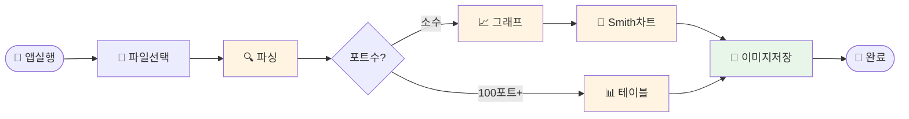

# 나의 워크샵 스킬 설계서

> 📋 **이 설계서는 [사전설문응답.md](사전설문응답.md) 인터뷰를 바탕으로 작성되었습니다.**

> ⚠️ **이 설계서는 초안입니다!**
>
> 정답이 아니에요. 워크샵 당일 강사님과 함께 범위를 더 좁히거나, 더 구체화할 수 있습니다.
>
> **사전과제의 목적**:
> 1. 스킬을 설치해서 한 번 써본 것 ✅
> 2. 나만의 스킬 설계서를 만들어서 "아, 내 작업이 이렇게 자동화되겠구나", "이런 흐름이겠구나" 감 잡기 ✅
>
> 이 정도면 충분해요! 나머지는 워크샵에서 함께 다듬어봐요 😊

## 목차
- [0. 선언](#0-선언)
- [한눈에 보기](#한눈에-보기)
- [Core (필수)](#core-필수)
  - [1. 언제 쓰나요?](#1-언제-쓰나요)
  - [2. 사용법](#2-사용법)
  - [3. 입력/출력 명세](#3-입력출력-명세)
  - [4. 범위](#4-범위)
  - [5. 데이터/도구/권한](#5-데이터도구권한)
  - [6. 실패/예외 처리](#6-실패예외-처리)
  - [7. 대화 시나리오](#7-대화-시나리오)
  - [8. 테스트 & 완료 기준](#8-테스트--완료-기준)
- [Optional](#optional)
  - [A. 파일 기반](#a-파일-기반)
  - [C. 다단계 워크플로우](#c-다단계-워크플로우)
- [나중에 더 발전시킬 아이디어](#나중에-더-발전시킬-아이디어)

---

## 0. 선언

- **스킬 이름**: `sparam-viewer`
- **한 줄 설명**: S-parameter 파일을 드래그하면 그래프와 테이블을 자동으로 생성해주는 GUI 분석 툴
- **만드는 사람**: RF Front End Module Engineer
- **스킬 유형**: [x] 파일 기반  [ ] 텍스트 변환  [ ] 외부 API  [ ] 다단계 워크플로우
- **결과물 형태**: 독립 실행 GUI 앱 (PyInstaller로 패키징)
- **MVP 목표**: "s2p 파일을 드래그하면 S11/S21/S22 그래프와 Smith chart가 자동으로 뜬다"

---

## 한눈에 보기

### 외부 연동

없음 — 별도 설정 없이 바로 시작할 수 있어요!

### 워크플로 시각화

> 💡 **다이어그램이 안 보이나요?**
>
> VSCode에서 Mermaid 다이어그램을 보려면 확장 프로그램이 필요해요:
> 1. VSCode 왼쪽 사이드바에서 **확장(Extensions)** 아이콘 클릭 (또는 `Cmd+Shift+X`)
> 2. `Markdown Preview Mermaid Support` 검색
> 3. **Install** 클릭
> 4. 이 파일을 다시 열고 **미리보기**(`Cmd+Shift+V`)로 확인!



---

## Core (필수)

### 1. 언제 쓰나요?

**대표 상황**:
- 측정 완료 후 s2p 파일이 생겼을 때 → S11/S21/S22 확인하고 보고서에 붙여야 할 때
- EM simulation 결과로 100포트 넘는 파일이 나왔을 때 → 포트별 데이터 정리해야 할 때

**왜 필요한가**:
- 현재는 ADS나 회사 고유 툴을 열고 → 파일 불러오고 → 포트 하나씩 설정하고 → 스크린샷 → 보고서 붙이기까지 손이 너무 많이 감
- 100포트짜리는 open/short 설정 + 모든 조합 캡처가 수작업으로 불가능한 수준

### 2. 사용법

**이렇게 사용하면**:
- 앱 실행 → s-parameter 파일 드래그 앤 드롭 (또는 파일 선택 버튼)
- 포트 수, 마커 주파수, open/short 조건 설정
- "분석 시작" 클릭

**결과물 형태**: [x] 파일 (이미지 + CSV/Excel)

**결과물 예시**:
```
output/
├── S11_S21_S22.png       ← 직사각형 그래프
├── SmithChart.png         ← Smith chart
└── port_table.csv         ← 포트별 S-parameter 테이블
```

### 3. 입력/출력 명세

| 구분 | 내용 |
|------|------|
| **사용자 입력** | S-parameter 파일 (`.s2p`, `.s4p`, `.s?p`) |
| **필수 옵션** | 파일 선택 |
| **선택 옵션** | 마커 주파수 설정, 포트 open/short 조건, 출력 포트 조합 선택 |
| **출력 규칙** | 파일과 같은 폴더에 `output/` 폴더 생성, PNG + CSV 저장 |

### 4. 범위

**하는 것**:
1. s-parameter 파일 읽고 → S11/S21/S22 직사각형 그래프 + Smith chart 생성 및 저장
2. 100포트+ 파일 → 지정한 포트 조합의 S-parameter 값 테이블로 추출 (CSV)
3. 특정 주파수 마커 설정 + 포트 open/short 조건 적용

**안 하는 것**:
1. ADS 등 외부 툴 직접 연동 (파일 기반으로만 동작)
2. 실시간 측정 장비 연결

### 5. 데이터/도구/권한

| 항목 | 내용 |
|------|------|
| **읽는 데이터** | 로컬 `.s?p` 파일 |
| **쓰는 위치** | 입력 파일과 같은 폴더의 `output/` 하위 |
| **외부 서비스** | 없음 |
| **민감정보** | 없음 |
| **주요 라이브러리** | `scikit-rf`, `matplotlib`, `pandas`, `tkinter`, `PyInstaller` |

### 6. 실패/예외 처리

**예상되는 실패 상황**:
1. 지원하지 않는 파일 형식 → "`.s2p`, `.s4p` 등 S-parameter 파일만 지원해요" 안내
2. 포트 수와 파일 형식 불일치 → "파일 형식을 확인해주세요 (예: s2p는 2포트)" 안내
3. 마커 주파수가 파일의 주파수 범위 밖 → "파일의 주파수 범위는 X~Y GHz예요" 안내

**실패 시 안내 원칙**:
GUI 팝업으로 친절한 에러 메시지 표시. 가능하면 파일 정보(포트 수, 주파수 범위)를 자동으로 읽어서 힌트 제공.

### 7. 대화 시나리오

**정상 케이스**:

파일 드래그 → 분석 시작 클릭

> ✅ 분석 완료!
> - S11/S21/S22 그래프 저장: `output/S11_S21_S22.png`
> - Smith chart 저장: `output/SmithChart.png`
> - 2.4 GHz 마커: S21 = -1.2 dB, S11 = -18.5 dB

**실패 케이스**:

잘못된 파일 형식 드래그

> ❌ 지원하지 않는 파일이에요.
> `.s2p`, `.s4p` 등 S-parameter 파일을 넣어주세요!

### 8. 테스트 & 완료 기준

**테스트 체크리스트**:
- [ ] s2p 파일 드래그 → S11/S21/S22 그래프 정상 생성
- [ ] Smith chart 정상 생성
- [ ] 100포트 파일 → 포트별 테이블 CSV 정상 생성
- [ ] 포트 open/short 조건 설정 후 결과 변화 확인
- [ ] 잘못된 파일 넣었을 때 에러 메시지 표시

**Done 기준**:
"s2p 파일을 드래그하면 30초 안에 그래프 2장과 CSV 파일이 생성되고, 바로 보고서에 붙일 수 있는 상태"

---

## Optional

### A. 파일 기반

| 항목 | 내용 |
|------|------|
| **지원 형식** | `.s1p`, `.s2p`, `.s4p`, `.sNp` (Touchstone 포맷) |
| **예시 입력 파일** | `measurement_2.4GHz.s2p` |
| **출력 파일 예시** | `output/S11_S21_S22.png`, `output/SmithChart.png`, `output/port_table.csv` |

### C. 다단계 워크플로우

**단계 목록**:
1. 파일 로드 → 산출물: 포트 수, 주파수 범위 자동 감지 + GUI에 표시
2. 파라미터 설정 → 산출물: 마커 주파수, 출력 포트 조합, open/short 조건 확정
3. 분석 실행 → 산출물: 그래프 PNG + 테이블 CSV 저장 완료

---

## 나중에 더 발전시킬 아이디어

- [ ] 여러 파일 한 번에 비교 (overlay plot)
- [ ] 보고서 템플릿에 자동으로 그래프 삽입 (Word/PowerPoint)
- [ ] 시뮬레이션 vs 측정 결과 자동 비교 overlay
- [ ] 주파수 범위별 pass/fail 판정 자동화

---

## 배포 준비 (워크샵 후)

워크샵에서 앱을 완성한 후 PyInstaller로 패키징합니다.

### 패키징 방법

워크샵에서 앱을 완성한 후, Claude Code에게 말하세요:

```
이 앱 exe로 패키징해줘
```

Claude Code가 자동으로:
1. PyInstaller 설정 생성
2. 단일 실행 파일 빌드
3. 팀원에게 공유 가능한 형태로 안내

---

**워크샵 당일 이 설계서 가져오세요!**
