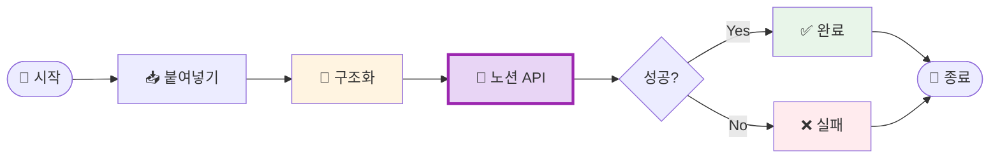

# 나의 워크샵 스킬 설계서

> 📋 **이 설계서는 [사전설문응답.md](사전설문응답.md) 인터뷰를 바탕으로 작성되었습니다.**

> ⚠️ **이 설계서는 초안입니다!**
>
> 정답이 아니에요. 워크샵 당일 강사님과 함께 범위를 더 좁히거나, 더 구체화할 수 있습니다.
>
> **사전과제의 목적**:
> 1. 스킬을 설치해서 한 번 써본 것 ✅
> 2. 나만의 스킬 설계서를 만들어서 "아, 내 작업이 이렇게 자동화되겠구나", "이런 흐름이겠구나" 감 잡기 ✅
>
> 이 정도면 충분해요! 나머지는 워크샵에서 함께 다듬어봐요 😊

## 목차

- [0. 선언](#0-선언)
- [한눈에 보기](#한눈에-보기) (외부 연동 + 워크플로 시각화)
- [Core (필수)](#core-필수)
- [Optional - 외부 API 연동](#optional---외부-api-연동)
- [나중에 더 발전시킬 아이디어](#나중에-더-발전시킬-아이디어)
- [배포 준비 (워크샵 후)](#배포-준비-워크샵-후)

---

## 0. 선언

- **스킬 이름**: trend-news-brief
- **한 줄 설명**: 텔레그램에서 수집한 뉴스/트렌드를 노션 템플릿 구조에 맞춰 정리해 노션 페이지로 생성
- **만드는 사람**: CSO / Growth
- **스킬 유형**: [ ] 텍스트 변환  [ ] 파일 기반  [x] 외부 API  [ ] 다단계 워크플로우
- **MVP 목표**: "붙여넣은 뉴스/트렌드 내용을 업계 시황·트렌드 템플릿 구조로 정리해 노션에 페이지 생성"

---

## 한눈에 보기

### 외부 연동

| 서비스 | 용도       | 연동 방식 | 복잡도 | 가이드 |
|--------|------------|----------|--------|--------|
| Notion | 페이지 생성 | MCP      | 쉬움   | [📘 설정 가이드](연동가이드/Notion.md) |

> 📁 상세 설정 가이드: [연동가이드/](연동가이드/) 폴더 참조

### 워크플로 시각화

> 💡 **다이어그램이 안 보이나요?**
>
> VSCode에서 Mermaid 다이어그램을 보려면 확장 프로그램이 필요해요:
> 1. VSCode 왼쪽 사이드바에서 **확장(Extensions)** 아이콘 클릭 (또는 `Cmd+Shift+X`)
> 2. `Markdown Preview Mermaid Support` 검색
> 3. **Install** 클릭
> 4. 이 파일을 다시 열고 **미리보기**(`Cmd+Shift+V`)로 확인!



---

## Core (필수)

### 1. 언제 쓰나요?

**대표 상황**:
- 아침에 텔레그램 주요 채널을 둘러본 뒤, 그날의 뉴스·트렌드·신규 프로젝트를 한곳에 모아 노션 문서로 정리할 때
- 팀과 금요일에 검토할 "업계 시황 및 주요 뉴스", "트렌드 및 주목할 프로젝트" 문서를 매일 같은 구조로 채울 때

**왜 필요한가** (불편/비용/시간):
- 매일 약 1시간(그중 인사이트 정리만 40분)이 반복적으로 소요됨. 붙여넣기만 하면 구조에 맞춰 정리·노션 페이지 생성까지 되면 시간을 크게 줄일 수 있음.

### 2. 사용법

**이렇게 부르면**:
- `/trend-news-brief`
- "오늘 텔레그램에서 본 거 정리해줘"
- "시황 정리해줘"

**결과물 형태**: [ ] 메시지  [x] 파일(노션 페이지)  [ ] 링크/리포트  [ ] 기타

**결과물 예시**:
> 노션에 생성된 페이지: "업계 시황 및 주요 뉴스" + "트렌드 및 주목할 프로젝트" 구조에 맞춘 블록(헤드라인·요약·영향도·시사점, 매크로/기술/소셜 + Takeaway).

### 3. 입력/출력 명세

| 구분           | 내용 |
|----------------|------|
| **사용자 입력** | 텔레그램에서 복사한 뉴스/트렌드 텍스트(붙여넣기) |
| **필수 옵션**   | 없음 (붙여넣은 내용만으로 진행) |
| **선택 옵션**   | 날짜, 대상 노션 페이지/DB ID(있으면 해당 위치에 생성) |
| **출력 규칙**   | 노션 템플릿 구조 준수(헤드라인·영향도·시사점, 트렌드 카테고리·Takeaway) |

### 4. 범위

**하는 것** (3개 이내):
1. 붙여넣은 텍스트를 "업계 시황 및 주요 뉴스", "트렌드 및 주목할 프로젝트" 구조로 파싱·정리
2. 정리된 내용을 노션 블록 구조(헤딩, 불릿, 토글 등)로 변환
3. 지정한 노션 페이지(또는 기본 위치)에 새 페이지/블록으로 생성

**안 하는 것** (2개 이내):
1. 텔레그램에서 자동 수집(붙여넣기 입력만 지원)
2. 기존 노션 페이지 수정·삭제(생성만)

### 5. 데이터/도구/권한

| 항목         | 내용 |
|--------------|------|
| **읽는 데이터** | 사용자가 붙여넣은 텍스트(채팅/메시지 입력) |
| **쓰는 위치**  | Notion: 지정한 부모 페이지 하위에 새 페이지 생성 |
| **외부 서비스** | Notion (API 키로 페이지/블록 생성) |
| **민감정보**   | Notion API 키 필요. 노션 페이지 ID는 환경변수 또는 대화로 지정 가능 |

### 6. 실패/예외 처리

**예상되는 실패 상황**:
1. Notion API 키 미설정 또는 만료
2. 부모 페이지 ID 잘못됨 또는 접근 권한 없음
3. 붙여넣은 내용이 비어 있거나 구조 파악 불가

**실패 시 안내 원칙**:
- API/권한 오류: "노션 연동을 확인해 주세요. API 키와 페이지 접근 권한을 점검해 보세요." + 연동가이드 링크
- 입력 부족: "정리할 뉴스/트렌드 내용을 붙여넣어 주세요."

### 7. 대화 시나리오

**정상 케이스**:

**나**: "오늘 텔레그램에서 본 거 정리해줘" (이어서 텍스트 붙여넣기)

**스킬**:
> 노션에 "[날짜] 업계 시황 및 주요 뉴스" 페이지를 만들어 두었어요. 링크: [노션 URL]. 금요일 검토 때 그대로 보시면 됩니다.

**실패 케이스**:

**나**: (내용 없이) "정리해줘"

**스킬**:
> 정리할 뉴스나 트렌드 내용을 텔레그램에서 복사해서 붙여넣어 주시면, 노션 구조에 맞춰 정리해 드릴게요.

### 8. 테스트 & 완료 기준

**테스트 체크리스트**:
- [ ] 뉴스/트렌드 텍스트 붙여넣기 → 노션 페이지 생성 성공
- [ ] 생성된 페이지가 "업계 시황 및 주요 뉴스", "트렌드 및 주목할 프로젝트" 구조를 따름
- [ ] API 키 누락 또는 잘못된 페이지 ID 시 친절한 에러 안내

**Done 기준**:
"붙여넣은 내용만 주면 노션에 정리된 페이지가 생성되고, 팀이 금요일에 그 문서로 검토할 수 있는 상태"

---

## Optional - 외부 API 연동

1개의 외부 서비스(Notion) 연동이 필요합니다.

### 환경변수 요약

| 변수명           | 서비스 | 발급 방법 |
|------------------|--------|----------|
| `NOTION_API_KEY` | Notion | [Notion 연동 가이드](연동가이드/Notion.md) 참고. My Integrations에서 Integration 생성 후 Internal Integration Token 복사 |

> **Tip**: Claude Code에게 API 키를 알려주면 자동으로 `.env`에 설정해줄 수 있어요!  
> 예: "노션 API 키는 secret_xxxx야"

### B-1. Notion

| 항목               | 내용 |
|--------------------|------|
| **연동 방식**      | MCP (페이지/블록 생성) |
| **필요한 credential** | Internal Integration Token |
| **환경변수**       | `NOTION_API_KEY` |
| **복잡도**         | 쉬움 (API 키만) |
| **예상 설정 시간** | 약 10–15분 |

**설정 가이드 요약**:
- Notion 워크스페이스에서 Integration 생성 → Capabilities에서 해당 페이지/DB 접근 허용 → Token을 `.env`의 `NOTION_API_KEY`로 설정. 상세는 [연동가이드/Notion.md](연동가이드/Notion.md) 참조.

---

## 나중에 더 발전시킬 아이디어

- [ ] 인사이트 초안 자동 생성(영향도·시사점·Takeaway 문장 제안)
- [ ] 금요일 회의용 한 주 요약 페이지 자동 생성
- [ ] 텔레그램 채널에서 직접 수집(봇/API 연동) 후 정리

---

## 배포 준비 (워크샵 후)

워크샵에서 스킬을 완성한 후, GitHub에 배포하여 다른 사람도 사용할 수 있게 합니다.

### 필요한 파일

| 파일          | 상태 | 설명 |
|---------------|------|------|
| `SKILL.md`    | [ ] 미완성 | 스킬 정의 (워크샵에서 작성) |
| `README.md`   | [ ] 자동생성 예정 | 설치 가이드 (배포 시 자동 생성) |
| `.env.example`| [x] 완료 | 환경변수 예시 |
| `.gitignore`  | [x] 완료 | .env 제외 설정 |

### 배포 방법

워크샵에서 스킬을 완성한 후, Claude Code에게 말하세요:

```
이 스킬 배포해줘
```

Claude Code가 자동으로 README 생성, GitHub 레포 생성, 설치 명령어 안내를 해줍니다.

---

**워크샵 당일 이 설계서 가져오세요!**
